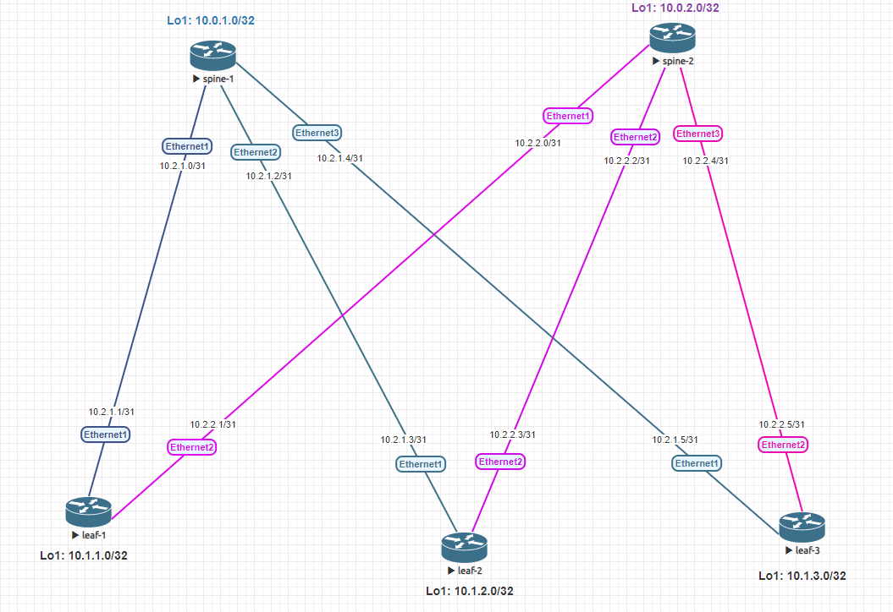

# Домашнее задание
## Проектирование адресного пространства

## Цель:
- ### Собрать схему CLOS
- ### Распределить адресное пространство

## Выполнение
### Схема сети

### Правила распределения адресного пространства:
Шаблон назначения IP адреса: **[10.Dn.Sn.X]**
<table><tr><th>Octet</th><th>DC#</th><th>Value(s)</th><th>Usage</th><th>Note</th></tr><tr><td>Dn</td><td>1</td><td>0</td><td>Spine's loopbacks</td><td>/32</td></tr><tr><td>Dn</td><td>1</td><td>1</td><td>Leaf's loopbacks</td><td>/32</td></tr><tr><td>Dn</td><td>1</td><td>2</td><td>underlay p2p links</td><td>/31</td></tr><tr><td>Dn</td><td>1</td><td>3</td><td>reserved</td><td></td></tr><tr><td>Dn</td><td>1</td><td>4-7</td><td>Client services</td><td></td></tr><tr><td>Sn</td><td>1-255</td><td>0-255</td><td>Spine/Leaf node number</td><td></td></tr><tr><td>X</td><td>0-255</td><td>0-255</td><td>serial number</td><td></td></tr></table>

### Таблица распределения адресов
<table><tr><th>Hostname</th><th>Interface</th><th>Addr/Mask</th><th>Interface descr.</th></tr><tr><td>spine-1</td><td>Loopback1</td><td>10.0.1.0/32</td><td></td></tr><tr><td>spine-1</td><td>Ethernet1</td><td>10.2.1.0/31</td><td>to_leaf-1</td></tr><tr><td>spine-1</td><td>Ethernet2</td><td>10.2.1.2/31</td><td>to_leaf-2</td></tr><tr><td>spine-1</td><td>Ethernet3</td><td>10.2.1.4/31</td><td>to_leaf-3</td></tr><tr><td></td><td></td><td></td><td></td></tr><tr><td>spine-2</td><td>Loopback1</d><td>10..2.0/32</td><td></td></tr><tr><td>spine-2</td><td>Ethernet1</td><td>10.2.2.0/31</td><td>to_leaf-1</td></tr><tr><td>spine-2</td><td>Ethernet2</td><td>10.2.2.2/31</d><td>to_leaf-2</td></tr><tr><td>spine-2</td><td>Ethernet3</td><td>10.2.2.4/31</td><td>to_leaf-3</td></tr><tr><td></td><td></td><td></td><td></td></tr><tr><td>leaf-1</d><td>Loopback1</td><td>10.1.1.0/32</td><td></td></tr><tr><td>leaf-1</td><td>Ethernet1</td><td>10.2.1.1/31</td><td>to_spine-1</td></tr><tr><td>leaf-1</td><td>Ethernet2</d><td>10.2.2.1/31</td><td>to_spine-2</td></tr><tr><td></td><td></td><td></td><td></td></tr><tr><td>leaf-2</td><td>Loopback1</td><td>10.1.2.0/32</td><td></td></tr><tr><td>leaf-2</td><td>Ethernet1</td><td>10.2.1.3/31</td><td>to_spine-1</td></tr><tr><td>leaf-1</td><td>Ethernet2</td><td>10.2.2.3/31</td><td>to_spine-2</td></tr><tr><td></td><td></td><td></td><td></td></tr><tr><td>leaf-3</td><td>Loopback1</td><td>10.1.3.0/32</td><td></td></tr><tr><td>leaf-3</td><td>Ethernet1</td><td>10.2.1.5/31</d><td>to_spine-1</td></tr><tr><td>leaf-3</td><td>Ethernet2</td><td>10.2.2.5/31</td><td>to_spine-2</td></tr></table>

### Конфигурация интерфейсов
##### spine-1 config
    spine-1# show running-configuration interface 
    !
    interface Ethernet1
     description to_leaf-1
     mtu 9100
     speed 25000
     no autoneg
     no shutdown
     ip address 10.2.1.0/31
    !
    interface Ethernet2
     description to_leaf-2
     mtu 9100
     speed 25000
     no autoneg
     no shutdown
     ip address 10.2.1.2/31
    !
    interface Ethernet3
     description to_leaf-3
     mtu 9100
     speed 25000
     no autoneg
     no shutdown
     ip address 10.2.1.4/31
    !
    interface Loopback1
     no shutdown
     ip address 10.0.1.0/32
    !

##### spine-2 config
    spine-2# show running-configuration interface 
    !
    interface Ethernet1
     description to_leaf-1
     mtu 9100
     speed 25000
     no autoneg
     no shutdown
     ip address 10.2.2.0/31
    !
    interface Ethernet2
     description to_leaf-2
     mtu 9100
     speed 25000
     no autoneg
     no shutdown
     ip address 10.2.2.2/31
    !
    interface Ethernet3
     description to_leaf-3
     mtu 9100
     speed 25000
     no autoneg
     no shutdown
     ip address 10.2.2.4/31
    !
    interface Loopback1
     no shutdown
     ip address 10.0.2.0/32

##### leaf-1 config
    leaf-1# show running-configuration interface 
    !
    interface Ethernet1
     description to_spine-1
     mtu 9100
     speed 25000
     no autoneg
     no shutdown
     ip address 10.2.1.1/31
    !
    interface Ethernet2
     description to_spine-2
     mtu 9100
     speed 25000
     no autoneg
     no shutdown
     ip address 10.2.2.1/31
    !
    interface Loopback1
     no shutdown
     ip address 10.1.1.0/32

##### leaf-2 config
    leaf-2# show running-configuration interface 
    !
    interface Ethernet1
     description to_spine-1
     mtu 9100
     speed 25000
     no autoneg
     no shutdown
     ip address 10.2.1.3/31
    !
    interface Ethernet2
     description to_spine-2
     mtu 9100
     speed 25000
     no autoneg
     no shutdown
     ip address 10.2.2.3/31
    !
    interface Loopback1
     no shutdown
     ip address 10.1.2.0/32
    !

##### leaf-3 config
    leaf-3# show running-configuration interface 
    !
    interface Ethernet1
     description to_spine-1
     mtu 9100
     speed 25000
     no autoneg
     no shutdown
     ip address 10.2.1.5/31
    !
    interface Ethernet2
     description to_spine-2
     mtu 9100
     speed 25000
     no autoneg
     no shutdown
     ip address 10.2.2.5/31
    !
    interface Loopback1
     no shutdown
     ip address 10.1.3.0/32
    !

### Проверка доступности
##### От spine-1
    //to leaf-1//
    spine-1# ping 10.2.1.1
    PING 10.2.1.1 (10.2.1.1) 56(84) bytes of data.
    64 bytes from 10.2.1.1: icmp_seq=1 ttl=64 time=23.7 ms
    64 bytes from 10.2.1.1: icmp_seq=2 ttl=64 time=2.47 ms
    64 bytes from 10.2.1.1: icmp_seq=3 ttl=64 time=2.26 ms
    64 bytes from 10.2.1.1: icmp_seq=4 ttl=64 time=1.31 ms
    64 bytes from 10.2.1.1: icmp_seq=5 ttl=64 time=1.88 ms
    
    //to leaf-2//
    spine-1# ping 10.2.1.3
    PING 10.2.1.3 (10.2.1.3) 56(84) bytes of data.
    64 bytes from 10.2.1.3: icmp_seq=1 ttl=64 time=7.05 ms
    64 bytes from 10.2.1.3: icmp_seq=2 ttl=64 time=1.29 ms
    64 bytes from 10.2.1.3: icmp_seq=3 ttl=64 time=1.28 ms
    64 bytes from 10.2.1.3: icmp_seq=4 ttl=64 time=1.19 ms
    64 bytes from 10.2.1.3: icmp_seq=5 ttl=64 time=1.25 ms
    64 bytes from 10.2.1.3: icmp_seq=6 ttl=64 time=1.25 ms
    64 bytes from 10.2.1.3: icmp_seq=7 ttl=64 time=1.28 ms
    64 bytes from 10.2.1.3: icmp_seq=8 ttl=64 time=1.36 ms
    
    //to leaf-3//
    spine-1# ping 10.2.1.5
    PING 10.2.1.5 (10.2.1.5) 56(84) bytes of data.
    64 bytes from 10.2.1.5: icmp_seq=1 ttl=64 time=4.59 ms
    64 bytes from 10.2.1.5: icmp_seq=2 ttl=64 time=1.23 ms
    64 bytes from 10.2.1.5: icmp_seq=3 ttl=64 time=1.18 ms
    64 bytes from 10.2.1.5: icmp_seq=4 ttl=64 time=1.16 ms
    64 bytes from 10.2.1.5: icmp_seq=5 ttl=64 time=1.17 ms
    64 bytes from 10.2.1.5: icmp_seq=6 ttl=64 time=1.49 ms

##### От spine-2
    //to leaf-1//
    spine-2# ping 10.2.2.1
    PING 10.2.2.1 (10.2.2.1) 56(84) bytes of data.
    64 bytes from 10.2.2.1: icmp_seq=1 ttl=64 time=7.92 ms
    64 bytes from 10.2.2.1: icmp_seq=2 ttl=64 time=1.25 ms
    64 bytes from 10.2.2.1: icmp_seq=3 ttl=64 time=1.44 ms
    64 bytes from 10.2.2.1: icmp_seq=4 ttl=64 time=1.22 ms
    64 bytes from 10.2.2.1: icmp_seq=5 ttl=64 time=1.42 ms
    
    //to leaf-2//
    spine-2# ping 10.2.2.3
    PING 10.2.2.3 (10.2.2.3) 56(84) bytes of data.
    64 bytes from 10.2.2.3: icmp_seq=1 ttl=64 time=12.0 ms
    64 bytes from 10.2.2.3: icmp_seq=2 ttl=64 time=1.21 ms
    64 bytes from 10.2.2.3: icmp_seq=3 ttl=64 time=1.28 ms
    64 bytes from 10.2.2.3: icmp_seq=4 ttl=64 time=2.97 ms
    64 bytes from 10.2.2.3: icmp_seq=5 ttl=64 time=1.41 ms
    64 bytes from 10.2.2.3: icmp_seq=6 ttl=64 time=1.48 ms
    
    //to leaf-3//
    spine-2# ping 10.2.2.5
    PING 10.2.2.5 (10.2.2.5) 56(84) bytes of data.
    64 bytes from 10.2.2.5: icmp_seq=1 ttl=64 time=5.50 ms
    64 bytes from 10.2.2.5: icmp_seq=2 ttl=64 time=1.25 ms
    64 bytes from 10.2.2.5: icmp_seq=3 ttl=64 time=1.22 ms
    64 bytes from 10.2.2.5: icmp_seq=4 ttl=64 time=1.33 ms
    64 bytes from 10.2.2.5: icmp_seq=5 ttl=64 time=1.27 ms
    64 bytes from 10.2.2.5: icmp_seq=6 ttl=64 time=1.33 ms
    64 bytes from 10.2.2.5: icmp_seq=7 ttl=64 time=1.29 ms
