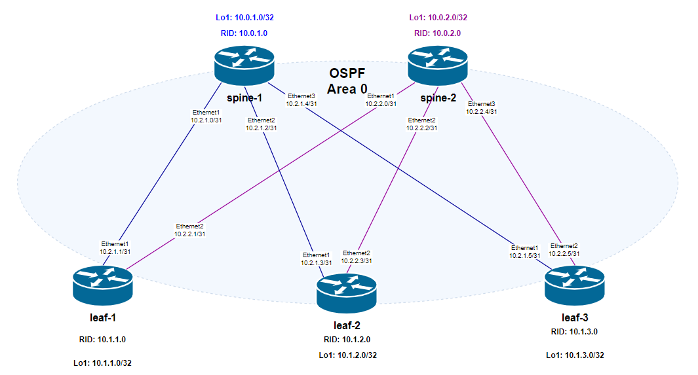

# Домашнее задание №2
## Underlay. OSPF

## Цель:
- ### Настроить OSPF для Underlay сети

## Выполнение
### Схема сети

### План работ
- #### настройка процесса OSPF
    - Area 0
    - Router Id
- #### настройка интерфейсов
    - Area 0
    - network type = 'point to point'
    - BFD
    - OSPF timers = defaults

Адресация интерфейсов соответствует [underlay ip plan из lab01](/Homework/01_work/lab01.md#таблица-распределения-адресов)

### Конфигурация оборудования

- spine-1
  
        spine-1# show running-configuration ospf
        !
        router ospf
        ospf router-id 10.0.1.0`
        area 0.0.0.0
    	
        spine-1# show running-configuration interface 
        !
        interface Ethernet1
         description to_leaf-1
         mtu 9100
         speed 1000
         no autoneg
         no shutdown
         ip address 10.2.1.0/31
         ip ospf area 0.0.0.0  
         ip ospf bfd  
         ip ospf network point-to-point  
        !
        interface Ethernet2
         description to_leaf-2
         mtu 9100
         speed 1000
         no autoneg
         no shutdown
         ip address 10.2.1.2/31
         ip ospf area 0.0.0.0  
         ip ospf bfd  
         ip ospf network point-to-point  
        !
        interface Ethernet3
         description to_leaf-3
         mtu 9100
         speed 1000
         no autoneg
         no shutdown
         ip address 10.2.1.4/31
         ip ospf area 0.0.0.0  
         ip ospf bfd  
         ip ospf network point-to-point  
        !

- spine-2

        spine-2# show running-configuration ospf
        !
        router ospf  
        ospf router-id 10.0.2.0  
        area 0.0.0.0 
        
        spine-2# show running-configuration interface 
        !
        interface Ethernet1
        description to_leaf-1
        mtu 9100
        speed 1000
        no autoneg
        no shutdown
        ip address 10.2.2.0/31
        ip ospf area 0.0.0.0  
        ip ospf bfd  
        ip ospf network point-to-point  
        !
        interface Ethernet2
        description to_leaf-2
        mtu 9100
        speed 1000
        no autoneg
        no shutdown
        ip address 10.2.2.2/31
        ip ospf area 0.0.0.0  
        ip ospf bfd  
        ip ospf network point-to-point  
        !
        interface Ethernet3
        description to_leaf-3
        mtu 9100
        speed 1000
        no autoneg
        no shutdown
        ip address 10.2.2.4/31
        ip ospf area 0.0.0.0  
        ip ospf bfd  
        ip ospf network point-to-point  
        !

- leaf-1

        leaf-1# show running-configuration ospf
        !
        router ospf  
        ospf router-id 10.1.1.0  
        area 0.0.0.0 

        leaf-1# show running-configuration interface
        !
        interface Ethernet1
        description to_spine-1
        mtu 9100
        speed 1000
        no autoneg
        no shutdown
        ip address 10.2.1.1/31
        ip ospf area 0.0.0.0  
        ip ospf bfd  
        ip ospf network point-to-point  
        !
        interface Ethernet2
        description to_spine-2
        mtu 9100
        speed 1000
        no autoneg
        no shutdown
        ip address 10.2.2.1/31
        ip ospf area 0.0.0.0  
        ip ospf bfd  
        ip ospf network point-to-point  

- leaf-2

        leaf-2# show running-configuration ospf
        !
        router ospf  
        ospf router-id 10.1.2.0  
        area 0.0.0.0 

        leaf-2# show running-configuration interface 
        !
        interface Ethernet1
        description to_spine-1
        mtu 9100
        speed 1000
        no autoneg
        no shutdown
        ip address 10.2.1.3/31
        ip ospf area 0.0.0.0  
        ip ospf bfd  
        ip ospf network point-to-point  
        !
        interface Ethernet2
        description to_spine-2
        mtu 9100
        speed 1000
        no autoneg
        no shutdown
        ip address 10.2.2.3/31
        ip ospf area 0.0.0.0  
        ip ospf bfd  
        ip ospf network point-to-point  

- leaf-3

        leaf-3# show running-configuration ospf
        !
        router ospf  
        ospf router-id 10.1.3.0  
        area 0.0.0.0 

        leaf-3# show running-configuration interface 
        !
        interface Ethernet1
        description to_spine-1
        mtu 9100
        speed 1000
        no autoneg
        no shutdown
        ip address 10.2.1.5/31
        ip ospf area 0.0.0.0  
        ip ospf bfd  
        ip ospf network point-to-point  
        !
        interface Ethernet2
        description to_spine-2
        mtu 9100
        speed 1000
        no autoneg
        no shutdown
        ip address 10.2.2.5/31
        ip ospf area 0.0.0.0  
        ip ospf bfd  
        ip ospf network point-to-point

### Проверка связанности устройств по протоколу OSPF

#### OSPF-соседства
- spine-1

        spine-1# show ip ospf neighbor 
        
        Neighbor ID     Pri State           Dead Time Address         Interface            RXmtL RqstL DBsmL
        10.1.1.0          1 Full/DROther      34.710s 10.2.1.1        Ethernet1:10.2.1.0       0     0     0
        10.1.2.0          1 Full/DROther      39.023s 10.2.1.3        Ethernet2:10.2.1.2       0     0     0
        10.1.3.0          1 Full/DROther      32.204s 10.2.1.5        Ethernet3:10.2.1.4       0     0     0

- spine-2

        spine-2# show ip ospf neighbor 
        
        Neighbor ID     Pri State           Dead Time Address         Interface            R
        XmtL RqstL DBsmL
        10.1.1.0          1 Full/DROther      37.841s 10.2.2.1        Ethernet1:10.2.2.0    
        0     0     0
        10.1.2.0          1 Full/DROther      32.152s 10.2.2.3        Ethernet2:10.2.2.2    
        0     0     0
        10.1.3.0          1 Full/DROther      35.335s 10.2.2.5        Ethernet3:10.2.2.4    
        0     0     0

#### OSPF interface traffic

- spine-1

        spine-1# show ip ospf interface traffic
        
        Interface       HELLO            DB-Desc         LS-Req           LS-Update        LS-Ack        
                        Rx/Tx            Rx/Tx            Rx/Tx            Rx/Tx            Rx/Tx        
        --------------------------------------------------------------------------------------------
        Ethernet1       976/976            2/3             0/1            29/26           18/22     
        Ethernet2       878/976            4/6             3/3            21/30           17/8      
        Ethernet3       868/976            2/3             2/2            15/25           13/5   

- spine-2

        spine-2# show ip ospf interface traffic
        
        Interface       HELLO            DB-Desc         LS-Req           LS-Update        LS-Ack        
                        Rx/Tx            Rx/Tx            Rx/Tx            Rx/Tx            Rx/Tx        
        --------------------------------------------------------------------------------------------
        Ethernet1       902/902            2/3             0/1            28/29           13/12     
        Ethernet2       886/902            2/3             1/1            24/24           10/10     
        Ethernet3       876/902            2/3             1/1            21/21           10/10 

#### OSPF database
- spine-1

        spine-1# show ip ospf database
        VRF Name: default
                
            OSPF Router with ID (10.0.1.0)
        
                        Router Link States (Area 0.0.0.0)
                            
        Link ID         ADV Router      Age  Seq#       CkSum  Link count
        10.0.1.0        10.0.1.0         273 0x80000023 0xee4b 6
        10.0.2.0        10.0.2.0         328 0x80000012 0xf54d 6
        10.1.1.0        10.1.1.0         462 0x80000011 0xccd4 4
        10.1.2.0        10.1.2.0         349 0x8000000d 0xb3e7 4
        10.1.3.0        10.1.3.0         166 0x8000000c 0x94fd 4

- spine-2

        spine-2# show ip ospf database
        VRF Name: default
                
            OSPF Router with ID (10.0.2.0)
        
                        Router Link States (Area 0.0.0.0)
                            
        Link ID         ADV Router      Age  Seq#       CkSum  Link count
        10.0.1.0        10.0.1.0         315 0x80000023 0xee4b 6
        10.0.2.0        10.0.2.0         366 0x80000012 0xf54d 6
        10.1.1.0        10.1.1.0         502 0x80000011 0xccd4 4
        10.1.2.0        10.1.2.0         389 0x8000000d 0xb3e7 4
        10.1.3.0        10.1.3.0         206 0x8000000c 0x94fd 4

#### OSPF routes
- spine-1

        spine-1# show ip ospf route
        ============ OSPF network routing table ============
        N    10.2.1.0/31           [4] area: 0.0.0.0
                                directly attached to Ethernet1
        N    10.2.1.2/31           [4] area: 0.0.0.0
                                directly attached to Ethernet2
        N    10.2.1.4/31           [4] area: 0.0.0.0
                                directly attached to Ethernet3
        N    10.2.2.0/31           [8] area: 0.0.0.0
                via 10.2.1.1, Ethernet1
        N    10.2.2.2/31           [8] area: 0.0.0.0
                via 10.2.1.3, Ethernet2
        N    10.2.2.4/31           [8] area: 0.0.0.0
                via 10.2.1.5, Ethernet3
        
        ============ OSPF router routing table =============
        
        ============ OSPF external routing table ===========

- spine-2

        spine-2# show ip ospf route
        ============ OSPF network routing table ============
        N    10.2.1.0/31           [8] area: 0.0.0.0
                via 10.2.2.1, Ethernet1
        N    10.2.1.2/31           [8] area: 0.0.0.0
                via 10.2.2.3, Ethernet2
        N    10.2.1.4/31           [8] area: 0.0.0.0
                via 10.2.2.5, Ethernet3
        N    10.2.2.0/31           [4] area: 0.0.0.0
                                directly attached to Ethernet1
        N    10.2.2.2/31           [4] area: 0.0.0.0
                                directly attached to Ethernet2
        N    10.2.2.4/31           [4] area: 0.0.0.0
                                directly attached to Ethernet3
        
        ============ OSPF router routing table =============
        
        ============ OSPF external routing table ===========