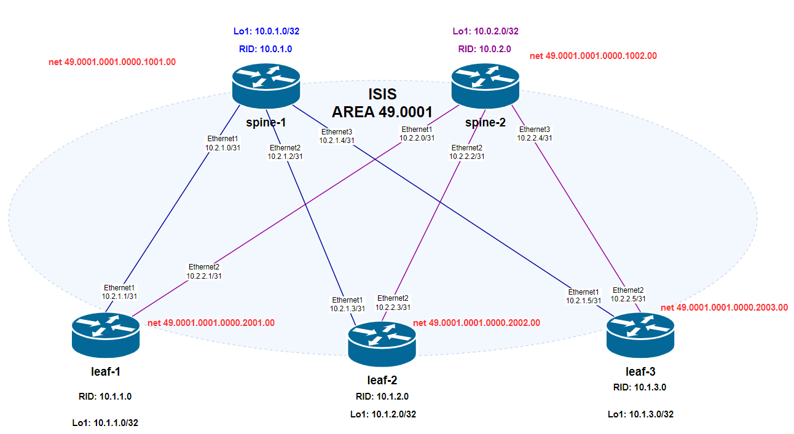

# Домашнее задание №3
## Underlay. ISIS

## Цель:
- ### Настроить ISIS для Underlay сети

## Выполнение
### Схема сети

### План работ
- #### настройка процесса ISIS
    - Network ID
    - ISIS level = 1
    - Hostname dynamic
    - Metric style = wide
- #### настройка BFD Profile
    - detect multiplier = 3
    - receive interval = 100ms
    - transmit interval = 100ms    
- #### настройка интерфейсов
    - Включение в процесс ISIS
    - Тип сети = point-to-point (для Ethernet интерфейсов)
    - включение BFD для ISIS, согласно профиля
    - ISIS timers = defaults

Адресация интерфейсов соответствует [underlay ip plan из lab01](/Homework/01_work/lab01.md#таблица-распределения-адресов)

### Конфигурация FRR оборудования

- spine-1. 
  
        configure
        !
        hostname spine-1
        !
        router isis Underlay
        is-type level-1
        net 49.0001.0001.0000.1001.00
        hostname dynamic
        metric-style wide
        exit
        !
        bfd
        profile DCBFD
        detect-multiplier 3
        transmit-interval 100
        receive-interval 100
        exit
        !
        exit
        !
        interface Ethernet1
        description to_leaf-1
        ip router isis Underlay
        isis bfd
        isis bfd profile DCBFD
        isis network point-to-point
        exit
        !
        interface Ethernet2
        description to_leaf-2
        isis bfd
        isis bfd profile DCBFD
        ip router isis Underlay
        isis network point-to-point
        exit
        !
        interface Ethernet3
        description to_leaf-3
        isis bfd
        isis bfd profile DCBFD
        ip router isis Underlay
        isis network point-to-point
        exit
        !
        interface Loopback1
        ip router isis Underlay
        isis passive
        exit
        !
        exit
        !
        write
        !

- spine-2

        configure
        !
        hostname spine-2
        !
        router isis Underlay
        is-type level-1
        net 49.0001.0001.0000.1002.00
        hostname dynamic
        metric-style wide
        exit
        !
        bfd
        profile DCBFD
        detect-multiplier 3
        transmit-interval 100
        receive-interval 100
        exit
        !
        exit
        !
        interface Ethernet1
        description to_leaf-1
        ip router isis Underlay
        isis bfd
        isis bfd profile DCBFD
        isis network point-to-point
        exit
        !
        interface Ethernet2
        description to_leaf-2
        ip router isis Underlay
        isis bfd
        isis bfd profile DCBFD
        isis network point-to-point
        exit
        !
        interface Ethernet3
        description to_leaf-3
        ip router isis Underlay
        isis bfd
        isis bfd profile DCBFD
        isis network point-to-point
        exit
        !
        interface Loopback1
        ip router isis Underlay
        isis passive
        exit
        !
        exit
        !
        write

- leaf-1

        configure
        !
        hostname leaf-1
        !
        router isis Underlay
        is-type level-1
        net 49.0001.0001.0000.2001.00
        hostname dynamic
        metric-style wide
        exit
        !
        bfd
        profile DCBFD
        detect-multiplier 3
        transmit-interval 100
        receive-interval 100
        exit
        !
        exit
        !
        interface Ethernet1
        description to_spine-1
        ip router isis Underlay
        isis bfd
        isis bfd profile DCBFD
        isis network point-to-point
        exit
        !
        interface Ethernet2
        description to_spine-2
        ip router isis Underlay
        isis bfd
        isis bfd profile DCBFD
        isis network point-to-point
        exit
        !
        interface Loopback1
        ip router isis Underlay
        isis passive
        exit
        exit
        !
        write

- leaf-2

        configure
        !
        hostname leaf-2
        !
        router isis Underlay
        is-type level-1
        net 49.0001.0001.0000.2002.00
        hostname dynamic
        metric-style wide
        exit
        !
        bfd
        profile DCBFD
        detect-multiplier 3
        transmit-interval 100
        receive-interval 100
        exit
        !
        exit
        !
        interface Ethernet1
        description to_spine-1
        ip router isis Underlay
        isis bfd
        isis bfd profile DCBFD
        isis network point-to-point
        exit
        !
        interface Ethernet2
        description to_spine-2
        ip router isis Underlay
        isis bfd
        isis bfd profile DCBFD
        isis network point-to-point
        exit
        !
        interface Loopback1
        ip router isis Underlay
        isis passive
        exit
        exit
        !
        write

- leaf-3

        configure
        !
        hostname leaf-3
        !
        router isis Underlay
        is-type level-1
        net 49.0001.0001.0000.2003.00
        hostname dynamic
        metric-style wide
        exit
        !
        bfd
        profile DCBFD
        detect-multiplier 3
        transmit-interval 100
        receive-interval 100
        exit
        !
        exit
        !
        interface Ethernet1
        description to_spine-1
        ip router isis Underlay
        isis bfd
        isis bfd profile DCBFD
        isis network point-to-point
        exit
        !
        interface Ethernet2
        description to_spine-2
        ip router isis Underlay
        isis bfd
        isis bfd profile DCBFD
        isis network point-to-point
        exit
        !
        interface Loopback1
        ip router isis Underlay
        isis passive
        exit
        exit
        !
        write 

### Проверка связанности устройств по протоколу ISIS

#### ISIS-соседства + BFD статус
- spine-1

        spine-1# show isis neighbor detail
        Area Underlay:
        leaf-1
            Interface: Ethernet1, Level: 1, State: Up, Expires in 28s
            Adjacency flaps: 1, Last: 1h34m55s ago
            Circuit type: L1, Speaks: IPv4
            SNPA: 2020.2020.2020
            Area Address(es):
            49.0001
            IPv4 Address(es):
            10.2.1.1
            BFD is active, status Up

        leaf-2
            Interface: Ethernet2, Level: 1, State: Up, Expires in 29s
            Adjacency flaps: 1, Last: 31m50s ago
            Circuit type: L1, Speaks: IPv4
            SNPA: 2020.2020.2020
            Area Address(es):
            49.0001
            IPv4 Address(es):
            10.2.1.3
            BFD is active, status Up

        leaf-3
            Interface: Ethernet3, Level: 1, State: Up, Expires in 28s
            Adjacency flaps: 1, Last: 24m57s ago
            Circuit type: L1, Speaks: IPv4
            SNPA: 2020.2020.2020
            Area Address(es):
            49.0001
            IPv4 Address(es):
            10.2.1.5
            BFD is active, status Up

- spine-2

        spine-2# show isis neighbor detail
        Area Underlay:
        leaf-1
            Interface: Ethernet1, Level: 1, State: Up, Expires in 29s
            Adjacency flaps: 1, Last: 1h58m41s ago
            Circuit type: L1, Speaks: IPv4
            SNPA: 2020.2020.2020
            Area Address(es):
            49.0001
            IPv4 Address(es):
            10.2.2.1
            BFD is active, status Up

        leaf-2
            Interface: Ethernet2, Level: 1, State: Up, Expires in 27s
            Adjacency flaps: 1, Last: 33m18s ago
            Circuit type: L1, Speaks: IPv4
            SNPA: 2020.2020.2020
            Area Address(es):
            49.0001
            IPv4 Address(es):
            10.2.2.3
            BFD is active, status Up

        leaf-3
            Interface: Ethernet3, Level: 1, State: Up, Expires in 27s
            Adjacency flaps: 1, Last: 26m25s ago
            Circuit type: L1, Speaks: IPv4
            SNPA: 2020.2020.2020
            Area Address(es):
            49.0001
            IPv4 Address(es):
            10.2.2.5
            BFD is active, status Up

#### ISIS database
- spine-1

        spine-1# show isis database detail
        Area Underlay:
        IS-IS Level-1 link-state database:
        LSP ID                  PduLen  SeqNumber   Chksum  Holdtime  ATT/P/OL
        spine-1.00-00        *    137   0x00000016  0xb8f7    1078    0/0/0
        Protocols Supported: IPv4
        Area Address: 49.0001
        Hostname: spine-1
        TE Router ID: 10.0.1.0
        Router Capability: 10.0.1.0 , D:0, S:0
        Extended Reachability: 0001.0000.2001.00 (Metric: 10)
        Extended Reachability: 0001.0000.2002.00 (Metric: 10)
        Extended Reachability: 0001.0000.2003.00 (Metric: 10)
        IPv4 Interface Address: 10.0.1.0
        Extended IP Reachability: 10.2.1.0/31 (Metric: 10)
        Extended IP Reachability: 10.2.1.2/31 (Metric: 10)
        Extended IP Reachability: 10.2.1.4/31 (Metric: 10)
        Extended IP Reachability: 10.0.1.0/32 (Metric: 10)

        spine-2.00-00            138   0x00000012  0x963c    1066    0/0/0
        Protocols Supported: IPv4
        Area Address: 49.0001
        Hostname: kornfeld
        TE Router ID: 10.0.2.0
        Router Capability: 10.0.2.0 , D:0, S:0
        Extended Reachability: 0001.0000.2001.00 (Metric: 10)
        Extended Reachability: 0001.0000.2002.00 (Metric: 10)
        Extended Reachability: 0001.0000.2003.00 (Metric: 10)
        IPv4 Interface Address: 10.0.2.0
        Extended IP Reachability: 10.2.2.0/31 (Metric: 10)
        Extended IP Reachability: 10.2.2.2/31 (Metric: 10)
        Extended IP Reachability: 10.2.2.4/31 (Metric: 10)
        Extended IP Reachability: 10.0.2.0/32 (Metric: 10)

        leaf-1.00-00              116   0x0000000f  0x3b8e    1072    0/0/0
        Protocols Supported: IPv4
        Area Address: 49.0001
        Hostname: leaf-1
        TE Router ID: 10.1.1.0
        Router Capability: 10.1.1.0 , D:0, S:0
        Extended Reachability: 0001.0000.1001.00 (Metric: 10)
        Extended Reachability: 0001.0000.1002.00 (Metric: 10)
        IPv4 Interface Address: 10.1.1.0
        Extended IP Reachability: 10.2.1.0/31 (Metric: 10)
        Extended IP Reachability: 10.2.2.0/31 (Metric: 10)
        Extended IP Reachability: 10.1.1.0/32 (Metric: 10)

        leaf-2.00-00            118   0x0000000b  0x73ee    1054    0/0/0
        Protocols Supported: IPv4
        Area Address: 49.0001
        Hostname: kornfeld
        TE Router ID: 10.1.2.0
        Router Capability: 10.1.2.0 , D:0, S:0
        Extended Reachability: 0001.0000.1001.00 (Metric: 10)
        Extended Reachability: 0001.0000.1002.00 (Metric: 10)
        IPv4 Interface Address: 10.1.2.0
        Extended IP Reachability: 10.2.1.2/31 (Metric: 10)
        Extended IP Reachability: 10.2.2.2/31 (Metric: 10)
        Extended IP Reachability: 10.1.2.0/32 (Metric: 10)

        leaf-3.00-00            118   0x00000007  0x81db    1055    0/0/0
        Protocols Supported: IPv4
        Area Address: 49.0001
        Hostname: kornfeld
        TE Router ID: 10.1.3.0
        Router Capability: 10.1.3.0 , D:0, S:0
        Extended Reachability: 0001.0000.1001.00 (Metric: 10)
        Extended Reachability: 0001.0000.1002.00 (Metric: 10)
        IPv4 Interface Address: 10.1.3.0
        Extended IP Reachability: 10.2.1.4/31 (Metric: 10)
        Extended IP Reachability: 10.2.2.4/31 (Metric: 10)
        Extended IP Reachability: 10.1.3.0/32 (Metric: 10)

            5 LSPs

- spine-2

        spine-2# show isis database detail
        Area Underlay:
        IS-IS Level-1 link-state database:
        LSP ID                  PduLen  SeqNumber   Chksum  Holdtime  ATT/P/OL
        spine-1.00-00             137   0x00000016  0xb8f7     941    0/0/0
        Protocols Supported: IPv4
        Area Address: 49.0001
        Hostname: spine-1
        TE Router ID: 10.0.1.0
        Router Capability: 10.0.1.0 , D:0, S:0
        Extended Reachability: 0001.0000.2001.00 (Metric: 10)
        Extended Reachability: 0001.0000.2002.00 (Metric: 10)
        Extended Reachability: 0001.0000.2003.00 (Metric: 10)
        IPv4 Interface Address: 10.0.1.0
        Extended IP Reachability: 10.2.1.0/31 (Metric: 10)
        Extended IP Reachability: 10.2.1.2/31 (Metric: 10)
        Extended IP Reachability: 10.2.1.4/31 (Metric: 10)
        Extended IP Reachability: 10.0.1.0/32 (Metric: 10)

        spine-2.00-00       *    138   0x00000012  0x963c     929    0/0/0
        Protocols Supported: IPv4
        Area Address: 49.0001
        Hostname: kornfeld
        TE Router ID: 10.0.2.0
        Router Capability: 10.0.2.0 , D:0, S:0
        Extended Reachability: 0001.0000.2001.00 (Metric: 10)
        Extended Reachability: 0001.0000.2002.00 (Metric: 10)
        Extended Reachability: 0001.0000.2003.00 (Metric: 10)
        IPv4 Interface Address: 10.0.2.0
        Extended IP Reachability: 10.2.2.0/31 (Metric: 10)
        Extended IP Reachability: 10.2.2.2/31 (Metric: 10)
        Extended IP Reachability: 10.2.2.4/31 (Metric: 10)
        Extended IP Reachability: 10.0.2.0/32 (Metric: 10)

        leaf-1.00-00              116   0x0000000f  0x3b8e     936    0/0/0
        Protocols Supported: IPv4
        Area Address: 49.0001
        Hostname: leaf-1
        TE Router ID: 10.1.1.0
        Router Capability: 10.1.1.0 , D:0, S:0
        Extended Reachability: 0001.0000.1001.00 (Metric: 10)
        Extended Reachability: 0001.0000.1002.00 (Metric: 10)
        IPv4 Interface Address: 10.1.1.0
        Extended IP Reachability: 10.2.1.0/31 (Metric: 10)
        Extended IP Reachability: 10.2.2.0/31 (Metric: 10)
        Extended IP Reachability: 10.1.1.0/32 (Metric: 10)

        leaf-2.00-00            118   0x0000000b  0x73ee     918    0/0/0
        Protocols Supported: IPv4
        Area Address: 49.0001
        Hostname: kornfeld
        TE Router ID: 10.1.2.0
        Router Capability: 10.1.2.0 , D:0, S:0
        Extended Reachability: 0001.0000.1001.00 (Metric: 10)
        Extended Reachability: 0001.0000.1002.00 (Metric: 10)
        IPv4 Interface Address: 10.1.2.0
        Extended IP Reachability: 10.2.1.2/31 (Metric: 10)
        Extended IP Reachability: 10.2.2.2/31 (Metric: 10)
        Extended IP Reachability: 10.1.2.0/32 (Metric: 10)

        leaf-3.00-00            118   0x00000007  0x81db     918    0/0/0
        Protocols Supported: IPv4
        Area Address: 49.0001
        Hostname: kornfeld
        TE Router ID: 10.1.3.0
        Router Capability: 10.1.3.0 , D:0, S:0
        Extended Reachability: 0001.0000.1001.00 (Metric: 10)
        Extended Reachability: 0001.0000.1002.00 (Metric: 10)
        IPv4 Interface Address: 10.1.3.0
        Extended IP Reachability: 10.2.1.4/31 (Metric: 10)
        Extended IP Reachability: 10.2.2.4/31 (Metric: 10)
        Extended IP Reachability: 10.1.3.0/32 (Metric: 10)

            5 LSPs

#### ISIS routes
- spine-1

        spine-1# show isis route
        Area Underlay:
        IS-IS L1 IPv4 routing table:

        Prefix       Metric  Interface  Nexthop   Label(s)
        ----------------------------------------------------
        10.0.1.0/32  0       -          -         -
        10.0.2.0/32  30      Ethernet1  10.2.1.1  -
                            Ethernet2  10.2.1.3  -
                            Ethernet3  10.2.1.5  -
        10.1.1.0/32  20      Ethernet1  10.2.1.1  -
        10.1.2.0/32  20      Ethernet2  10.2.1.3  -
        10.1.3.0/32  20      Ethernet3  10.2.1.5  -
        10.2.1.0/31  20      Ethernet1  10.2.1.1  -
        10.2.1.2/31  20      Ethernet2  10.2.1.3  -
        10.2.1.4/31  20      Ethernet3  10.2.1.5  -
        10.2.2.0/31  20      Ethernet1  10.2.1.1  -
        10.2.2.2/31  20      Ethernet2  10.2.1.3  -
        10.2.2.4/31  20      Ethernet3  10.2.1.5  -

- spine-2

        spine-2# show isis route
        Area Underlay:
        IS-IS L1 IPv4 routing table:

        Prefix       Metric  Interface  Nexthop   Label(s)
        ----------------------------------------------------
        10.0.1.0/32  30      Ethernet1  10.2.2.1  -
                            Ethernet2  10.2.2.3  -
                            Ethernet3  10.2.2.5  -
        10.0.2.0/32  0       -          -         -
        10.1.1.0/32  20      Ethernet1  10.2.2.1  -
        10.1.2.0/32  20      Ethernet2  10.2.2.3  -
        10.1.3.0/32  20      Ethernet3  10.2.2.5  -
        10.2.1.0/31  20      Ethernet1  10.2.2.1  -
        10.2.1.2/31  20      Ethernet2  10.2.2.3  -
        10.2.1.4/31  20      Ethernet3  10.2.2.5  -
        10.2.2.0/31  20      Ethernet1  10.2.2.1  -
        10.2.2.2/31  20      Ethernet2  10.2.2.3  -
        10.2.2.4/31  20      Ethernet3  10.2.2.5  -

#### Проверка связности между Loopback leaf узлов
 - от leaf-1

        //to leaf-2//
        admin@leaf-1:~$ ping 10.1.2.0
        PING 10.1.2.0 (10.1.2.0) 56(84) bytes of data.
        64 bytes from 10.1.2.0: icmp_seq=1 ttl=63 time=3.25 ms
        64 bytes from 10.1.2.0: icmp_seq=2 ttl=63 time=1.87 ms
        64 bytes from 10.1.2.0: icmp_seq=3 ttl=63 time=4.02 ms
        64 bytes from 10.1.2.0: icmp_seq=4 ttl=63 time=53.2 ms

        
        //to leaf-3//
        admin@leaf-1:~$ ping 10.1.3.0
        PING 10.1.3.0 (10.1.3.0) 56(84) bytes of data.
        64 bytes from 10.1.3.0: icmp_seq=1 ttl=63 time=3.08 ms
        64 bytes from 10.1.3.0: icmp_seq=2 ttl=63 time=1.87 ms
        64 bytes from 10.1.3.0: icmp_seq=3 ttl=63 time=1.71 ms

