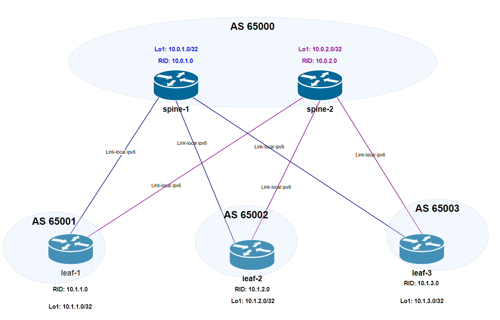

# Домашнее задание №3
## Underlay. eBGP

## Цель:
- ### Настроить eBGP для Underlay сети

## Выполнение
### Схема сети

### План работ
- #### настройка интерфейсов
    - IPv4 адреса лупбэков
    - активация ipv6 link-local адресов на Ethernet-интерфейсах
- #### настройка BGP на спайнах
    - router Id
    - peer-группа LEAFS
        - таймеры
        - bfd
        - AF IPV6
        - AF IPV4
        - соседи (leafs)    

- #### настройка BGP на лифах
    - router Id
    - peer-группа LEAFS
        - таймеры
        - bfd
        - AF IPV6
        - AF IPV4
            - редистрибуция connected сетей (loopback ip)
        - соседи (leafs)

Адресация Loopback интерфейсов соответствует [underlay ip plan из lab01](/Homework/01_work/lab01.md#таблица-распределения-адресов)

### Конфигурация оборудования

- spine-1. Interfaces 
  
        configure
        hostname spine-1
        !
        !
        interface Loopback1
        no shutdown
        ip address 10.0.1.0/32
        exit
        !
        interface Ethernet1
        description to_leaf-1
        mtu 9000
        speed 1000
        ipv6 enable
        no autoneg
        no shutdown
        exit
        !
        interface Ethernet2
        description to_leaf-2
        mtu 9000
        speed 1000
        ipv6 enable
        no autoneg
        no shutdown
        exit
        !
        interface Ethernet3
        description to_leaf-3
        mtu 9000
        speed 1000
        ipv6 enable
        no autoneg
        no shutdown
        exit
        !

- spine-1. BGP

        configure
        !
        router bgp 65000
        router-id 10.0.1.0
        log-neighbor-changes
        no ebgp-requires-policy
        !
        peer-group LEAFS
        timers 3 9
        timers connect 12
        bfd
        !
        address-family ipv6 unicast
        maximum paths 2
        activate
        exit

        address-family ipv4 unicast
        activate
        exit
        !
        exit
        !
        neighbor interface Ethernet1
        peer-group LEAFS
        remote-as 65001
        description leaf-1_peer
        exit
        !
        neighbor interface Ethernet2
        peer-group LEAFS
        remote-as 65002
        description leaf-2_peer
        exit
        !
        neighbor interface Ethernet3
        peer-group LEAFS
        remote-as 65003
        description leaf-3_peer
        end
        !

- spine-2. Interfaces

        configure
        hostname spine-2
        !
        !
        interface Loopback1
        no shutdown
        ip address 10.0.2.0/32
        exit
        !
        interface Ethernet1
        description to_leaf-1
        mtu 9000
        speed 1000
        ipv6 enable
        no autoneg
        no shutdown
        exit
        !
        interface Ethernet2
        description to_leaf-2
        mtu 9000
        speed 1000
        ipv6 enable
        no autoneg
        no shutdown
        exit
        !
        interface Ethernet3
        description to_leaf-3
        mtu 9000
        speed 1000
        ipv6 enable
        no autoneg
        no shutdown
        exit

- spine-2. BGP

        configure
        !
        router bgp 65000
        router-id 10.0.2.0
        log-neighbor-changes
        no ebgp-requires-policy
        !
        peer-group LEAFS
        timers 3 9
        timers connect 12
        bfd
        !
        address-family ipv6 unicast
        maximum paths 2
        activate
        exit
        
        address-family ipv4 unicast
        activate
        exit
        !
        exit
        !
        neighbor interface Ethernet1
        peer-group LEAFS
        remote-as 65001
        description leaf-1_peer
        exit
        !
        neighbor interface Ethernet2
        peer-group LEAFS
        remote-as 65002
        description leaf-2_peer
        exit
        !
        neighbor interface Ethernet3
        peer-group LEAFS
        remote-as 65003
        description leaf-3_peer
        end
        !
        write memory

- leaf-1. Interfaces

        configure
        hostname leaf-1
        !
        !
        interface Loopback1
        no shutdown
        ip address 10.1.1.0/32
        exit
        !
        interface Ethernet1
        description to_spine-1
        mtu 9000
        ipv6 enable
        speed 1000
        no autoneg
        no shutdown
        exit
        !
        interface Ethernet2
        description to_spine-2
        mtu 9000
        ipv6 enable
        speed 1000
        no autoneg
        no shutdown
        exit

- leaf-1. BGP

        configure
        !
        router bgp 65001
        router-id 10.1.1.0
        log-neighbor-changes
        no ebgp-requires-policy
        !
        peer-group SPINES
        remote-as 65000
        timers 3 9
        bfd
        !
        address-family ipv6 unicast
        maximum paths 2
        activate
        exit
        !
        address-family ipv4 unicast
        redistribute connected
        activate
        exit
        exit
        !
        neighbor interface Ethernet1
        description spine-1_peer
        peer-group SPINES
        exit
        !
        neighbor interface Ethernet2
        description spine-2_peer
        peer-group SPINES
        end
        !
        write memory

- leaf-2. Interfaces

        configure
        hostname leaf-2
        !
        !
        interface Loopback1
        no shutdown
        ip address 10.1.2.0/32
        exit
        !
        interface Ethernet1
        description to_spine-1
        mtu 9000
        ipv6 enable
        speed 1000
        no autoneg
        no shutdown
        exit
        !
        interface Ethernet2
        description to_spine-2
        mtu 9000
        ipv6 enable
        speed 1000
        no autoneg
        no shutdown
        exit

- leaf-2. BGP
        configure
        !
        router bgp 65002
        router-id 10.1.2.0
        log-neighbor-changes
        no ebgp-requires-policy
        !
        peer-group SPINES
        remote-as 65000
        timers 3 9
        bfd
        !
        address-family ipv6 unicast
        maximum paths 2
        activate
        exit
        !
        address-family ipv4 unicast
        redistribute connected
        activate
        exit
        exit
        !
        neighbor interface Ethernet1
        description spine-1_peer
        peer-group SPINES
        exit
        !
        neighbor interface Ethernet2
        description spine-2_peer
        peer-group SPINES
        end
        !
        write memory

- leaf-3. Interfaces

        configure
        hostname leaf-3
        !
        !
        interface Loopback1
        no shutdown
        ip address 10.1.3.0/32
        exit
        !
        interface Ethernet1
        description to_spine-1
        mtu 9000
        ipv6 enable
        speed 1000
        no autoneg
        no shutdown
        exit
        !
        interface Ethernet2
        description to_spine-2
        mtu 9000
        ipv6 enable
        speed 1000
        no autoneg
        no shutdown
        exit

- leaf-3. BGP
        configure
        !
        router bgp 65003
        router-id 10.1.3.0
        log-neighbor-changes
        no ebgp-requires-policy
        !
        peer-group SPINES
        remote-as 65000
        timers 3 9
        bfd
        !
        address-family ipv6 unicast
        maximum paths 2
        activate
        exit
        !
        address-family ipv4 unicast
        redistribute connected
        activate
        exit
        exit
        !
        neighbor interface Ethernet1
        description spine-1_peer
        peer-group SPINES
        exit
        !
        neighbor interface Ethernet2
        description spine-2_peer
        peer-group SPINES
        end
        !
        write memory
        !
 
 ### Проверка связанности устройств по протоколу BGP

#### BGP-neighbors + BFD
- spine-1

        spine-1# show bgp ipv6 unicast summary 
        BGP router identifier 10.0.1.0, local AS number 65000 
        Neighbor      V   AS      MsgRcvd   MsgSent   InQ     OutQ    Up/Down         State/PfxRcd   
        Ethernet1     4   65001   4501      4505      0       0       01:01:43        0              
        Ethernet2     4   65002   2716      2723      0       0       01:01:43        0              
        Ethernet3     4   65003   2553      2551      0       0       00:45:44        0 

        spine-1# show bfd peers brief 
        Session Count: 3
        SessionId  LocalAddress                              PeerAddress                               Status         Vrf     
        =========  ============                              ===========                               ======         ===     
        2471591865 fe80::520a:ff:fe01:0                      fe80::520a:ff:fe02:0                      UP             default 
        1439115871 fe80::520a:ff:fe01:0                      fe80::520a:ff:fe04:0                      UP             default 
        2183992514 fe80::520a:ff:fe01:0                      fe80::520a:ff:fe05:0                      UP             default 

- spine-2

        spine-2# show bgp ipv6 unicast summary 
        BGP router identifier 10.0.2.0, local AS number 65000 
        Neighbor      V   AS      MsgRcvd   MsgSent   InQ     OutQ    Up/Down         State/PfxRcd   
        Ethernet1     4   65001   743       743       0       0       00:36:51        0              
        Ethernet2     4   65002   736       736       0       0       00:36:30        0              
        Ethernet3     4   65003   731       731       0       0       00:36:13        0 

        spine-2# show bfd peers brief 
        Session Count: 3
        SessionId  LocalAddress                              PeerAddress                               Status         Vrf     
        =========  ============                              ===========                               ======         ===     
        3786033955 fe80::520a:ff:fe03:0                      fe80::520a:ff:fe02:0                      UP             default 
        99244253   fe80::520a:ff:fe03:0                      fe80::520a:ff:fe04:0                      UP             default 
        3841945892 fe80::520a:ff:fe03:0                      fe80::520a:ff:fe05:0                      UP             default 

#### BGP af ipv4 routes
- leaf-1

        leaf-1# show ip route bgp
        Codes:  K - kernel route, C - connected, S - static, B - BGP, O - OSPF
                > - selected route, * - FIB route, q - queued route, r - rejected route, # - not installed in hardware
            Destination  Gateway                   Interface  Dist/Metric  Uptime    Tag  
        -------------------------------------------------------------------------------------
        B>*   10.1.2.0/32  via fe80::520a:ff:fe01:0  Ethernet1  20/0         00:40:10       
        *                via fe80::520a:ff:fe03:0  Ethernet2                              
        B>*   10.1.3.0/32  via fe80::520a:ff:fe01:0  Ethernet1  20/0         00:39:53       
        *                via fe80::520a:ff:fe03:0  Ethernet2    

- leaf-2

        leaf-2# show ip route bgp
        Codes:  K - kernel route, C - connected, S - static, B - BGP, O - OSPF
                > - selected route, * - FIB route, q - queued route, r - rejected route, # - not installed in hardware
            Destination  Gateway                   Interface  Dist/Metric  Uptime    Tag  
        -------------------------------------------------------------------------------------
        B>*   10.1.1.0/32  via fe80::520a:ff:fe01:0  Ethernet1  20/0         00:41:08       
        *                via fe80::520a:ff:fe03:0  Ethernet2                              
        B>*   10.1.3.0/32  via fe80::520a:ff:fe01:0  Ethernet1  20/0         00:40:51       
        *                via fe80::520a:ff:fe03:0  Ethernet2 

- leaf-3

                leaf-3# show ip route bgp
                Codes:  K - kernel route, C - connected, S - static, B - BGP, O - OSPF
                        > - selected route, * - FIB route, q - queued route, r - rejected route, # - not installed in hardware
                Destination  Gateway                   Interface  Dist/Metric  Uptime    Tag  
                -------------------------------------------------------------------------------------
                B>*   10.1.1.0/32  via fe80::520a:ff:fe01:0  Ethernet1  20/0         00:50:52       
                *                via fe80::520a:ff:fe03:0  Ethernet2                              
                B>*   10.1.2.0/32  via fe80::520a:ff:fe01:0  Ethernet1  20/0         00:50:52       
                *                via fe80::520a:ff:fe03:0  Ethernet2   

#### Проверка связности между Loopback leaf узлов
 - от leaf-1

        //to leaf-2//
                leaf-1# ping -4 -I Loopback1 10.1.2.0
                PING 10.1.2.0 (10.1.2.0) from 10.1.1.0 : 56(84) bytes of data.
                64 bytes from 10.1.2.0: icmp_seq=1 ttl=63 time=8.56 ms
                64 bytes from 10.1.2.0: icmp_seq=2 ttl=63 time=2.98 ms
                64 bytes from 10.1.2.0: icmp_seq=3 ttl=63 time=4.85 ms

        
        //to leaf-3//
                leaf-1# ping -4 -I Loopback1 10.1.3.0
                PING 10.1.3.0 (10.1.3.0) from 10.1.1.0 : 56(84) bytes of data.
                64 bytes from 10.1.3.0: icmp_seq=1 ttl=63 time=5.62 ms
                64 bytes from 10.1.3.0: icmp_seq=2 ttl=63 time=3.89 ms
                64 bytes from 10.1.3.0: icmp_seq=3 ttl=63 time=56.9 ms
                64 bytes from 10.1.3.0: icmp_seq=4 ttl=63 time=5.90 ms

