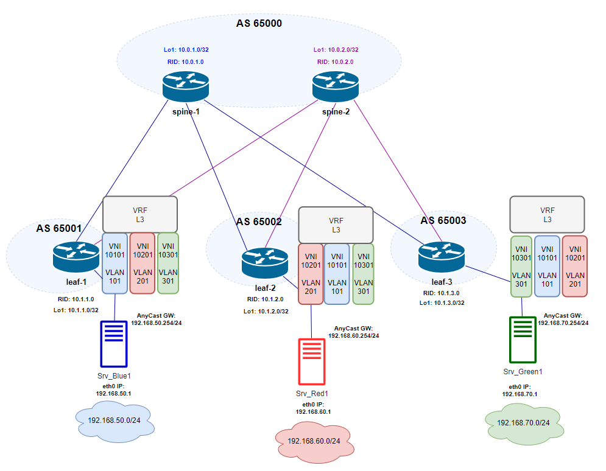

# Домашнее задание №5
## VXLAN L2 VNI

## Цель:
- ### Настроить маршрутизацию в рамках Overlay между клиентами c использованием VXLAN L2 VNI

## Выполнение
### Схема сети

### Распределение идентификаторов
|  Клиент |  Subnet  | GW  | Srv IP addr  | VNI  | VLAN  | Vrf | Leaf N |
| :------------: | :------------: | :------------: | :------------: | :------------: | :------------: |:------------: |:------------: |
| Blue  | 192.168.50.0/24  | 192.168.50.254  |  192.168.50.1 | 10101  |  101 | Vrf_Blue  |  1-3 |
| Red  | 192.168.60.0/24  | 192.168.60.254  |  192.168.60.1 | 10201  |  201 | Vrf_Red  |  1-3 |
| Green  | 192.168.70.0/24  | 192.168.70.254  |  192.168.70.1 | 10301  |  301 | Vrf_Green  |  1-3 |

### План работ (на leafs)
- #### Разрешение использования anycast адресов
    - присвоение anycast mac
- #### Конфигурация VRF
- #### Конфигурация клиентских vlan-интерфейсов
    - vlan Id
    - включение в Vrf
    - назначение IP anycast gw
    - назначение на access-порт подключения клиентского сервера
    - отключение режима autostate (чтобы интерфейс был в Up) - для vlan, не имеющих локального подключения
- #### Конфигурация VTEP
    - назначение source ip = Lo1 ip
    - маппинг VNI - VLAN
- #### Конфигурация EVPN
    - конфигурация AF l2vpn evpn
        - advertise-all-vni
        - настройка RT , RD
    - активация AF l2vpn evpn для peer group      

### План работ (на spine)
- #### Конфигурация EVPN
    - конфигурация AF l2vpn evpn
    - активация AF l2vpn evpn для peer group  

### План работ (на клиентах)
- #### настройка Ip addr на интерфейсе подключения
- #### настройка default route static

### Конфигурация underlay соответствует [eBGP underlay из lab04](/Homework/04_work_ebgp_UL/lab04.md)

### Конфигурация оборудования

- spine-1,2: EVPN 
  
        configure
        router bgp 65000
        peer-group LEAFS
        address-family l2vpn evpn
        activate
        end

- leaf-1. 
  - Anycast

        config
        ip anycast-address enable
        ip anycast-mac-address 00:00:00:01:02:03
        end
  - Vrf

        config
        ip vrf Vrf_L3
        end

  - Client Vlan

            config
            vlan 101
            description client_Blue_acc_Vlan
            exit
            interface Vlan 101
            description client_Blue_acc_Vlan
            ip vrf forwarding Vrf_L3
            ip anycast-address 192.168.50.254/24
            neigh-suppress
            exit
            interface Ethernet 3
            description client_Blue_access
            switchport access Vlan 101
            exit

            vlan 201
            description client_Red_acc_Vlan
            exit
            interface Vlan 201
            description client_Red_acc_Vlan
            ip vrf forwarding Vrf_L3
            ip anycast-address 192.168.60.254/24
            neigh-suppress
            no autostate
            exit

            vlan 301
            description client_Green_acc_Vlan
            exit
            interface Vlan 301
            description client_Green_acc_Vlan
            ip vrf forwarding Vrf_L3
            ip anycast-address 192.168.70.254/24
            neigh-suppress
            no autostate
            exit
            end
            write memory

  - VTEP

            config
            interface vxlan vtep1
            source-ip 10.1.1.0
            map vni 10101 vlan 101
            map vni 10201 vlan 201
            map vni 10301 vlan 301
            end
            write memory

  - EVPN

            config
            router bgp 65001
            address-family l2vpn evpn
            advertise-all-vni
            vni 10101
            rd 10.1.1.0:101
            route-target both 1:101
            exit
            vni 10201
            rd 10.1.1.0:201
            route-target both 1:201
            exit
            vni 10301
            rd 10.1.1.0:301
            route-target both 1:301
            exit
            exit
            peer-group SPINES
            address-family l2vpn evpn
            activate
            end
            write memory

- leaf-2. 
  - Anycast

        config
        ip anycast-address enable
        ip anycast-mac-address 00:00:00:01:02:03
        end
  - Vrf

        config
        ip vrf Vrf_L3
        end

  - Client Vlan

            config
            vlan 201
            description client_Red_acc_Vlan
            exit
            interface Vlan 201
            description client_Red_acc_Vlan
            ip vrf forwarding Vrf_L3
            ip anycast-address 192.168.60.254/24
            neigh-suppress
            exit
            interface Ethernet 3
            description client_Red_access
            switchport access Vlan 201
            exit

            vlan 101
            description client_Blue_acc_Vlan
            exit
            interface Vlan 101
            description client_Blue_acc_Vlan
            ip vrf forwarding Vrf_L3
            ip anycast-address 192.168.50.254/24
            neigh-suppress
            no autostate
            exit

            vlan 301
            description client_Green_acc_Vlan
            exit
            interface Vlan 301
            description client_Green_acc_Vlan
            ip vrf forwarding Vrf_L3
            ip anycast-address 192.168.70.254/24
            neigh-suppress
            no autostate
            exit
            end
            write memory

  - VTEP

            config
            interface vxlan vtep1
            source-ip 10.1.2.0
            map vni 10101 vlan 101
            map vni 10201 vlan 201
            map vni 10301 vlan 301
            end
            write memory

  - EVPN

            config
            router bgp 65002
            address-family l2vpn evpn
            advertise-all-vni
            vni 10101
            rd 10.1.2.0:101
            route-target both 1:101
            exit
            vni 10201
            rd 10.1.2.0:201
            route-target both 1:201
            exit
            vni 10301
            rd 10.1.2.0:301
            route-target both 1:301
            exit
            exit
            peer-group SPINES
            address-family l2vpn evpn
            activate
            end
            write memory

- leaf-3. 
  - Anycast

        config
        ip anycast-address enable
        ip anycast-mac-address 00:00:00:01:02:03
        end
  - Vrf

        config
        ip vrf Vrf_L3
        end

  - Client Vlan

            config
            vlan 301
            description client_Red_acc_Vlan
            exit
            interface Vlan 301
            description client_Red_acc_Vlan
            ip vrf forwarding Vrf_L3
            ip anycast-address 192.168.70.254/24
            neigh-suppress
            exit
            interface Ethernet 3
            description client_Red_access
            switchport access Vlan 301
            exit

            vlan 101
            description client_Blue_acc_Vlan
            exit
            interface Vlan 101
            description client_Blue_acc_Vlan
            ip vrf forwarding Vrf_L3
            ip anycast-address 192.168.50.254/24
            neigh-suppress
            no autostate
            exit

            vlan 201
            description client_Green_acc_Vlan
            exit
            interface Vlan 201
            description client_Green_acc_Vlan
            ip vrf forwarding Vrf_L3
            ip anycast-address 192.168.60.254/24
            neigh-suppress
            no autostate
            exit
            end
            write memory

  - VTEP

            config
            interface vxlan vtep1
            source-ip 10.1.3.0
            map vni 10101 vlan 101
            map vni 10201 vlan 201
            map vni 10301 vlan 301
            end
            write memory

  - EVPN

            config
            interface vxlan vtep1
            source-ip 10.1.3.0
            map vni 10101 vlan 101
            map vni 10201 vlan 201
            map vni 10301 vlan 301
            end
            write memory

### Конфигурация клиентов
- Srv_Blue1

      config
      set interfaces ethernet eth0 address 192.168.50.1/24 
      set protocols static route 0.0.0.0/0 next-hop 192.168.50.254
      commit
      save
      exit

- Srv_Red1

      config
      set interfaces ethernet eth0 address 192.168.60.1/24 
      set protocols static route 0.0.0.0/0 next-hop 192.168.60.254
      commit
      save
      exit

- Srv_Green1

      config
      set interfaces ethernet eth0 address 192.168.70.1/24 
      set protocols static route 0.0.0.0/0 next-hop 192.168.70.254
      commit
      save
      exit

### Проверка состояния VXLAN
- leaf-1:

        leaf-1# show vxlan interface

        VTEP Name        :  vtep1
        VTEP Source IP   :  10.1.1.0
        EVPN NVO Name    :  nvo1
        EVPN VTEP        :  vtep1
        Source Interface :  Loopback1
        PrimaryIP Interface :  Not Configured

      leaf-1# show vxlan vlanvnimap

      VLAN      VNI
      ======    =====
      Vlan101   10101
      Vlan201   10201
      Vlan301   10301
      Total count :    3

- leaf-2:

        leaf-2# show vxlan interface

        VTEP Name        :  vtep1
        VTEP Source IP   :  10.1.2.0
        EVPN NVO Name    :  nvo1
        EVPN VTEP        :  vtep1
        Source Interface :  Loopback1
        PrimaryIP Interface :  Not Configured

      leaf-2# show vxlan vlanvnimap

      VLAN      VNI
      ======    =====
      Vlan101   10101
      Vlan201   10201
      Vlan301   10301
      Total count :    3

- leaf-3:

        leaf-3# show vxlan interface

        VTEP Name        :  vtep1
        VTEP Source IP   :  10.1.3.0
        EVPN NVO Name    :  nvo1
        EVPN VTEP        :  vtep1
        Source Interface :  Loopback1
        PrimaryIP Interface :  Not Configured

      leaf-3# show vxlan vlanvnimap

      VLAN      VNI
      ======    =====
      Vlan101   10101
      Vlan201   10201
      Vlan301   10301
      Total count :    3

### Проверка состояния EVPN (frr - vtysh)

- leaf-1:

        leaf-1# show evpn
        L2 VNIs: 3
        L3 VNIs: 0
        Advertise gateway mac-ip: No
        Advertise svi mac-ip: No
        Advertise svi mac: No
        Duplicate address detection: Enable
        Detection max-moves 5, time 180
        EVPN MH:
        mac-holdtime: 1080s, neigh-holdtime: 1080s
        startup-delay: 180s, start-delay-timer: --:--:--
        uplink-cfg-cnt: 0, uplink-active-cnt: 0

      leaf-1# show evpn vni 10101
      VNI: 10101
      Type: L2
      Tenant VRF: Vrf_L3
      VxLAN interface: vtep1-101
      VxLAN ifIndex: 82
      SVI interface: Vlan101
      SVI ifIndex: 73
      Local VTEP IP: 10.1.1.0
      Mcast group: 0.0.0.0
      Remote VTEPs for this VNI:
      10.1.3.0 flood: HER
      10.1.2.0 flood: HER
      Number of MACs (local and remote) known for this VNI: 1
      Number of ARPs (IPv4 and IPv6, local and remote) known for this VNI: 1
      Advertise-gw-macip: No
      Advertise-svi-macip: No

      leaf-1# show evpn vni 10201
      VNI: 10201
      Type: L2
      Tenant VRF: Vrf_L3
      VxLAN interface: vtep1-201
      VxLAN ifIndex: 83
      SVI interface: Vlan201
      SVI ifIndex: 76
      Local VTEP IP: 10.1.1.0
      Mcast group: 0.0.0.0
      Remote VTEPs for this VNI:
      10.1.3.0 flood: HER
      10.1.2.0 flood: HER
      Number of MACs (local and remote) known for this VNI: 1
      Number of ARPs (IPv4 and IPv6, local and remote) known for this VNI: 1
      Advertise-gw-macip: No
      Advertise-svi-macip: No

      leaf-1# show evpn vni 10301
      VNI: 10301
      Type: L2
      Tenant VRF: Vrf_L3
      VxLAN interface: vtep1-301
      VxLAN ifIndex: 84
      SVI interface: Vlan301
      SVI ifIndex: 78
      Local VTEP IP: 10.1.1.0
      Mcast group: 0.0.0.0
      Remote VTEPs for this VNI:
      10.1.3.0 flood: HER
      10.1.2.0 flood: HER
      Number of MACs (local and remote) known for this VNI: 1
      Number of ARPs (IPv4 and IPv6, local and remote) known for this VNI: 1
      Advertise-gw-macip: No
      Advertise-svi-macip: No
     

      leaf-1# show bgp l2vpn evpn route type macip
      BGP table version is 77, local router ID is 10.1.1.0
      Status codes: s suppressed, d damped, h history, * valid, > best, i - internal
      Origin codes: i - IGP, e - EGP, ? - incomplete
      EVPN type-1 prefix: [1]:[EthTag]:[ESI]:[IPlen]:[VTEP-IP]:[Frag-id]
      EVPN type-2 prefix: [2]:[EthTag]:[MAClen]:[MAC]:[IPlen]:[IP]
      EVPN type-3 prefix: [3]:[EthTag]:[IPlen]:[OrigIP]
      EVPN type-4 prefix: [4]:[ESI]:[IPlen]:[OrigIP]
      EVPN type-5 prefix: [5]:[EthTag]:[IPlen]:[IP]

      Network          Next Hop            Metric LocPrf Weight Path
                        Extended Community
      Route Distinguisher: 10.1.1.0:101
      *> [2]:[0]:[48]:[50:13:00:06:00:00]
                        10.1.1.0(leaf-1)
                                                            32768 i
                        ET:8 RT:1:101
      *> [2]:[0]:[48]:[50:13:00:06:00:00]:[32]:[192.168.50.1]
                        10.1.1.0(leaf-1)
                                                            32768 i
                        ET:8 RT:1:101
      Route Distinguisher: 10.1.2.0:201
      *> [2]:[0]:[48]:[50:13:00:07:00:00]
                        10.1.2.0(spine-1)
                                                            0 65000 65002 i
                        RT:1:201 ET:8
      *  [2]:[0]:[48]:[50:13:00:07:00:00]
                        10.1.2.0(spine-2)
                                                            0 65000 65002 i
                        RT:1:201 ET:8
      *> [2]:[0]:[48]:[50:13:00:07:00:00]:[32]:[192.168.60.1]
                        10.1.2.0(spine-1)
                                                            0 65000 65002 i
                        RT:1:201 ET:8
      *  [2]:[0]:[48]:[50:13:00:07:00:00]:[32]:[192.168.60.1]
                        10.1.2.0(spine-2)
                                                            0 65000 65002 i
                        RT:1:201 ET:8
      Route Distinguisher: 10.1.3.0:301
      *> [2]:[0]:[48]:[50:13:00:08:00:00]
                        10.1.3.0(spine-1)
                                                            0 65000 65003 i
                        RT:1:301 ET:8
      *  [2]:[0]:[48]:[50:13:00:08:00:00]
                        10.1.3.0(spine-2)
                                                            0 65000 65003 i
                        RT:1:301 ET:8
      *  [2]:[0]:[48]:[50:13:00:08:00:00]:[32]:[192.168.70.1]
                        10.1.3.0(spine-2)
                                                            0 65000 65003 i
                        RT:1:301 ET:8
      *> [2]:[0]:[48]:[50:13:00:08:00:00]:[32]:[192.168.70.1]
                        10.1.3.0(spine-1)
                                                            0 65000 65003 i
                        RT:1:301 ET:8
  

- leaf-2:

        leaf-2# show evpn
        L2 VNIs: 3
        L3 VNIs: 0
        Advertise gateway mac-ip: No
        Advertise svi mac-ip: No
        Advertise svi mac: No
        Duplicate address detection: Enable
        Detection max-moves 5, time 180
        EVPN MH:
        mac-holdtime: 1080s, neigh-holdtime: 1080s
        startup-delay: 180s, start-delay-timer: --:--:--
        uplink-cfg-cnt: 0, uplink-active-cnt: 0

      leaf-2# show evpn vni 10101
      VNI: 10101
      Type: L2
      Tenant VRF: Vrf_L3
      VxLAN interface: vtep1-101
      VxLAN ifIndex: 85
      SVI interface: Vlan101
      SVI ifIndex: 75
      Local VTEP IP: 10.1.2.0
      Mcast group: 0.0.0.0
      Remote VTEPs for this VNI:
      10.1.3.0 flood: HER
      10.1.1.0 flood: HER
      Number of MACs (local and remote) known for this VNI: 1
      Number of ARPs (IPv4 and IPv6, local and remote) known for this VNI: 1
      Advertise-gw-macip: No
      Advertise-svi-macip: No

      leaf-2# show evpn vni 10201
      VNI: 10201
      Type: L2
      Tenant VRF: Vrf_L3
      VxLAN interface: vtep1-201
      VxLAN ifIndex: 86
      SVI interface: Vlan201
      SVI ifIndex: 73
      Local VTEP IP: 10.1.2.0
      Mcast group: 0.0.0.0
      Remote VTEPs for this VNI:
      10.1.3.0 flood: HER
      10.1.1.0 flood: HER
      Number of MACs (local and remote) known for this VNI: 1
      Number of ARPs (IPv4 and IPv6, local and remote) known for this VNI: 1
      Advertise-gw-macip: No
      Advertise-svi-macip: No

      leaf-2# show evpn vni 10301
      VNI: 10301
      Type: L2
      Tenant VRF: Vrf_L3
      VxLAN interface: vtep1-301
      VxLAN ifIndex: 87
      SVI interface: Vlan301
      SVI ifIndex: 76
      Local VTEP IP: 10.1.2.0
      Mcast group: 0.0.0.0
      Remote VTEPs for this VNI:
      10.1.3.0 flood: HER
      10.1.1.0 flood: HER
      Number of MACs (local and remote) known for this VNI: 1
      Number of ARPs (IPv4 and IPv6, local and remote) known for this VNI: 1
      Advertise-gw-macip: No
      Advertise-svi-macip: No

      leaf-2# show bgp l2vpn evpn route type macip
      BGP table version is 71, local router ID is 10.1.2.0
      Status codes: s suppressed, d damped, h history, * valid, > best, i - internal
      Origin codes: i - IGP, e - EGP, ? - incomplete
      EVPN type-1 prefix: [1]:[EthTag]:[ESI]:[IPlen]:[VTEP-IP]:[Frag-id]
      EVPN type-2 prefix: [2]:[EthTag]:[MAClen]:[MAC]:[IPlen]:[IP]
      EVPN type-3 prefix: [3]:[EthTag]:[IPlen]:[OrigIP]
      EVPN type-4 prefix: [4]:[ESI]:[IPlen]:[OrigIP]
      EVPN type-5 prefix: [5]:[EthTag]:[IPlen]:[IP]

      Network          Next Hop            Metric LocPrf Weight Path
                        Extended Community
      Route Distinguisher: 10.1.1.0:101
      *> [2]:[0]:[48]:[50:13:00:06:00:00]
                        10.1.1.0(spine-1)
                                                            0 65000 65001 i
                        RT:1:101 ET:8
      *  [2]:[0]:[48]:[50:13:00:06:00:00]
                        10.1.1.0(spine-2)
                                                            0 65000 65001 i
                        RT:1:101 ET:8
      *> [2]:[0]:[48]:[50:13:00:06:00:00]:[32]:[192.168.50.1]
                        10.1.1.0(spine-1)
                                                            0 65000 65001 i
                        RT:1:101 ET:8
      *  [2]:[0]:[48]:[50:13:00:06:00:00]:[32]:[192.168.50.1]
                        10.1.1.0(spine-2)
                                                            0 65000 65001 i
                        RT:1:101 ET:8
      Route Distinguisher: 10.1.2.0:201
      *> [2]:[0]:[48]:[50:13:00:07:00:00]
                        10.1.2.0(leaf-2)
                                                            32768 i
                        ET:8 RT:1:201
      *> [2]:[0]:[48]:[50:13:00:07:00:00]:[32]:[192.168.60.1]
                        10.1.2.0(leaf-2)
                                                            32768 i
                        ET:8 RT:1:201
      Route Distinguisher: 10.1.3.0:301
      *> [2]:[0]:[48]:[50:13:00:08:00:00]
                        10.1.3.0(spine-1)
                                                            0 65000 65003 i
                        RT:1:301 ET:8
      *  [2]:[0]:[48]:[50:13:00:08:00:00]
                        10.1.3.0(spine-2)
                                                            0 65000 65003 i
                        RT:1:301 ET:8
      *  [2]:[0]:[48]:[50:13:00:08:00:00]:[32]:[192.168.70.1]
                        10.1.3.0(spine-2)
                                                            0 65000 65003 i
                        RT:1:301 ET:8
      *> [2]:[0]:[48]:[50:13:00:08:00:00]:[32]:[192.168.70.1]
                        10.1.3.0(spine-1)
                                                            0 65000 65003 i
                        RT:1:301 ET:8

- leaf-3:

        leaf-3# show evpn
        L2 VNIs: 3
        L3 VNIs: 0
        Advertise gateway mac-ip: No
        Advertise svi mac-ip: No
        Advertise svi mac: No
        Duplicate address detection: Enable
        Detection max-moves 5, time 180
        EVPN MH:
        mac-holdtime: 1080s, neigh-holdtime: 1080s
        startup-delay: 180s, start-delay-timer: --:--:--
        uplink-cfg-cnt: 0, uplink-active-cnt: 0

      leaf-3# show evpn vni 10101
      VNI: 10101
      Type: L2
      Tenant VRF: Vrf_L3
      VxLAN interface: vtep1-101
      VxLAN ifIndex: 78
      SVI interface: Vlan101
      SVI ifIndex: 73
      Local VTEP IP: 10.1.3.0
      Mcast group: 0.0.0.0
      Remote VTEPs for this VNI:
      10.1.2.0 flood: HER
      10.1.1.0 flood: HER
      Number of MACs (local and remote) known for this VNI: 1
      Number of ARPs (IPv4 and IPv6, local and remote) known for this VNI: 1
      Advertise-gw-macip: No
      Advertise-svi-macip: No

      leaf-3# show evpn vni 10201
      VNI: 10201
      Type: L2
      Tenant VRF: Vrf_L3
      VxLAN interface: vtep1-201
      VxLAN ifIndex: 79
      SVI interface: Vlan201
      SVI ifIndex: 74
      Local VTEP IP: 10.1.3.0
      Mcast group: 0.0.0.0
      Remote VTEPs for this VNI:
      10.1.2.0 flood: HER
      10.1.1.0 flood: HER
      Number of MACs (local and remote) known for this VNI: 1
      Number of ARPs (IPv4 and IPv6, local and remote) known for this VNI: 1
      Advertise-gw-macip: No
      Advertise-svi-macip: No

      leaf-3# show evpn vni 10301
      VNI: 10301
      Type: L2
      Tenant VRF: Vrf_L3
      VxLAN interface: vtep1-301
      VxLAN ifIndex: 80
      SVI interface: Vlan301
      SVI ifIndex: 71
      Local VTEP IP: 10.1.3.0
      Mcast group: 0.0.0.0
      Remote VTEPs for this VNI:
      10.1.2.0 flood: HER
      10.1.1.0 flood: HER
      Number of MACs (local and remote) known for this VNI: 1
      Number of ARPs (IPv4 and IPv6, local and remote) known for this VNI: 1
      Advertise-gw-macip: No
      Advertise-svi-macip: No

      leaf-3# show bgp l2vpn evpn route type macip
      BGP table version is 35, local router ID is 10.1.3.0
      Status codes: s suppressed, d damped, h history, * valid, > best, i - internal
      Origin codes: i - IGP, e - EGP, ? - incomplete
      EVPN type-1 prefix: [1]:[EthTag]:[ESI]:[IPlen]:[VTEP-IP]:[Frag-id]
      EVPN type-2 prefix: [2]:[EthTag]:[MAClen]:[MAC]:[IPlen]:[IP]
      EVPN type-3 prefix: [3]:[EthTag]:[IPlen]:[OrigIP]
      EVPN type-4 prefix: [4]:[ESI]:[IPlen]:[OrigIP]
      EVPN type-5 prefix: [5]:[EthTag]:[IPlen]:[IP]

      Network          Next Hop            Metric LocPrf Weight Path
                        Extended Community
      Route Distinguisher: 10.1.1.0:101
      *> [2]:[0]:[48]:[50:13:00:06:00:00]
                        10.1.1.0(spine-1)
                                                            0 65000 65001 i
                        RT:1:101 ET:8
      *  [2]:[0]:[48]:[50:13:00:06:00:00]
                        10.1.1.0(spine-2)
                                                            0 65000 65001 i
                        RT:1:101 ET:8
      *> [2]:[0]:[48]:[50:13:00:06:00:00]:[32]:[192.168.50.1]
                        10.1.1.0(spine-1)
                                                            0 65000 65001 i
                        RT:1:101 ET:8
      *  [2]:[0]:[48]:[50:13:00:06:00:00]:[32]:[192.168.50.1]
                        10.1.1.0(spine-2)
                                                            0 65000 65001 i
                        RT:1:101 ET:8
      Route Distinguisher: 10.1.2.0:201
      *  [2]:[0]:[48]:[50:13:00:07:00:00]
                        10.1.2.0(spine-2)
                                                            0 65000 65002 i
                        RT:1:201 ET:8
      *> [2]:[0]:[48]:[50:13:00:07:00:00]
                        10.1.2.0(spine-1)
                                                            0 65000 65002 i
                        RT:1:201 ET:8
      *  [2]:[0]:[48]:[50:13:00:07:00:00]:[32]:[192.168.60.1]
                        10.1.2.0(spine-2)
                                                            0 65000 65002 i
                        RT:1:201 ET:8
      *> [2]:[0]:[48]:[50:13:00:07:00:00]:[32]:[192.168.60.1]
                        10.1.2.0(spine-1)
                                                            0 65000 65002 i
                        RT:1:201 ET:8
      Route Distinguisher: 10.1.3.0:301
      *> [2]:[0]:[48]:[50:13:00:08:00:00]
                        10.1.3.0(leaf-3)
                                                            32768 i
                        ET:8 RT:1:301
      *> [2]:[0]:[48]:[50:13:00:08:00:00]:[32]:[192.168.70.1]
                        10.1.3.0(leaf-3)
                                                            32768 i
                        ET:8 RT:1:301

  

#### Проверка связности между клиентами
 - от Srv_Blue1

        //to Srv_Red1//
            vyos@vyos:~$ ping 192.168.60.1
            PING 192.168.60.1 (192.168.60.1) 56(84) bytes of data.
            64 bytes from 192.168.60.1: icmp_seq=1 ttl=63 time=1.93 ms
            64 bytes from 192.168.60.1: icmp_seq=2 ttl=63 time=1.88 ms
            64 bytes from 192.168.60.1: icmp_seq=3 ttl=63 time=1.63 ms

        
        //to Srv_Green1//
            vyos@vyos:~$ ping 192.168.70.1
            PING 192.168.70.1 (192.168.70.1) 56(84) bytes of data.
            64 bytes from 192.168.70.1: icmp_seq=1 ttl=63 time=2.25 ms
            64 bytes from 192.168.70.1: icmp_seq=2 ttl=63 time=1.74 ms
            64 bytes from 192.168.70.1: icmp_seq=3 ttl=63 time=1.71 ms
            64 bytes from 192.168.70.1: icmp_seq=4 ttl=63 time=1.76 ms

