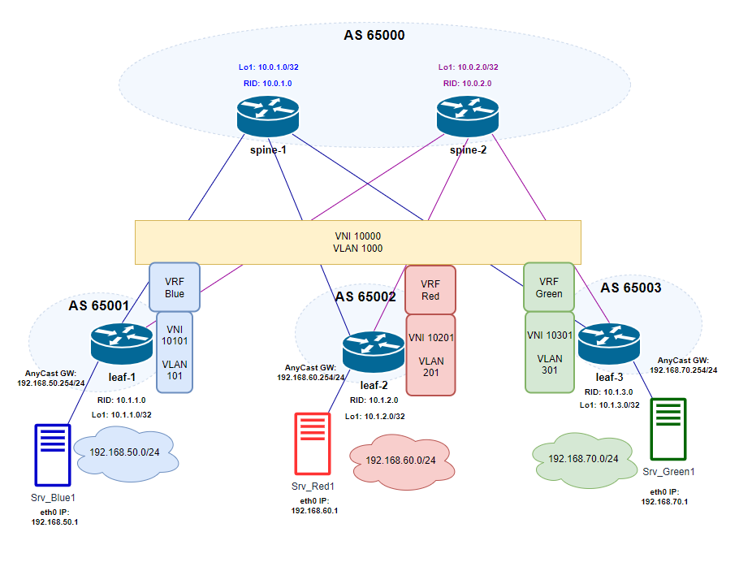

# Домашнее задание №6
## VXLAN L3 VNI

## Цель:
- ### Настроить маршрутизацию в рамках Overlay между клиентами c использованием VXLAN L3VNI

## Выполнение
### Схема сети

### Распределение идентификаторов
|  Клиент |  Subnet  | GW  | Srv IP addr  | VNI  | VLAN  | Vrf | Leaf N |
| :------------: | :------------: | :------------: | :------------: | :------------: | :------------: |:------------: |:------------: |
| Blue  | 192.168.50.0/24  | 192.168.50.254  |  192.168.50.1 | 10101  |  101 | Vrf_Blue  |  1 |
| Red  | 192.168.60.0/24  | 192.168.60.254  |  192.168.60.1 | 10201  |  201 | Vrf_Red  |  2 |
| Green  | 192.168.70.0/24  | 192.168.70.254  |  192.168.70.1 | 10301  |  301 | Vrf_Green  |  3 |

#### L3VNI
Vlan: 1000
VNI: 10000

### План работ (на leafs)
- #### Разрешение использования anycast адресов
    - присвоение anycast mac
- #### Конфигурация VRF
- #### Конфигурация клиентских vlan-интерфейсов
    - vlan Id
    - включение в Vrf
    - назначение IP anycast gw
    - назначение на access-порт подключения клиентского сервера
- #### Конфигурация vlan-интерфейса для L3VNI
    - vlan Id
    - включение в Vrf
    - отключение режима autostate (чтобы интерфейс был в Up)
- #### Конфигурация VTEP
    - назначение source ip = Lo1 ip
    - маппинг VNI - VLAN
    - маппмнг L3VNI - VRF
- #### Конфигурация EVPN
    - конфигурация AF l2vpn evpn
        - advertise-all-vni
        - настройка RT (auto), RD
    - активация AF l2vpn evpn для peer group      

### План работ (на spine)
- #### Конфигурация EVPN
    - конфигурация AF l2vpn evpn
    - активация AF l2vpn evpn для peer group  

Конфигурация underlay соответствует [eBGP underlay из lab04](/Homework/04_work_ebgp_UL/lab04.md)

### Конфигурация оборудования

- spine-1,2: EVPN 
  
        configure
        router bgp 65000
        peer-group LEAFS
        address-family l2vpn evpn
        activate
        end

- leaf-1. 
  - Anycast

        config
        ip anycast-address enable
        ip anycast-mac-address 00:00:00:01:02:03
        end
  - Vrf

        config
        ip vrf Vrf_Blue
        end

  - Client Vlan

        config
        vlan 101
        description client_Blue_acc_Vlan
        exit
        interface Vlan 101
        description client_Blue_acc_Vlan
        ip vrf forwarding Vrf_Blue
        ip anycast-address 192.168.50.254/24
        neigh-suppress
        exit
        exit
        config
        interface Ethernet 3
        description client_Blue_access
        switchport access Vlan 101
        end

  - L3VNI Vlan

        conf
        vlan 1000
        description l3vni_vlan
        exit
        interface vlan 1000
        description l3vni_vlan
        ip vrf forwarding Vrf_Blue
        no autostate
        end

  - VTEP

        config
        interface vxlan vtep1
        source-ip 10.1.1.0
        map vni 10000 vlan 1000
        map vni 10000 vrf Vrf_Blue
        map vni 10101 vlan 101
        end
  - EVPN

        conf
        router bgp 65001
        address-family l2vpn evpn
        advertise-all-vni
        autort rfc8365-compatible 
        rd 10.1.1.0:10
        exit
        peer-group SPINES
        address-family l2vpn evpn
        activate
        end

- leaf-2. 
  - Anycast

        config
        ip anycast-address enable
        ip anycast-mac-address 00:00:00:01:02:03
        end
  - Vrf

        config
        ip vrf Vrf_Red
        end

  - Client Vlan

        config
        vlan 201
        description client_Red_acc_Vlan
        exit
        interface Vlan 201
        description client_Red_acc_Vlan
        ip vrf forwarding Vrf_Red
        ip anycast-address 192.168.60.254/24
        neigh-suppress
        exit
        exit
        config
        interface Ethernet 3
        description client_Red_access
        switchport access Vlan 201
        end

  - L3VNI Vlan

        conf
        vlan 1000
        description l3vni_vlan
        exit
        interface vlan 1000
        description l3vni_vlan
        ip vrf forwarding Vrf_Red
        no autostate
        end

  - VTEP

        config
        interface vxlan vtep1
        source-ip 10.1.2.0
        map vni 10000 vlan 1000
        map vni 10000 vrf Vrf_Red
        map vni 10201 vlan 201
        end
  - EVPN

        conf
        router bgp 65002
        address-family l2vpn evpn
        advertise-all-vni
        autort rfc8365-compatible 
        rd 10.1.2.0:10
        exit
        peer-group SPINES
        address-family l2vpn evpn
        activate
        end

- leaf-3. 
  - Anycast

        config
        ip anycast-address enable
        ip anycast-mac-address 00:00:00:01:02:03
        end
  - Vrf

        config
        ip vrf Vrf_Green
        end

  - Client Vlan

        config
        vlan 301
        description client_Green_acc_Vlan
        exit
        interface Vlan 301
        description client_Green_acc_Vlan
        ip vrf forwarding Vrf_Green
        ip anycast-address 192.168.70.254/24
        neigh-suppress
        exit
        exit
        config
        interface Ethernet 3
        description client_Green_access
        switchport access Vlan 301
        end

  - L3VNI Vlan

        conf
        vlan 1000
        description l3vni_vlan
        exit
        interface vlan 1000
        description l3vni_vlan
        ip vrf forwarding Vrf_Green
        no autostate
        end

  - VTEP

        config
        interface vxlan vtep1
        source-ip 10.1.3.0
        map vni 10000 vlan 1000
        map vni 10000 vrf Vrf_Green
        map vni 10301 vlan 301
        end
  - EVPN

        conf
        router bgp 65003
        address-family l2vpn evpn
        advertise-all-vni
        autort rfc8365-compatible 
        rd 10.1.3.0:10
        exit
        peer-group SPINES
        address-family l2vpn evpn
        activate
        end

### Проверка состояния VXLAN
- leaf-1:

        leaf-1# show vxlan interface

        VTEP Name        :  vtep1
        VTEP Source IP   :  10.1.1.0
        EVPN NVO Name    :  nvo1
        EVPN VTEP        :  vtep1
        Source Interface :  Loopback1
        PrimaryIP Interface :  Not Configured

        leaf-1# show vxlan vlanvnimap
        VLAN      VNI
        ======    =====
        Vlan1000  10000
        Vlan101   10101
        Total count :    2

        leaf-1# show vxlan vrfvnimap
        VRF       VNI
        ======    =====
        Vrf_Blue  10000

- leaf-2:

        leaf-2# show vxlan interface

        VTEP Name        :  vtep1
        VTEP Source IP   :  10.1.2.0
        EVPN NVO Name    :  nvo1
        EVPN VTEP        :  vtep1
        Source Interface :  Loopback1
        PrimaryIP Interface :  Not Configured

        leaf-2# show vxlan vlanvnimap
        VLAN      VNI
        ======    =====
        Vlan1000  10000
        Vlan201   10201
        Total count :    2

        leaf-2# show vxlan vrfvnimap
        VRF       VNI
        ======    =====
        Vrf_Red  10000

- leaf-3:

        leaf-3# show vxlan interface

        VTEP Name        :  vtep1
        VTEP Source IP   :  10.1.3.0
        EVPN NVO Name    :  nvo1
        EVPN VTEP        :  vtep1
        Source Interface :  Loopback1
        PrimaryIP Interface :  Not Configured

        leaf-3# show vxlan vlanvnimap
        VLAN      VNI
        ======    =====
        Vlan1000  10000
        Vlan301   10301
        Total count :    2

        leaf-3# show vxlan vrfvnimap
        VRF       VNI
        ======    =====
        Vrf_Green  10000

### Проверка состояния EVPN (frr - vtysh)

- leaf-1:

        leaf-1# show evpn
        L2 VNIs: 1
        L3 VNIs: 1
        Advertise gateway mac-ip: No
        Advertise svi mac-ip: No
        Advertise svi mac: No
        Duplicate address detection: Enable
        Detection max-moves 5, time 180
        EVPN MH:
        mac-holdtime: 1080s, neigh-holdtime: 1080s
        startup-delay: 180s, start-delay-timer: --:--:--
        uplink-cfg-cnt: 0, uplink-active-cnt: 0

        leaf-1# show evpn vni 10000
        VNI: 10000
        Type: L3
        Tenant VRF: Vrf_Blue
        Local Vtep Ip: 10.1.1.0
        Vxlan-Intf: vtep1-1000
        SVI-If: Vlan1000
        State: Up
        VNI Filter: none
        System MAC: 50:13:00:03:00:00
        Router MAC: 50:13:00:03:00:00
        L2 VNIs: 10101

        leaf-1# show evpn vni 10101
        VNI: 10101
        Type: L2
        Tenant VRF: Vrf_Blue
        VxLAN interface: vtep1-101
        VxLAN ifIndex: 76
        SVI interface: Vlan101
        SVI ifIndex: 73
        Local VTEP IP: 10.1.1.0
        Mcast group: 0.0.0.0
        No remote VTEPs known for this VNI
        Number of MACs (local and remote) known for this VNI: 1
        Number of ARPs (IPv4 and IPv6, local and remote) known for this VNI: 1
        Advertise-gw-macip: No
        Advertise-svi-macip: No

        leaf-1# show bgp l2vpn evpn route type macip
        BGP table version is 52, local router ID is 10.1.1.0
        Status codes: s suppressed, d damped, h history, * valid, > best, i - internal
        Origin codes: i - IGP, e - EGP, ? - incomplete
        EVPN type-1 prefix: [1]:[EthTag]:[ESI]:[IPlen]:[VTEP-IP]:[Frag-id]
        EVPN type-2 prefix: [2]:[EthTag]:[MAClen]:[MAC]:[IPlen]:[IP]
        EVPN type-3 prefix: [3]:[EthTag]:[IPlen]:[OrigIP]
        EVPN type-4 prefix: [4]:[ESI]:[IPlen]:[OrigIP]
        EVPN type-5 prefix: [5]:[EthTag]:[IPlen]:[IP]

        Network          Next Hop            Metric LocPrf Weight Path
                        Extended Community
        Route Distinguisher: 10.1.1.0:3
        *> [2]:[0]:[48]:[50:13:00:06:00:00]
                        10.1.1.0
                                                        32768 i
                        ET:8 RT:65001:268445557
        *> [2]:[0]:[48]:[50:13:00:06:00:00]:[32]:[192.168.50.1]
                        10.1.1.0
                                                        32768 i
                        ET:8 RT:65001:268445557 RT:65001:10000 Rmac:50:13:00:03:00:00
        Route Distinguisher: 10.1.2.0:3
        *  [2]:[0]:[48]:[50:13:00:07:00:00]
                        10.1.2.0
                                                                0 65000 65002 i
                        RT:65002:268445657 ET:8
        *> [2]:[0]:[48]:[50:13:00:07:00:00]
                        10.1.2.0
                                                                0 65000 65002 i
                        RT:65002:268445657 ET:8
        *  [2]:[0]:[48]:[50:13:00:07:00:00]:[32]:[192.168.60.1]
                        10.1.2.0
                                                                0 65000 65002 i
                        RT:65002:10000 RT:65002:268445657 ET:8 Rmac:50:13:00:04:00:00
        *> [2]:[0]:[48]:[50:13:00:07:00:00]:[32]:[192.168.60.1]
                        10.1.2.0
                                                                0 65000 65002 i
                        RT:65002:10000 RT:65002:268445657 ET:8 Rmac:50:13:00:04:00:00
        Route Distinguisher: 10.1.3.0:3
        *  [2]:[0]:[48]:[50:13:00:08:00:00]
                        10.1.3.0
                                                                0 65000 65003 i
                        RT:65003:268445757 ET:8
        *> [2]:[0]:[48]:[50:13:00:08:00:00]
                        10.1.3.0
                                                                0 65000 65003 i
                        RT:65003:268445757 ET:8
        *  [2]:[0]:[48]:[50:13:00:08:00:00]:[32]:[192.168.70.1]
                        10.1.3.0
                                                                0 65000 65003 i
                        RT:65003:10000 RT:65003:268445757 ET:8 Rmac:50:13:00:05:00:00
        *> [2]:[0]:[48]:[50:13:00:08:00:00]:[32]:[192.168.70.1]
                        10.1.3.0
                                                                0 65000 65003 i
                        RT:65003:10000 RT:65003:268445757 ET:8 Rmac:50:13:00:05:00:00

        Displayed 6 prefixes (10 paths) (of requested type)

- leaf-2:

        leaf-2# show evpn
        L2 VNIs: 1
        L3 VNIs: 1
        Advertise gateway mac-ip: No
        Advertise svi mac-ip: No
        Advertise svi mac: No
        Duplicate address detection: Enable
        Detection max-moves 5, time 180
        EVPN MH:
        mac-holdtime: 1080s, neigh-holdtime: 1080s
        startup-delay: 180s, start-delay-timer: --:--:--
        uplink-cfg-cnt: 0, uplink-active-cnt: 0

        leaf-2# show evpn vni 10000
        VNI: 10000
        Type: L3
        Tenant VRF: Vrf_Red
        Local Vtep Ip: 10.1.2.0
        Vxlan-Intf: vtep1-1000
        SVI-If: Vlan1000
        State: Up
        VNI Filter: none
        System MAC: 50:13:00:04:00:00
        Router MAC: 50:13:00:04:00:00
        L2 VNIs: 10201

        leaf-2# show evpn vni 10201
        VNI: 10201
        Type: L2
        Tenant VRF: Vrf_Red
        VxLAN interface: vtep1-201
        VxLAN ifIndex: 76
        SVI interface: Vlan201
        SVI ifIndex: 73
        Local VTEP IP: 10.1.2.0
        Mcast group: 0.0.0.0
        No remote VTEPs known for this VNI
        Number of MACs (local and remote) known for this VNI: 1
        Number of ARPs (IPv4 and IPv6, local and remote) known for this VNI: 1
        Advertise-gw-macip: No
        Advertise-svi-macip: No

        leaf-2# show bgp l2vpn evpn route type macip
        BGP table version is 51, local router ID is 10.1.2.0
        Status codes: s suppressed, d damped, h history, * valid, > best, i - internal
        Origin codes: i - IGP, e - EGP, ? - incomplete
        EVPN type-1 prefix: [1]:[EthTag]:[ESI]:[IPlen]:[VTEP-IP]:[Frag-id]
        EVPN type-2 prefix: [2]:[EthTag]:[MAClen]:[MAC]:[IPlen]:[IP]
        EVPN type-3 prefix: [3]:[EthTag]:[IPlen]:[OrigIP]
        EVPN type-4 prefix: [4]:[ESI]:[IPlen]:[OrigIP]
        EVPN type-5 prefix: [5]:[EthTag]:[IPlen]:[IP]

        Network          Next Hop            Metric LocPrf Weight Path
                        Extended Community
        Route Distinguisher: 10.1.1.0:3
        *  [2]:[0]:[48]:[50:13:00:06:00:00]
                        10.1.1.0
                                                                0 65000 65001 i
                        RT:65001:268445557 ET:8
        *> [2]:[0]:[48]:[50:13:00:06:00:00]
                        10.1.1.0
                                                                0 65000 65001 i
                        RT:65001:268445557 ET:8
        *  [2]:[0]:[48]:[50:13:00:06:00:00]:[32]:[192.168.50.1]
                        10.1.1.0
                                                                0 65000 65001 i
                        RT:65001:10000 RT:65001:268445557 ET:8 Rmac:50:13:00:03:00:00
        *> [2]:[0]:[48]:[50:13:00:06:00:00]:[32]:[192.168.50.1]
                        10.1.1.0
                                                                0 65000 65001 i
                        RT:65001:10000 RT:65001:268445557 ET:8 Rmac:50:13:00:03:00:00
        Route Distinguisher: 10.1.2.0:3
        *> [2]:[0]:[48]:[50:13:00:07:00:00]
                        10.1.2.0
                                                        32768 i
                        ET:8 RT:65002:268445657
        *> [2]:[0]:[48]:[50:13:00:07:00:00]:[32]:[192.168.60.1]
                        10.1.2.0
                                                        32768 i
                        ET:8 RT:65002:268445657 RT:65002:10000 Rmac:50:13:00:04:00:00
        Route Distinguisher: 10.1.3.0:3
        *  [2]:[0]:[48]:[50:13:00:08:00:00]
                        10.1.3.0
                                                                0 65000 65003 i
                        RT:65003:268445757 ET:8
        *> [2]:[0]:[48]:[50:13:00:08:00:00]
                        10.1.3.0(kornfeld)
                                                                0 65000 65003 i
                        RT:65003:268445757 ET:8
        *  [2]:[0]:[48]:[50:13:00:08:00:00]:[32]:[192.168.70.1]
                        10.1.3.0
                                                                0 65000 65003 i
                        RT:65003:10000 RT:65003:268445757 ET:8 Rmac:50:13:00:05:00:00
        *> [2]:[0]:[48]:[50:13:00:08:00:00]:[32]:[192.168.70.1]
                        10.1.3.0
                                                                0 65000 65003 i
                        RT:65003:10000 RT:65003:268445757 ET:8 Rmac:50:13:00:05:00:00

        Displayed 6 prefixes (10 paths) (of requested type)

- leaf-3:
        leaf-3# show evpn
        L2 VNIs: 1
        L3 VNIs: 1
        Advertise gateway mac-ip: No
        Advertise svi mac-ip: No
        Advertise svi mac: No
        Duplicate address detection: Enable
        Detection max-moves 5, time 180
        EVPN MH:
        mac-holdtime: 1080s, neigh-holdtime: 1080s
        startup-delay: 180s, start-delay-timer: --:--:--
        uplink-cfg-cnt: 0, uplink-active-cnt: 0

        leaf-3# show evpn vni 10000
        VNI: 10000
        Type: L3
        Tenant VRF: Vrf_Green
        Local Vtep Ip: 10.1.3.0
        Vxlan-Intf: vtep1-1000
        SVI-If: Vlan1000
        State: Up
        VNI Filter: none
        System MAC: 50:13:00:05:00:00
        Router MAC: 50:13:00:05:00:00
        L2 VNIs: 10301

        leaf-3# show evpn vni 10301
        VNI: 10301
        Type: L2
        Tenant VRF: Vrf_Green
        VxLAN interface: vtep1-301
        VxLAN ifIndex: 76
        SVI interface: Vlan301
        SVI ifIndex: 73
        Local VTEP IP: 10.1.3.0
        Mcast group: 0.0.0.0
        No remote VTEPs known for this VNI
        Number of MACs (local and remote) known for this VNI: 1
        Number of ARPs (IPv4 and IPv6, local and remote) known for this VNI: 1
        Advertise-gw-macip: No
        Advertise-svi-macip: No

        leaf-3# show bgp l2vpn evpn route type macip
        BGP table version is 47, local router ID is 10.1.3.0
        Status codes: s suppressed, d damped, h history, * valid, > best, i - internal
        Origin codes: i - IGP, e - EGP, ? - incomplete
        EVPN type-1 prefix: [1]:[EthTag]:[ESI]:[IPlen]:[VTEP-IP]:[Frag-id]
        EVPN type-2 prefix: [2]:[EthTag]:[MAClen]:[MAC]:[IPlen]:[IP]
        EVPN type-3 prefix: [3]:[EthTag]:[IPlen]:[OrigIP]
        EVPN type-4 prefix: [4]:[ESI]:[IPlen]:[OrigIP]
        EVPN type-5 prefix: [5]:[EthTag]:[IPlen]:[IP]

        Network          Next Hop            Metric LocPrf Weight Path
                        Extended Community
        Route Distinguisher: 10.1.1.0:3
        *  [2]:[0]:[48]:[50:13:00:06:00:00]
                        10.1.1.0
                                                                0 65000 65001 i
                        RT:65001:268445557 ET:8
        *> [2]:[0]:[48]:[50:13:00:06:00:00]
                        10.1.1.0
                                                                0 65000 65001 i
                        RT:65001:268445557 ET:8
        *  [2]:[0]:[48]:[50:13:00:06:00:00]:[32]:[192.168.50.1]
                        10.1.1.0
                                                                0 65000 65001 i
                        RT:65001:10000 RT:65001:268445557 ET:8 Rmac:50:13:00:03:00:00
        *> [2]:[0]:[48]:[50:13:00:06:00:00]:[32]:[192.168.50.1]
                        10.1.1.0
                                                                0 65000 65001 i
                        RT:65001:10000 RT:65001:268445557 ET:8 Rmac:50:13:00:03:00:00
        Route Distinguisher: 10.1.2.0:3
        *> [2]:[0]:[48]:[50:13:00:07:00:00]
                        10.1.2.0
                                                                0 65000 65002 i
                        RT:65002:268445657 ET:8
        *  [2]:[0]:[48]:[50:13:00:07:00:00]
                        10.1.2.0
                                                                0 65000 65002 i
                        RT:65002:268445657 ET:8
        *> [2]:[0]:[48]:[50:13:00:07:00:00]:[32]:[192.168.60.1]
                        10.1.2.0
                                                                0 65000 65002 i
                        RT:65002:10000 RT:65002:268445657 ET:8 Rmac:50:13:00:04:00:00
        *  [2]:[0]:[48]:[50:13:00:07:00:00]:[32]:[192.168.60.1]
                        10.1.2.0
                                                                0 65000 65002 i
                        RT:65002:10000 RT:65002:268445657 ET:8 Rmac:50:13:00:04:00:00
        Route Distinguisher: 10.1.3.0:3
        *> [2]:[0]:[48]:[50:13:00:08:00:00]
                        10.1.3.0
                                                        32768 i
                        ET:8 RT:65003:268445757
        *> [2]:[0]:[48]:[50:13:00:08:00:00]:[32]:[192.168.70.1]
                        10.1.3.0
                                                        32768 i
                        ET:8 RT:65003:268445757 RT:65003:10000 Rmac:50:13:00:05:00:00

        Displayed 6 prefixes (10 paths) (of requested type)

#### Проверка связности между клиентами
 - от Srv_Blue1

        //to Srv_Red1//
                vyos@vyos:~$ ping 192.168.60.1
                PING 192.168.60.1 (192.168.60.1) 56(84) bytes of data.
                64 bytes from 192.168.60.1: icmp_seq=1 ttl=62 time=1.70 ms
                64 bytes from 192.168.60.1: icmp_seq=2 ttl=62 time=1.86 ms
                64 bytes from 192.168.60.1: icmp_seq=3 ttl=62 time=1.86 ms

        
        //to Srv_Green1//
                vyos@vyos:~$ ping 192.168.70.1
                PING 192.168.70.1 (192.168.70.1) 56(84) bytes of data.
                64 bytes from 192.168.70.1: icmp_seq=1 ttl=62 time=2.22 ms
                64 bytes from 192.168.70.1: icmp_seq=2 ttl=62 time=2.34 ms
                64 bytes from 192.168.70.1: icmp_seq=3 ttl=62 time=1.80 ms
                64 bytes from 192.168.70.1: icmp_seq=4 ttl=62 time=2.05 ms

