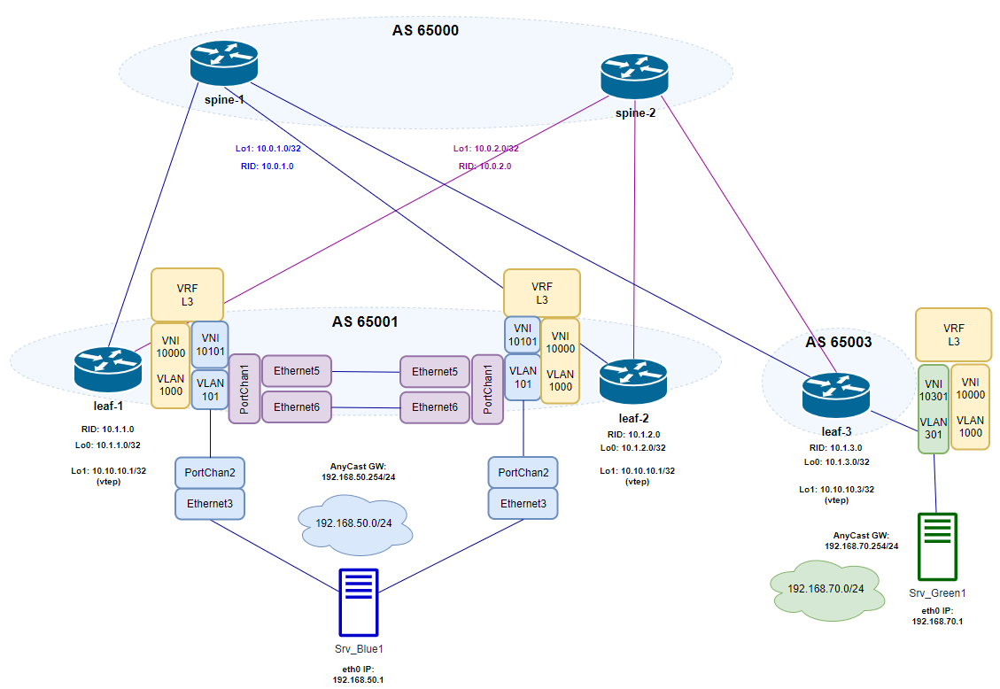

# Домашнее задание №7
## MCLAG с поддержкой VXLAN

## Цель:
- ### Настроить агрегированное подключение клиента к двум leaf, объединенным через MCLAG (Dell Sonic Enterprise)

## Выполнение
### Схема сети

### Распределение идентификаторов

#### Underlay (eBGP) & vtep
|  node |  RID | Lo0 (rid) | Lo1 (vtep)  | AS  |
| :------------: | :------------: | :------------: | :------------: | :------------: |
| spine-1 | 10.0.1.0  | 10.0.1.0/32  |   | 65000  |
| spine-2 | 10.0.2.0  | 10.0.2.0/32  |   | 65000  |
| leaf-1 | 10.1.1.0  | 10.1.1.0/32  | 10.10.10.1/32 | 65001  |
| leaf-2 | 10.1.2.0  | 10.1.2.0/32  | 10.10.10.1/32 | 65001  |
| leaf-3 | 10.1.3.0  | 10.1.3.0/32  | 10.10.10.3/32 | 65003  |

#### Overlay
|  Клиент |  Subnet  | GW  | Srv IP addr  | VNI  | VLAN  | Vrf | Leaf N |
| :------------: | :------------: | :------------: | :------------: | :------------: | :------------: |:------------: |:------------: |
| Blue  | 192.168.50.0/24  | 192.168.50.254  |  192.168.50.1 | 10101  |  101 | Vrf_L3  |  1-2 |
| Green  | 192.168.70.0/24  | 192.168.70.254  |  192.168.70.1 | 10301  |  301 | Vrf_L3  |  3 |

#### L3VNI
    Vlan: 1000
    VNI: 10000

### План работ

#### Underlay eBGP
#####  spines
 - Настройка интерфейсов Ethernet, Loopback
   - Ethetrnet - ipv6
 - Настройка eBGP router
   - AS, RID
   - AF ipv4, AF l2vpn evpn
   - eBGP peers на интерфейсах в сторону leaf

#####  leafs
 - Настройка интерфейсов Ethernet, Loopback
   - Ethernet в сторону spine - ipv6
 - Настройка eBGP router
   - AS, RID
   - AF ipv4, AF l2vpn evpn
   - eBGP peers на интерфейсах в сторону spine  

#### Overlay
##### leafs
- Разрешение использования anycast адресов
  - присвоение anycast mac
- Конфигурация VRF
- Конфигурация клиентских vlan-интерфейсов
    - vlan Id
    - включение в Vrf
    - назначение IP anycast gw
    - отключение режима autostate (чтобы интерфейс был в Up)
- Конфигурация vlan-интерфейса для L3VNI (SymmIRB)
    - vlan Id
    - включение в Vrf
    - отключение режима autostate (чтобы интерфейс был в Up)
- Конфигурация VTEP
    - назначение source ip = Lo1 ip
    - маппинг VNI - VLAN
    - маппмнг L3VNI - VRF

#### MCLAG
##### leafs 1, 2
- Конфигурация MCLAG peer-link Portchannel
  - режим active fallback fast_rate
  - режим trunk с разрешением client vlanid, l3vni vlanid
- Конфигурация client Portchannel
  - режим om (static)
  - режим access с разрешением client vlanid
- Конфигурация mclag domain
  - source/peer-ip
  - peer-link (PortChannel)
  - mclag system mac
  - таймеры

#### Настройка клиентов
- Конфигурация агрегированного подключения клиента
  - vlan интерфейс с ip адресом
  - Portchannel в static mode
  - static route
- Конфигурация одиночного подключения клиента (leaf-3)

### Конфигурация оборудования
- spine-1 

        config
        hostname spine-1
        end
        write memory

        config
        port-group 1 speed 10000
        port-group 2 speed 10000
        end
        write memory

        config
        interface Loopback 0
        description router-id
        ip address 10.0.1.0/32
        exit
        !
        interface Ethernet 1
        description to_leaf-1
        mtu 9000
        speed 1000
        no shutdown
        ipv6 enable
        exit
        !
        interface Ethernet 2
        description to_leaf-2
        mtu 9000
        speed 1000
        no shutdown
        ipv6 enable
        exit
        !
        interface Ethernet 3
        description to_leaf-3
        mtu 9000
        speed 1000
        no shutdown
        ipv6 enable
        exit
        !
        router bgp 65000
        router-id 10.0.1.0
        log-neighbor-changes
        bestpath as-path multipath-relax
        timers 60 180
        !
        address-family ipv4 unicast
        redistribute connected
        maximum-paths 2
        maximum-paths ibgp 1
        exit
        !
        peer-group LEAFS
        timers 3 9
        timers connect 12
        bfd
        advertisement-interval 0
        capability extended-nexthop
        !
        address-family ipv4 unicast
        activate
        send-community both
        exit
        !
        address-family l2vpn evpn
        activate
        exit
        exit
        !
        neighbor interface Ethernet1
        peer-group LEAFS
        remote-as 65001
        description leaf-1_peer
        exit
        !
        neighbor interface Ethernet2
        peer-group LEAFS
        remote-as 65001
        description leaf-2_peer
        exit
        !
        neighbor interface Ethernet3
        peer-group LEAFS
        remote-as 65003
        description leaf-3_peer
        exit
        !
        end
        write memory

- spine-2

        config
        hostname spine-2
        end
        write memory

        config
        port-group 1 speed 10000
        port-group 2 speed 10000
        end
        write memory

        config
        interface Loopback 0
        description router-id
        ip address 10.0.2.0/32
        exit
        !
        interface Ethernet 1
        description to_leaf-1
        mtu 9000
        speed 1000
        no shutdown
        ipv6 enable
        exit
        !
        interface Ethernet 2
        description to_leaf-2
        mtu 9000
        speed 1000
        no shutdown
        ipv6 enable
        exit
        !
        interface Ethernet 3
        description to_leaf-3
        mtu 9000
        speed 1000
        no shutdown
        ipv6 enable
        exit
        !
        router bgp 65000
        router-id 10.0.2.0
        log-neighbor-changes
        bestpath as-path multipath-relax
        timers 60 180
        !
        address-family ipv4 unicast
        redistribute connected
        maximum-paths 2
        maximum-paths ibgp 1
        exit
        !
        peer-group LEAFS
        timers 3 9
        timers connect 12
        bfd
        advertisement-interval 0
        capability extended-nexthop
        !
        address-family ipv4 unicast
        activate
        send-community both
        exit
        !
        address-family l2vpn evpn
        activate
        exit
        exit
        !
        neighbor interface Ethernet1
        peer-group LEAFS
        remote-as 65001
        description leaf-1_peer
        exit
        !
        neighbor interface Ethernet2
        peer-group LEAFS
        remote-as 65001
        description leaf-2_peer
        exit
        !
        neighbor interface Ethernet3
        peer-group LEAFS
        remote-as 65003
        description leaf-3_peer
        end
        write memory
        !

- leaf-1 (mclag)

        config
        hostname leaf-1
        end
        write memory

        config
        port-group 1 speed 10000
        port-group 2 speed 10000
        port-group 3 speed 10000
        end
        write memory
        !
        config
        interface Ethernet 1
        description to_spine-1
        mtu 9000
        ipv6 enable
        speed 1000
        no shutdown
        exit
        !
        interface Ethernet 2
        description to_spine-2
        mtu 9000
        ipv6 enable
        speed 1000
        no shutdown
        exit
        !
        interface Ethernet 3
        description ClientBlue_portchan_memeber
        mtu 9000
        speed 1000
        no shutdown
        exit
        !
        interface Ethernet 5
        description MCLAG_peerlink_portchan_memeber
        mtu 9000
        speed 1000
        no shutdown
        exit
        !
        interface Ethernet 6
        description MCLAG_peerlink_portchan_memeber
        mtu 9000
        speed 1000
        no shutdown
        exit
        !
        ip anycast-mac-address 00:00:00:01:02:03
        ip anycast-address enable
        mclag gateway-mac 00:11:00:11:00:11
        !
        ip vrf Vrf_L3
        !
        interface Vlan 101
        description client_Blue_acc_Vlan
        ip vrf forwarding Vrf_L3
        ip anycast-address 192.168.50.254/24
        neigh-suppress
        no autostate
        exit  
        !
        interface Vlan 1000
        description L3_VNI_vlan
        no autostate
        ip vrf forwarding Vrf_L3
        exit
        !
        interface Loopback 0
        description router-id
        ip address 10.1.1.0/32
        exit
        !
        interface Loopback 1
        description lvtep
        ip address 10.10.10.1/32
        exit
        !
        interface PortChannel 1 mode active fallback fast_rate
        mtu 9000
        description MCLAG_Peerlink
        switchport trunk allowed Vlan 101,1000
        no shutdown
        exit
        !
        interface Ethernet 5
        channel-group 1
        exit
        !
        interface Ethernet 6
        channel-group 1
        exit
        !
        mclag domain 1
        source-ip 10.1.1.0
        peer-ip 10.1.2.0
        peer-link PortChannel 1 
        mclag-system-mac 00:00:a1:a1:a1:a1
        keepalive-interval 1
        session-timeout 30
        delay-restore 90
        exit
        !
        interface PortChannel 2 mode on
        mtu 9000
        description Client_Blue_connect
        switchport access Vlan 101
        no shutdown
        mclag 1
        exit
        !
        interface Ethernet 3
        channel-group 2
        exit
        !
        router bgp 65001 vrf Vrf_L3
        router-id 10.1.1.0
        log-neighbor-changes
        timers 60 180
        !
        address-family ipv4 unicast
        redistribute connected
        maximum-paths 2
        maximum-paths ibgp 1
        exit 
        !
        address-family l2vpn evpn
        advertise ipv4 unicast
        exit
        exit 
        !
        router bgp 65001
        router-id 10.1.1.0
        log-neighbor-changes
        bestpath as-path multipath-relax
        timers 60 180
        !
        address-family ipv4 unicast
        redistribute connected
        maximum-paths 2
        maximum-paths ibgp 1
        exit 
        !
        address-family l2vpn evpn
        advertise-all-vni
        exit
        !
        peer-group SPINES
        timers 3 9
        timers connect 12
        remote-as 65000
        advertisement-interval 0
        capability extended-nexthop
        bfd
        !
        address-family ipv4 unicast
        activate
        allowas-in 2
        send-community both
        exit
        !
        address-family l2vpn evpn
        activate
        exit
        exit 
        !
        neighbor interface Ethernet 1
        description spine-1_peer
        peer-group SPINES
        exit
        !
        neighbor interface Ethernet 2
        description spine-2_peer
        peer-group SPINES
        exit
        exit
        !
        interface vxlan vtep1
        source-ip 10.10.10.1
        map vni 10101 vlan 101
        map vni 10000 vlan 1000 
        map vni 10000 vrf Vrf_L3
        end
        write memory

- leaf-2 (mclag)

        config
        hostname leaf-2
        end
        write memory

        config
        port-group 1 speed 10000
        port-group 2 speed 10000
        port-group 3 speed 10000
        end
        write memory
        !
        config
        interface Ethernet 1
        description to_spine-1
        mtu 9000
        ipv6 enable
        speed 1000
        no shutdown
        exit
        !
        interface Ethernet 2
        description to_spine-2
        mtu 9000
        ipv6 enable
        speed 1000
        no shutdown
        exit
        !
        interface Ethernet 3
        description ClientBlue_portchan_memeber
        mtu 9000
        speed 1000
        no shutdown
        exit
        !
        interface Ethernet 5
        description MCLAG_peerlink_portchan_memeber
        mtu 9000
        speed 1000
        no shutdown
        exit
        !
        interface Ethernet 6
        description MCLAG_peerlink_portchan_memeber
        mtu 9000
        speed 1000
        no shutdown
        exit
        !
        ip anycast-mac-address 00:00:00:01:02:03
        ip anycast-address enable
        mclag gateway-mac 00:11:00:11:00:11
        !
        ip vrf Vrf_L3
        !
        interface Vlan 101
        description client_Blue_acc_Vlan
        ip vrf forwarding Vrf_L3
        ip anycast-address 192.168.50.254/24
        neigh-suppress
        no autostate
        exit  
        !
        interface Vlan 1000
        description L3_VNI_vlan
        no autostate
        ip vrf forwarding Vrf_L3
        exit
        !
        interface Loopback 0
        description router-id
        ip address 10.1.2.0/32
        exit
        !
        interface Loopback 1
        description lvtep
        ip address 10.10.10.1/32
        exit
        !
        interface PortChannel 1 mode active fallback fast_rate
        mtu 9000
        description MCLAG_Peerlink
        switchport trunk allowed Vlan 101,1000
        no shutdown
        exit
        !
        interface Ethernet 5
        channel-group 1
        exit
        !
        interface Ethernet 6
        channel-group 1
        exit
        !
        mclag domain 1
        source-ip 10.1.2.0
        peer-ip 10.1.1.0
        peer-link PortChannel 1 
        mclag-system-mac 00:00:a1:a1:a1:a1
        keepalive-interval 1
        session-timeout 30
        delay-restore 90
        exit
        !
        interface PortChannel 2 mode on
        mtu 9000
        description Client_Blue_connect
        switchport access Vlan 101
        no shutdown
        mclag 1
        exit
        !
        interface Ethernet 3
        channel-group 2
        exit
        !
        router bgp 65001 vrf Vrf_L3
        router-id 10.1.2.0
        log-neighbor-changes
        timers 60 180
        !
        address-family ipv4 unicast
        redistribute connected
        maximum-paths 2
        maximum-paths ibgp 1
        exit 
        !
        address-family l2vpn evpn
        advertise ipv4 unicast
        exit
        exit 
        !
        router bgp 65001
        router-id 10.1.2.0
        log-neighbor-changes
        bestpath as-path multipath-relax
        timers 60 180
        !
        address-family ipv4 unicast
        redistribute connected
        maximum-paths 2
        maximum-paths ibgp 1
        exit 
        !
        address-family l2vpn evpn
        advertise-all-vni
        exit
        !
        peer-group SPINES
        timers 3 9
        timers connect 12
        remote-as 65000
        advertisement-interval 0
        capability extended-nexthop
        bfd
        !
        address-family ipv4 unicast
        activate
        allowas-in 2
        send-community both
        exit
        !
        address-family l2vpn evpn
        activate
        exit
        exit 
        !
        neighbor interface Ethernet 1
        description spine-1_peer
        peer-group SPINES
        exit
        !
        neighbor interface Ethernet 2
        description spine-2_peer
        peer-group SPINES
        exit
        exit
        !
        interface vxlan vtep1
        source-ip 10.10.10.1
        map vni 10101 vlan 101
        map vni 10000 vlan 1000 
        map vni 10000 vrf Vrf_L3
        end
        write memory

- leaf-3

        config
        hostname leaf-3
        end
        write memory

        config
        port-group 1 speed 10000
        port-group 2 speed 10000
        port-group 3 speed 10000
        end
        write memory
        !
        config
        interface Ethernet 1
        description to_spine-1
        mtu 9000
        ipv6 enable
        speed 1000
        no shutdown
        exit
        !
        interface Ethernet 2
        description to_spine-2
        mtu 9000
        ipv6 enable
        speed 1000
        no shutdown
        exit
        !
        interface Ethernet 3
        description ClientGreen_access
        mtu 9000
        speed 1000
        no shutdown
        exit
        !
        ip anycast-mac-address 00:00:00:01:02:03
        ip anycast-address enable
        !
        ip vrf Vrf_L3
        !
        interface Vlan 301
        description client_Green_acc_Vlan
        ip vrf forwarding Vrf_L3
        ip anycast-address 192.168.70.254/24
        neigh-suppress
        no autostate
        exit  
        !
        interface Vlan 1000
        description L3_VNI_vlan
        no autostate
        ip vrf forwarding Vrf_L3
        exit
        !
        interface Loopback 0
        description router-id
        ip address 10.1.3.0/32
        exit
        !
        interface Loopback 1
        description lvtep
        ip address 10.10.10.3/32
        exit
        !
        interface Ethernet 3
        switchport access Vlan 301
        exit
        !
        router bgp 65003 vrf Vrf_L3
        router-id 10.1.3.0
        log-neighbor-changes
        timers 60 180
        !
        address-family ipv4 unicast
        redistribute connected
        maximum-paths 1
        maximum-paths ibgp 1
        exit 
        !
        address-family l2vpn evpn
        advertise ipv4 unicast
        exit
        exit 
        !
        router bgp 65003
        router-id 10.1.3.0
        log-neighbor-changes
        bestpath as-path multipath-relax
        timers 60 180
        !
        address-family ipv4 unicast
        redistribute connected
        maximum-paths 2
        maximum-paths ibgp 1
        exit 
        !
        address-family l2vpn evpn
        advertise-all-vni
        exit
        !
        peer-group SPINES
        timers 3 9
        timers connect 12
        remote-as 65000
        advertisement-interval 0
        capability extended-nexthop
        bfd
        !
        address-family ipv4 unicast
        activate
        allowas-in 2
        send-community both
        exit
        !
        address-family l2vpn evpn
        activate
        exit
        exit 
        !
        neighbor interface Ethernet 1
        description spine-1_peer
        peer-group SPINES
        exit
        !
        neighbor interface Ethernet 2
        description spine-2_peer
        peer-group SPINES
        exit
        exit
        !
        interface vxlan vtep1
        source-ip 10.10.10.3
        map vni 10301 vlan 301
        map vni 10000 vlan 1000 
        map vni 10000 vrf Vrf_L3
        end
        write memory

### Конфигурация клиентов
#### Агрегированное подключение клиента (Sonic Dell)

- SrvBlue2

        config
        hostname SrvBlue2
        end
        write memory

        config
        port-group 1 speed 10000
        end
        write memory

        config
        interface Vlan 101
        ip address 192.168.50.1/24
        exit
        !
        interface PortChannel 1 mode on
        switchport access Vlan 101
        mtu 9000
        no shutdown
        exit
        !
        interface Ethernet 1
        mtu 9000
        speed 1000
        fec none
        channel-group 1
        no shutdown
        exit
        !
        interface Ethernet 2
        mtu 9000
        speed 1000
        fec none
        channel-group 1
        no shutdown
        exit
        !
        ip route 192.0.0.0/8 192.168.50.254
        end
        write memory

#### Одиночное подключение клиента (Vyos)
        set interfaces ethernet eth0 address 192.168.70.1/24 
        set protocols static route 0.0.0.0/0 next-hop 192.168.70.254

### Проверка настройки MCLAG

#### Статус MCLAG
- leaf-1

        leaf-1# show mclag brief

        Domain ID            : 1
        Role                 : active
        Session Status       : up
        Peer Link Status     : up
        Source Address       : 10.1.1.0
        Peer Address         : 10.1.2.0
        Peer Link            : PortChannel1
        Keepalive Interval   : 1 secs
        Session Timeout      : 30 secs
        Delay Restore        : 90 secs
        System Mac           : 50:00:10:0a:00:99
        Mclag System Mac     : 00:00:a1:a1:a1:a1
        Gateway Mac          : 00:11:00:11:00:11

        Number of MLAG Interfaces:1
        -----------------------------------------------------------
        MLAG Interface       Local/Remote Status
        -----------------------------------------------------------
        PortChannel2             up/up

- leaf-2

        leaf-2# show mclag brief

        Domain ID            : 1
        Role                 : standby
        Session Status       : up
        Peer Link Status     : up
        Source Address       : 10.1.2.0
        Peer Address         : 10.1.1.0
        Peer Link            : PortChannel1
        Keepalive Interval   : 1 secs
        Session Timeout      : 30 secs
        Delay Restore        : 90 secs
        System Mac           : 50:00:10:0a:00:99
        Mclag System Mac     : 00:00:a1:a1:a1:a1
        Gateway Mac          : 00:11:00:11:00:11

        Number of MLAG Interfaces:1
        -----------------------------------------------------------
        MLAG Interface       Local/Remote Status
        -----------------------------------------------------------
        PortChannel2             up/up

#### Маршруты EVPN
    mclag gateway-mac 00:11:00:11:00:11

- leaf-3

        leaf-3# show bgp l2vpn evpn route type macip
        BGP table version is 53, local router ID is 10.1.3.0
        Status codes: s suppressed, d damped, h history, * valid, > best, i - internal
        Origin codes: i - IGP, e - EGP, ? - incomplete
        EVPN type-1 prefix: [1]:[ESI]:[EthTag]
        EVPN type-2 prefix: [2]:[EthTag]:[MAClen]:[MAC]:[IPlen]:[IP]
        EVPN type-3 prefix: [3]:[EthTag]:[IPlen]:[OrigIP]
        EVPN type-4 prefix: [4]:[ESI]:[IPlen]:[OrigIP]
        EVPN type-5 prefix: [5]:[EthTag]:[IPlen]:[IP]
        Network          Next Hop            Metric LocPrf Weight Path
                            Extended Community
        Route Distinguisher: 10.1.1.0:101
        *>   [2]:[0]:[48]:[50:00:88:0a:00:08]
                            10.10.10.1                                     0 65000 65001 i
                            RT:65001:10101 ET:8 MM:1
        *    [2]:[0]:[48]:[50:00:88:0a:00:08]
                            10.10.10.1                                     0 65000 65001 i
                            RT:65001:10101 ET:8 MM:1
        *>   [2]:[0]:[48]:[50:00:88:0a:00:08]:[32]:[192.168.50.1]
                            10.10.10.1                                     0 65000 65001 i
                            RT:65001:10000 RT:65001:10101 ET:8 MM:1 Rmac:00:11:00:11:00:11
        *    [2]:[0]:[48]:[50:00:88:0a:00:08]:[32]:[192.168.50.1]
                            10.10.10.1                                     0 65000 65001 i
                            RT:65001:10000 RT:65001:10101 ET:8 MM:1 Rmac:00:11:00:11:00:11
        Route Distinguisher: 10.1.2.0:101
        *>   [2]:[0]:[48]:[50:00:88:0a:00:08]
                            10.10.10.1                                     0 65000 65001 i
                            RT:65001:10101 ET:8 MM:1
        *    [2]:[0]:[48]:[50:00:88:0a:00:08]
                            10.10.10.1                                     0 65000 65001 i
                            RT:65001:10101 ET:8 MM:1
        *>   [2]:[0]:[48]:[50:00:88:0a:00:08]:[32]:[192.168.50.1]
                            10.10.10.1                                     0 65000 65001 i
                            RT:65001:10000 RT:65001:10101 ET:8 MM:1 Rmac:00:11:00:11:00:11
        *    [2]:[0]:[48]:[50:00:88:0a:00:08]:[32]:[192.168.50.1]
                            10.10.10.1                                     0 65000 65001 i
                            RT:65001:10000 RT:65001:10101 ET:8 MM:1 Rmac:00:11:00:11:00:11
        Route Distinguisher: 10.1.3.0:301
        *>   [2]:[0]:[48]:[50:13:00:08:00:00]
                            10.10.10.3                                 32768 i
                            ET:8 RT:65003:10301
        *>   [2]:[0]:[48]:[50:13:00:08:00:00]:[32]:[192.168.70.1]
                            10.10.10.3                                 32768 i
                            ET:8 RT:65003:10301 RT:65003:10000 Rmac:50:00:30:0a:00:08
        Displayed 6 prefixes (10 paths) (of requested type)

#### Client Ping
- Srv_Green1

        vyos@vyos:~$ ping 192.168.50.1
        PING 192.168.50.1 (192.168.50.1) 56(84) bytes of data.
        64 bytes from 192.168.50.1: icmp_seq=1 ttl=62 time=4.35 ms
        64 bytes from 192.168.50.1: icmp_seq=2 ttl=62 time=2.59 ms
        64 bytes from 192.168.50.1: icmp_seq=3 ttl=62 time=3.71 ms
        ^C
        --- 192.168.50.1 ping statistics ---
        3 packets transmitted, 3 received, 0% packet loss, time 2003ms
        rtt min/avg/max/mdev = 2.585/3.549/4.352/0.730 ms