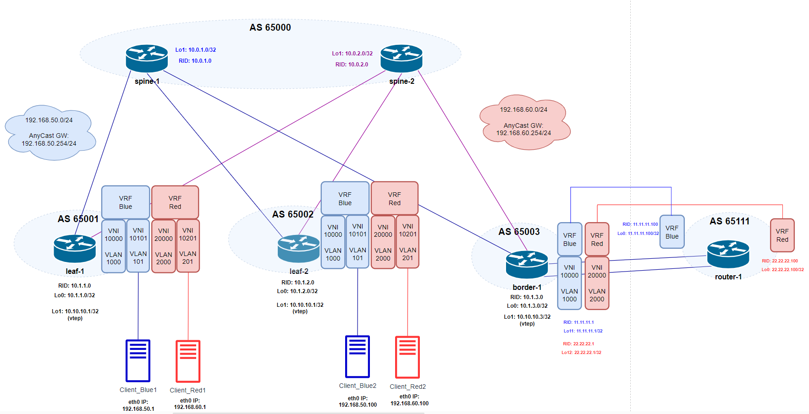

# Домашнее задание №8
## VxLAN. Routing

## Цель:
- ### Реализовать передачу суммарных префиксов через EVPN route-type 5

## Выполнение
### Схема сети

### Распределение идентификаторов

#### L3 links
|  Node A |  Interface A | Node Z | Interface Z  | L3 address A  | L3 address Z  | port mode | vlan id |
| :------------: | :------------: | :------------: | :------------: | :------------: | :------------: | :------------: | :------------: |
| spine-1 |  Ethernet1 | leaf-1 | Ethernet1  | ipv6 LL  | ipv6 LL  |  |   |
| spine-1 |  Ethernet2 | leaf-2 | Ethernet1  | ipv6 LL  | ipv6 LL  |  |   |
| spine-1 |  Ethernet3 | border-1 | Ethernet1  | ipv6 LL  | ipv6 LL  |  |   |
| spine-2 |  Ethernet1 | leaf-1 | Ethernet2  | ipv6 LL  | ipv6 LL  |  |   |
| spine-2 |  Ethernet2 | leaf-2 | Ethernet2  | ipv6 LL  | ipv6 LL  |  |   |
| spine-2 |  Ethernet3 | border-1 | Ethernet2  | ipv6 LL  | ipv6 LL  |  |   |
| leaf-1 |  Ethernet3 | Client_Blue1 | eth0  |  | 192.168.50.1/24 | access | 101 |
| leaf-1 |  Ethernet4 | Client_Red1 | eth0  |  | 192.168.60.1/24 | access | 201 |
| leaf-2 |  Ethernet3 | Client_Blue2 | eth0  |  | 192.168.50.100/24 | access | 101 |
| leaf-2 |  Ethernet4 | Client_Red2 | eth0  |  | 192.168.60.100/24 | access | 201 |
| border-1 |  Ethernet3 | router-1 | Ethernet1  | ipv6 LL  | ipv6 LL  |  |   |
| border-1 |  Ethernet4 | router-1 | Ethernet2  | ipv6 LL  | ipv6 LL  |  |   |

#### Underlay (eBGP) & vtep
|  node |  RID | Lo (rid) | Lo (vtep)  | AS  | VRF  |
| :------------: | :------------: | :------------: | :------------: | :------------: | :------------: |
| spine-1 | 10.0.1.0  | 10.0.1.0/32  |   | 65000  | default |
| spine-2 | 10.0.2.0  | 10.0.2.0/32  |   | 65000  | default |
| leaf-1 | 10.1.1.0  | 10.1.1.0/32  | 10.10.10.1/32 | 65001  | default |
| leaf-2 | 10.1.2.0  | 10.1.2.0/32  | 10.10.10.2/32 | 65002  | default |
| border-1 | 10.1.3.0  | 10.1.3.0/32  | 10.10.10.3/32 | 65003  | default |
| border-1 | 11.11.11.1  | 11.11.11.1/32  | | 65003  | Vrf_Blue |
| border-1 | 22.22.22.1  | 22.22.22.1/32  | | 65003  | Vrf_Red |
| router-1 | 11.11.11.100  | 11.11.11.100/32  | | 65111  | Vrf_Blue |
| router-1 | 22.22.22.100  | 22.22.22.100/32  | | 65111  | Vrf_Red |

#### Overlay
|  Client network |  Subnet  | GW  |  VNI  | VLAN  | Vrf | Leaf N |
| :------------: | :------------: | :------------: | :------------: | :------------: | :------------: |:------------: |
| Blue | 192.168.50.0/24  | 192.168.50.254  | 10101  |  101 | Vrf_Blue  |  1-2 |
| Red  | 192.168.60.0/24  | 192.168.60.254  | 10201  |  201 | Vrf_Red  |  1-2 |

#### L3VNI
|  Клиент |  VLAN  | VNI  | Vrf | Node |
| :------------: | :------------: | :------------: | :------------: | :------------: |
| Blue  | 1000  | 10000  | Vrf_Blue  |  leaf1-2,  border-1 |
| Red  | 2000  | 20000  | Vrf_Red  |  leaf1-2,  border-1 |

#### Клиенты
| Client | eth0 MAC | 
| :------------: | :------------: |
| Client_Blue1 | 50 0a 00 07 00 00 |
| Client_Blue2 | 50:0a:00:08:00:00  |
| Client_Red1 | 50:0a:00:09:00:00  |
| Client_Red2 | 50:0a:00:0a:00:00   |

### План работ

#### Underlay eBGP
#####  spines
 - Настройка интерфейсов Ethernet, Loopback
   - Ethetrnet - ipv6
 - Настройка eBGP router
   - AS, RID
   - AF ipv4, AF l2vpn evpn
   - eBGP peers на интерфейсах в сторону leaf и border

#####  leafs
 - Настройка интерфейсов Ethernet, Loopback
   - Ethernet в сторону spine - ipv6
 - Настройка eBGP router
   - AS, RID
   - AF ipv4, AF l2vpn evpn
   - eBGP peers на интерфейсах в сторону spine  

#####  border
 - Настройка интерфейсов Ethernet, Loopback
   - Ethernet в сторону spine - ipv6
   - Ethernet в сторону ext-router - ipv6
 - Настройка eBGP router default
   - AS, RID
   - AF ipv4, AF l2vpn evpn
   - eBGP peers на интерфейсах в сторону spine   
 - Настройка eBGP Vrf router
   - AS, RID
   - AF ipv4
   - eBGP peers на интерфейсах в сторону ext-router       

#### Overlay
##### leafs
- Разрешение использования anycast адресов
  - присвоение anycast mac
- Конфигурация VRF
- Конфигурация клиентских vlan-интерфейсов
    - vlan Id
    - включение в Vrf
    - назначение IP anycast gw
    - отключение режима autostate (чтобы интерфейс был в Up)
- Конфигурация vlan-интерфейса для L3VNI 
    - vlan Id
    - включение в Vrf
    - отключение режима autostate (чтобы интерфейс был в Up)
- Конфигурация VTEP
    - назначение source ip = Lo1 ip
    - маппинг VNI - VLAN
    - маппмнг L3VNI - VRF

##### border
- Разрешение использования anycast адресов
  - присвоение anycast mac
- Конфигурация VRF
- Конфигурация vlan-интерфейса для L3VNI (SymmIRB)
    - vlan Id
    - включение в Vrf
    - отключение режима autostate (чтобы интерфейс был в Up)
- Конфигурация VTEP
    - назначение source ip = Lo1 ip
    - маппинг VNI - VLAN
    - маппмнг L3VNI - VRF

#### Конфигурация external router
##### border
- Настройка клиентских Vrf
  - prefix-list, route-map для экспорта суммарных маршрутов в сторону ext-router
##### ext-router
- Настройка клиентских eBGP Vrf router
  - AS, RID
  - AF ipv4
  - eBGP peers на интерфейсах в сторону border-1
  - взаимный импорт суммарных маршрутов между Vrf
  - prefix-list, route-map для экспорта импортированных маршрутов в сторону border-1

#### Настройка клиентов
- IP address
- static route

#### Проверка работы схемы
- Статус экспорта суммарных маршрутов border-1 --> router-1
- Статус импорта маршрутов router-1  --> border-1 Vrf Blue <----> Red
- Статус импорта маршрутов border-1 --> leaf 1,2
- Статус bgp объявлений маршрутов с router-1 на leaf-1,2
- Связность между клиентами из разных сетей

### Конфигурация оборудования
#### spine-1
        сonfig
        hostname spine-1
        end
        write memory

        config
        port-group 1 speed 10000
        port-group 2 speed 10000
        end
        write memory

        config
        interface Loopback 0
        description router-id
        ip address 10.0.1.0/32
        exit
        !
        interface Ethernet 1
        description to_leaf-1
        mtu 9000
        speed 1000
        no shutdown
        ipv6 enable
        exit
        !
        interface Ethernet 2
        description to_leaf-2
        mtu 9000
        speed 1000
        no shutdown
        ipv6 enable
        exit
        !
        interface Ethernet 3
        description to_border-1
        mtu 9000
        speed 1000
        no shutdown
        ipv6 enable
        exit
        !
        router bgp 65000
        router-id 10.0.1.0
        log-neighbor-changes
        bestpath as-path multipath-relax
        timers 60 180
        !
        address-family ipv4 unicast
        redistribute connected
        maximum-paths 2
        maximum-paths ibgp 1
        exit
        !
        peer-group LEAFS
        timers 3 9
        timers connect 12
        bfd
        advertisement-interval 0
        capability extended-nexthop
        !
        address-family ipv4 unicast
        activate
        send-community both
        exit
        !
        address-family l2vpn evpn
        activate
        exit
        exit
        !
        neighbor interface Ethernet1
        peer-group LEAFS
        remote-as 65001
        description leaf-1_peer
        exit
        !
        neighbor interface Ethernet2
        peer-group LEAFS
        remote-as 65002
        description leaf-2_peer
        exit
        !
        neighbor interface Ethernet3
        peer-group LEAFS
        remote-as 65003
        description border_peer
        end
        write memory
        !

#### spine-2
        config
        hostname spine-2
        end
        write memory

        config
        port-group 1 speed 10000
        port-group 2 speed 10000
        end
        write memory

        config
        interface Loopback 0
        description router-id
        ip address 10.0.2.0/32
        exit
        !
        interface Ethernet 1
        description to_leaf-1
        mtu 9000
        speed 1000
        no shutdown
        ipv6 enable
        exit
        !
        interface Ethernet 2
        description to_leaf-2
        mtu 9000
        speed 1000
        no shutdown
        ipv6 enable
        exit
        !
        interface Ethernet 3
        description to_border-1
        mtu 9000
        speed 1000
        no shutdown
        ipv6 enable
        exit
        !
        router bgp 65000
        router-id 10.0.2.0
        log-neighbor-changes
        bestpath as-path multipath-relax
        timers 60 180
        !
        address-family ipv4 unicast
        redistribute connected
        maximum-paths 2
        maximum-paths ibgp 1
        exit
        !
        peer-group LEAFS
        timers 3 9
        timers connect 12
        bfd
        advertisement-interval 0
        capability extended-nexthop
        !
        address-family ipv4 unicast
        activate
        send-community both
        exit
        !
        address-family l2vpn evpn
        activate
        exit
        exit
        !
        neighbor interface Ethernet1
        peer-group LEAFS
        remote-as 65001
        description leaf-1_peer
        exit
        !
        neighbor interface Ethernet2
        peer-group LEAFS
        remote-as 65002
        description leaf-2_peer
        exit
        !
        neighbor interface Ethernet3
        peer-group LEAFS
        remote-as 65003
        description border_peer
        end
        write memory
        !

#### leaf-1
        config
        hostname leaf-1
        end
        write memory

        config
        port-group 1 speed 10000
        port-group 2 speed 10000
        port-group 3 speed 10000
        end
        write memory
        !
        config
        interface Ethernet 1
        description to_spine-1
        mtu 9000
        ipv6 enable
        speed 1000
        no shutdown
        exit
        !
        interface Ethernet 2
        description to_spine-2
        mtu 9000
        ipv6 enable
        speed 1000
        no shutdown
        exit
        !
        interface Ethernet 3
        description ClientBlue_access
        mtu 9000
        speed 1000
        no shutdown
        exit
        !
        interface Ethernet 4
        description ClientRed_access
        mtu 9000
        speed 1000
        no shutdown
        exit
        !
        ip anycast-mac-address 00:00:00:01:02:03
        ip anycast-address enable
        !
        ip vrf Vrf_Blue
        !
        ip vrf Vrf_Red
        !
        interface Vlan 101
        description client_Blue_acc_Vlan
        ip vrf forwarding Vrf_Blue
        ip anycast-address 192.168.50.254/24
        neigh-suppress
        no autostate
        exit
        !
        interface Vlan 1000
        description client_Blue_L3_Vlan
        ip vrf forwarding Vrf_Blue
        no autostate
        exit    
        !
        interface Vlan 201
        description client_Red_acc_Vlan
        ip vrf forwarding Vrf_Red
        ip anycast-address 192.168.60.254/24
        neigh-suppress
        no autostate
        exit
        !
        interface Vlan 2000
        description client_Red_L3_Vlan
        ip vrf forwarding Vrf_Red
        no autostate
        exit  
        !
        interface Loopback 0
        description router-id
        ip address 10.1.1.0/32
        exit
        !
        interface Loopback 1
        description lvtep
        ip address 10.10.10.1/32
        exit
        !
        interface Ethernet 3
        switchport access Vlan 101
        exit
        !
        interface Ethernet 4
        switchport access Vlan 201
        exit
        !
        interface vxlan vtep1
        source-ip 10.10.10.1
        map vni 10101 vlan 101
        map vni 10201 vlan 201
        map vni 10000 vlan 1000
        map vni 20000 vlan 2000
        map vni 10000 vrf Vrf_Blue
        map vni 20000 vrf Vrf_Red
        exit
        !
        router bgp 65001 vrf Vrf_Blue
        router-id 10.1.1.0
        log-neighbor-changes
        timers 60 180
        !
        address-family ipv4 unicast
        redistribute connected
        exit 
        !
        address-family l2vpn evpn
        advertise ipv4 unicast
        rd 65001:10
        route-target export 10101:10
        route-target import 30000:10
        exit
        exit
        !
        router bgp 65001 vrf Vrf_Red
        router-id 10.1.1.0
        log-neighbor-changes
        timers 60 180
        !
        address-family ipv4 unicast
        redistribute connected
        exit 
        !
        address-family l2vpn evpn
        advertise ipv4 unicast
        rd 65001:20
        route-target export 10201:20
        route-target import 30000:20
        exit
        exit
        !
        router bgp 65001
        router-id 10.1.1.0
        log-neighbor-changes
        bestpath as-path multipath-relax
        timers 60 180
        !
        address-family ipv4 unicast
        redistribute connected
        maximum-paths 2
        maximum-paths ibgp 1
        exit 
        !
        address-family l2vpn evpn
        advertise-all-vni
        exit
        !
        peer-group SPINES
        timers 3 9
        timers connect 12
        remote-as 65000
        advertisement-interval 0
        capability extended-nexthop
        bfd
        !
        address-family ipv4 unicast
        activate
        allowas-in 2
        send-community both
        exit
        !
        address-family l2vpn evpn
        activate
        exit
        exit 
        !
        neighbor interface Ethernet 1
        description spine-1_peer
        peer-group SPINES
        exit
        !
        neighbor interface Ethernet 2
        description spine-2_peer
        peer-group SPINES
        end
        !
        write memory

#### leaf-2
        config
        hostname leaf-2
        end
        write memory

        config
        port-group 1 speed 10000
        port-group 2 speed 10000
        port-group 3 speed 10000
        end
        write memory
        !
        config
        interface Ethernet 1
        description to_spine-1
        mtu 9000
        ipv6 enable
        speed 1000
        no shutdown
        exit
        !
        interface Ethernet 2
        description to_spine-2
        mtu 9000
        ipv6 enable
        speed 1000
        no shutdown
        exit
        !
        interface Ethernet 3
        description ClientBlue_access
        mtu 9000
        speed 1000
        no shutdown
        exit
        !
        interface Ethernet 4
        description ClientRed_access
        mtu 9000
        speed 1000
        no shutdown
        exit
        !
        ip anycast-mac-address 00:00:00:01:02:03
        ip anycast-address enable
        !
        ip vrf Vrf_Blue
        !
        ip vrf Vrf_Red
        !
        interface Vlan 101
        description client_Blue_acc_Vlan
        ip vrf forwarding Vrf_Blue
        ip anycast-address 192.168.50.254/24
        neigh-suppress
        no autostate
        exit
        !
        interface Vlan 1000
        description client_Blue_L3_Vlan
        ip vrf forwarding Vrf_Blue
        no autostate
        exit    
        !
        interface Vlan 201
        description client_Red_acc_Vlan
        ip vrf forwarding Vrf_Red
        ip anycast-address 192.168.60.254/24
        neigh-suppress
        no autostate
        exit
        !
        interface Vlan 2000
        description client_Red_L3_Vlan
        ip vrf forwarding Vrf_Red
        no autostate
        exit  
        !
        interface Loopback 0
        description router-id
        ip address 10.1.2.0/32
        exit
        !
        interface Loopback 1
        description lvtep
        ip address 10.10.10.2/32
        exit
        !
        interface Ethernet 3
        switchport access Vlan 101
        exit
        !
        interface Ethernet 4
        switchport access Vlan 201
        exit
        !
        interface vxlan vtep1
        source-ip 10.10.10.2
        map vni 10101 vlan 101
        map vni 10201 vlan 201
        map vni 10000 vlan 1000
        map vni 20000 vlan 2000
        map vni 10000 vrf Vrf_Blue
        map vni 20000 vrf Vrf_Red
        exit
        !
        router bgp 65002 vrf Vrf_Blue
        router-id 10.1.2.0
        log-neighbor-changes
        timers 60 180
        !
        address-family ipv4 unicast
        redistribute connected
        exit 
        !
        address-family l2vpn evpn
        advertise ipv4 unicast
        rd 65002:10
        route-target export 10101:10
        route-target import 30000:10
        exit
        exit
        !
        router bgp 65002 vrf Vrf_Red
        router-id 10.1.2.0
        log-neighbor-changes
        timers 60 180
        !
        address-family ipv4 unicast
        redistribute connected
        exit 
        !
        address-family l2vpn evpn
        advertise ipv4 unicast
        rd 65002:20
        route-target export 10201:20
        route-target import 30000:20
        exit
        exit
        !
        router bgp 65002
        router-id 10.1.2.0
        log-neighbor-changes
        bestpath as-path multipath-relax
        timers 60 180
        !
        address-family ipv4 unicast
        redistribute connected
        maximum-paths 2
        maximum-paths ibgp 1
        exit 
        !
        address-family l2vpn evpn
        advertise-all-vni
        exit
        !
        peer-group SPINES
        timers 3 9
        timers connect 12
        remote-as 65000
        advertisement-interval 0
        capability extended-nexthop
        bfd
        !
        address-family ipv4 unicast
        activate
        allowas-in 2
        send-community both
        exit
        !
        address-family l2vpn evpn
        activate
        exit
        exit 
        !
        neighbor interface Ethernet 1
        description spine-1_peer
        peer-group SPINES
        exit
        !
        neighbor interface Ethernet 2
        description spine-2_peer
        peer-group SPINES
        end
        !
        write memory

#### border-1
        config
        hostname border-1
        end
        write memory

        config
        port-group 1 speed 10000
        port-group 2 speed 10000
        port-group 3 speed 10000
        end
        write memory
        !
        config
        !
        ip vrf Vrf_Blue
        !
        ip vrf Vrf_Red
        !
        interface Ethernet 1
        description to_spine-1
        mtu 9000
        ipv6 enable
        speed 1000
        no shutdown
        exit
        !
        interface Ethernet 2
        description to_spine-2
        mtu 9000
        ipv6 enable
        speed 1000
        no shutdown
        exit
        !
        interface Ethernet 3
        description to_router_Vrf_Blue
        mtu 9000
        speed 1000
        no shutdown
        ip vrf forwarding Vrf_Blue
        ipv6 enable
        exit
        !
        interface Ethernet 4
        description to_router_Vrf_Red
        mtu 9000
        speed 1000
        no shutdown
        ip vrf forwarding Vrf_Red
        ipv6 enable 
        exit
        !
        interface Vlan 1000
        description router_Blue_L3_Vlan
        ip vrf forwarding Vrf_Blue
        no autostate
        exit    
        !
        interface Vlan 2000
        description router_Red_L3_Vlan
        ip vrf forwarding Vrf_Red
        no autostate
        exit  
        !
        interface Loopback 0
        description router-id
        ip address 10.1.3.0/32
        exit
        !
        interface Loopback 1
        description lvtep
        ip address 10.10.10.3/32
        exit
        !
        interface Loopback 11
        description Vrf_Blue_router_id
        ip address 11.11.11.1/32
        exit
        !
        interface Loopback 12
        description Vrf_Red_router_id
        ip address 22.22.22.1/32
        exit
        !
        interface vxlan vtep1
        source-ip 10.10.10.3
        map vni 10000 vlan 1000
        map vni 20000 vlan 2000
        map vni 10000 vrf Vrf_Blue
        map vni 20000 vrf Vrf_Red
        exit
        !
        router bgp 65003 vrf Vrf_Blue
        router-id 11.11.11.1
        log-neighbor-changes
        !
        address-family ipv4 unicast
        redistribute connected
        exit 
        !
        address-family l2vpn evpn
        advertise ipv4 unicast
        rd 65003:10
        route-target export 30000:10
        route-target import 10101:10
        exit
        neighbor interface Ethernet 3
        description extrouter-vrf_blue_peer
        timers 3 9
        timers connect 12
        remote-as 65111
        advertisement-interval 0
        capability extended-nexthop
        bfd
        address-family ipv4 unicast
        activate
        send-community both
        route-map VXLAN-EXT-MAP out
        exit
        address-family l2vpn evpn
        activate
        exit
        exit
        exit 
        !
        ip prefix-list VXLAN-EXT seq 10 permit 0.0.0.0/0 le 31
        !
        route-map VXLAN-EXT-MAP permit 10
        match ip address prefix-list VXLAN-EXT
        exit
        !
        router bgp 65003 vrf Vrf_Red
        router-id 22.22.22.1
        log-neighbor-changes
        !
        address-family ipv4 unicast
        redistribute connected
        exit 
        !
        address-family l2vpn evpn
        advertise ipv4 unicast
        rd 65003:20
        route-target export 30000:20 
        route-target import 10201:20
        exit
        neighbor interface Ethernet 4
        description extrouter-vrf_red_peer
        timers 3 9
        timers connect 12
        remote-as 65111
        advertisement-interval 0
        capability extended-nexthop
        bfd
        address-family ipv4 unicast
        activate
        send-community both
        route-map VXLAN-EXT-MAP out
        exit
        address-family l2vpn evpn
        activate
        exit
        exit 
        exit
        !
        router bgp 65003
        router-id 10.1.3.0
        log-neighbor-changes
        bestpath as-path multipath-relax
        timers 60 180
        !
        address-family ipv4 unicast
        redistribute connected
        maximum-paths 2
        maximum-paths ibgp 1
        exit 
        !
        address-family l2vpn evpn
        advertise-all-vni
        exit
        !
        peer-group SPINES
        timers 3 9
        timers connect 12
        remote-as 65000
        advertisement-interval 0
        capability extended-nexthop
        bfd
        !
        address-family ipv4 unicast
        activate
        allowas-in 2
        send-community both
        exit
        !
        address-family l2vpn evpn
        activate
        exit
        exit 
        !
        neighbor interface Ethernet 1
        description spine-1_peer
        peer-group SPINES
        exit
        !
        neighbor interface Ethernet 2
        description spine-2_peer
        peer-group SPINES
        end
        !
        write memory

#### router-1
        config
        hostname router-1
        end
        write memory

        config
        port-group 1 speed 10000
        port-group 2 speed 10000
        end
        write memory
        !
        config
        !
        ip vrf Vrf_Blue
        !
        ip vrf Vrf_Red
        !
        interface Loopback 0
        description router-id
        ip address 20.20.1.0/32
        exit
        !
        interface Loopback 11
        description Vrf_Blue_router_id
        ip address 11.11.11.100/32
        exit
        !
        interface Loopback 12
        description Vrf_Red_router_id
        ip address 22.22.22.100/32
        exit
        !
        interface Ethernet 1
        description to_border_vrf_Blue
        mtu 9000
        speed 1000
        no shutdown
        ip vrf forwarding Vrf_Blue
        ipv6 enable
        exit
        !
        interface Ethernet 2
        description to_border_vrf_Red
        mtu 9000
        speed 1000
        no shutdown
        ip vrf forwarding Vrf_Red
        ipv6 enable
        exit
        !
        ip prefix-list LEAK-VRF-RED seq 10 permit 192.168.60.0/24 
        ip prefix-list LEAK-VRF-BLUE seq 10 permit 192.168.50.0/24 
        !
        route-map LEAK-VRF-RED-MAP permit 10
        match ip address prefix-list LEAK-VRF-RED
        set as-path exclude all
        exit
        !
        route-map LEAK-VRF-BLUE-MAP permit 10
        match ip address prefix-list LEAK-VRF-BLUE
        set as-path exclude all
        exit
        !
        router bgp 65111 vrf Vrf_Blue
        router-id 11.11.11.100
        log-neighbor-changes
        !
        address-family ipv4 unicast
        redistribute connected
        import vrf Vrf_Red
        exit 
        !
        neighbor interface Ethernet 1
        description border-vrf_blue_peer
        timers 3 9
        timers connect 12
        remote-as 65003
        advertisement-interval 0
        capability extended-nexthop
        bfd
        address-family ipv4 unicast
        activate
        send-community both
        route-map LEAK-VRF-RED-MAP out
        exit
        exit
        exit
        !
        router bgp 65111 vrf Vrf_Red
        router-id 22.22.22.100
        log-neighbor-changes
        !
        address-family ipv4 unicast
        redistribute connected
        import vrf Vrf_Blue
        exit 
        !
        neighbor interface Ethernet 2
        description border-vrf_red_peer
        timers 3 9
        timers connect 12
        remote-as 65003
        advertisement-interval 0
        capability extended-nexthop
        bfd
        address-family ipv4 unicast
        activate
        send-community both
        route-map LEAK-VRF-BLUE-MAP out
        end  
        !
        write memory

#### Клиенты (vyos)

        config
        set system host-name ClientBlue1
        set interfaces ethernet eth0 address 192.168.50.1/24 
        set protocols static route 0.0.0.0/0 next-hop 192.168.50.254
        commit
        save

        config
        set system host-name ClientBlue2
        set interfaces ethernet eth0 address 192.168.50.100/24 
        set protocols static route 0.0.0.0/0 next-hop 192.168.50.254
        commit
        save

        config
        set system host-name ClientRed1
        set interfaces ethernet eth0 address 192.168.60.1/24 
        set protocols static route 0.0.0.0/0 next-hop 192.168.60.254
        commit
        save

        config
        set system host-name ClientRed2
        set interfaces ethernet eth0 address 192.168.60.100/24 
        set protocols static route 0.0.0.0/0 next-hop 192.168.60.254
        commit
        save

#### Проверка работы схемы
##### Статус экспорта суммарных маршрутов border-1 --> router-1. Статус route leaking Vrf_Blue <----> Vrf_Red
        router-1# show ip route vrf Vrf_Blue
        Codes:  K - kernel route, C - connected, S - static, B - BGP, O - OSPF
                > - selected route, * - FIB route, q - queued route, r - rejected route, # - not installed in hardware
        Destination                  Gateway                                                 Dist/Metric   Uptime
        --------------------------------------------------------------------------------------------------------------------
        B>*   192.168.50.0/24              via fe80::5200:33ff:fe0a:8    Ethernet1                 20/0          05:42:44
        B>*   192.168.60.0/24              via fe80::5200:33ff:fe0a:8    Ethernet2(vrf Vrf_Red)    200/0         05:42:44

        router-1# show ip route vrf Vrf_Red
        Codes:  K - kernel route, C - connected, S - static, B - BGP, O - OSPF
                > - selected route, * - FIB route, q - queued route, r - rejected route, # - not installed in hardware
        Destination                  Gateway                                                 Dist/Metric   Uptime
        --------------------------------------------------------------------------------------------------------------------
        B>*   192.168.50.0/24              via fe80::5200:33ff:fe0a:8    Ethernet1(vrf Vrf_Blue)   200/0         05:44:04
        B>*   192.168.60.0/24              via fe80::5200:33ff:fe0a:8    Ethernet2                 20/0          05:44:04

##### Статус импорта маршрутов router-1  --> border-1 Vrf Blue <----> Red
        border-1# show ip route vrf Vrf_Blue
        Codes:  K - kernel route, C - connected, S - static, B - BGP, O - OSPF
                > - selected route, * - FIB route, q - queued route, r - rejected route, # - not installed in hardware
        Destination                  Gateway                                                 Dist/Metric   Uptime
        --------------------------------------------------------------------------------------------------------------------
        B>*   192.168.50.0/24              via 10.10.10.2                Vlan1000                  20/0          05:46:27
        B>*   192.168.50.1/32              via 10.10.10.1                Vlan1000                  20/0          00:04:32
        B>*   192.168.50.100/32            via 10.10.10.2                Vlan1000                  20/0          00:02:52
        B>*   192.168.60.0/24              via fe80::5200:44ff:fe0a:8    Ethernet3                 20/0          05:28:13

        border-1# show ip route vrf Vrf_Red
        Codes:  K - kernel route, C - connected, S - static, B - BGP, O - OSPF
                > - selected route, * - FIB route, q - queued route, r - rejected route, # - not installed in hardware
        Destination                  Gateway                                                 Dist/Metric   Uptime
        --------------------------------------------------------------------------------------------------------------------
        B>*   192.168.50.0/24              via fe80::5200:44ff:fe0a:8    Ethernet4                 20/0          05:29:02
        B>*   192.168.60.0/24              via 10.10.10.2                Vlan2000                  20/0          05:46:52
        B>*   192.168.60.1/32              via 10.10.10.1                Vlan2000                  20/0          00:03:09
        B>*   192.168.60.100/32            via 10.10.10.2                Vlan2000                  20/0          00:04:31

- Статус импорта маршрутов border-1 --> leaf 1,2

        leaf-1# show ip route vrf Vrf_Blue
        Codes:  K - kernel route, C - connected, S - static, B - BGP, O - OSPF
                > - selected route, * - FIB route, q - queued route, r - rejected route, # - not installed in hardware
        Destination                  Gateway                                                 Dist/Metric   Uptime
        --------------------------------------------------------------------------------------------------------------------
        C>*   192.168.50.0/24              Direct                        Vlan101                   0/0           05:51:05
        B>*   192.168.60.0/24              via 10.10.10.3                Vlan1000                  20/0          05:32:37

        leaf-1# show ip route vrf Vrf_Red
        Codes:  K - kernel route, C - connected, S - static, B - BGP, O - OSPF
                > - selected route, * - FIB route, q - queued route, r - rejected route, # - not installed in hardware
        Destination                  Gateway                                                 Dist/Metric   Uptime
        --------------------------------------------------------------------------------------------------------------------
        B>*   192.168.50.0/24              via 10.10.10.3                Vlan2000                  20/0          05:33:27
        C>*   192.168.60.0/24              Direct                        Vlan201                   0/0           05:51:32

        leaf-2# show ip route vrf Vrf_Blue
        Codes:  K - kernel route, C - connected, S - static, B - BGP, O - OSPF
                > - selected route, * - FIB route, q - queued route, r - rejected route, # - not installed in hardware
        Destination                  Gateway                                                 Dist/Metric   Uptime
        --------------------------------------------------------------------------------------------------------------------
        C>*   192.168.50.0/24              Direct                        Vlan101                   0/0           05:52:07
        B>*   192.168.60.0/24              via 10.10.10.3                Vlan1000                  20/0          05:33:36

        leaf-2# show ip route vrf Vrf_Red
        Codes:  K - kernel route, C - connected, S - static, B - BGP, O - OSPF
                > - selected route, * - FIB route, q - queued route, r - rejected route, # - not installed in hardware
        Destination                  Gateway                                                 Dist/Metric   Uptime
        --------------------------------------------------------------------------------------------------------------------
        B>*   192.168.50.0/24              via 10.10.10.3                Vlan2000                  20/0          05:34:15
        C>*   192.168.60.0/24              Direct                        Vlan201                   0/0           05:52:22

- Статус bgp объявлений маршрутов с router-1 на leaf-1,2

        leaf-1# show bgp l2vpn evpn route type prefix
        BGP table version is 1, local router ID is 10.1.1.0
        Status codes: s suppressed, d damped, h history, * valid, > best, i - internal
        Origin codes: i - IGP, e - EGP, ? - incomplete
        EVPN type-1 prefix: [1]:[ESI]:[EthTag]
        EVPN type-2 prefix: [2]:[EthTag]:[MAClen]:[MAC]:[IPlen]:[IP]
        EVPN type-3 prefix: [3]:[EthTag]:[IPlen]:[OrigIP]
        EVPN type-4 prefix: [4]:[ESI]:[IPlen]:[OrigIP]
        EVPN type-5 prefix: [5]:[EthTag]:[IPlen]:[IP]
        Network          Next Hop            Metric LocPrf Weight Path
                        Extended Community
        Route Distinguisher: 65001:10
        *>   [5]:[0]:[24]:[192.168.50.0]
                        10.10.10.1               0                 32768 ?
                        ET:8 RT:10101:10 Rmac:50:00:11:0a:00:08
        Route Distinguisher: 65001:20
        *>   [5]:[0]:[24]:[192.168.60.0]
                        10.10.10.1               0                 32768 ?
                        ET:8 RT:10201:20 Rmac:50:00:11:0a:00:08
        Route Distinguisher: 65002:10
        *>   [5]:[0]:[24]:[192.168.50.0]
                        10.10.10.2                                     0 65000 65002 ?
                        RT:10101:10 ET:8 Rmac:50:00:22:0a:00:08
        *    [5]:[0]:[24]:[192.168.50.0]
                        10.10.10.2                                     0 65000 65002 ?
                        RT:10101:10 ET:8 Rmac:50:00:22:0a:00:08
        Route Distinguisher: 65002:20
        *>   [5]:[0]:[24]:[192.168.60.0]
                        10.10.10.2                                     0 65000 65002 ?
                        RT:10201:20 ET:8 Rmac:50:00:22:0a:00:08
        *    [5]:[0]:[24]:[192.168.60.0]
                        10.10.10.2                                     0 65000 65002 ?
                        RT:10201:20 ET:8 Rmac:50:00:22:0a:00:08
        Route Distinguisher: 65003:10
        *    [5]:[0]:[24]:[192.168.60.0]
                        10.10.10.3                                     0 65000 65003 65111 ?
                        RT:30000:10 ET:8 Rmac:50:00:33:0a:00:08
        *>   [5]:[0]:[24]:[192.168.60.0]
                        10.10.10.3                                     0 65000 65003 65111 ?
                        RT:30000:10 ET:8 Rmac:50:00:33:0a:00:08
        Route Distinguisher: 65003:20
        *    [5]:[0]:[24]:[192.168.50.0]
                        10.10.10.3                                     0 65000 65003 65111 ?
                        RT:30000:20 ET:8 Rmac:50:00:33:0a:00:08
        *>   [5]:[0]:[24]:[192.168.50.0]
                        10.10.10.3                                     0 65000 65003 65111 ?
                        RT:30000:20 ET:8 Rmac:50:00:33:0a:00:08

        leaf-2# show bgp l2vpn evpn route type prefix
        BGP table version is 2, local router ID is 10.1.2.0
        Status codes: s suppressed, d damped, h history, * valid, > best, i - internal
        Origin codes: i - IGP, e - EGP, ? - incomplete
        EVPN type-1 prefix: [1]:[ESI]:[EthTag]
        EVPN type-2 prefix: [2]:[EthTag]:[MAClen]:[MAC]:[IPlen]:[IP]
        EVPN type-3 prefix: [3]:[EthTag]:[IPlen]:[OrigIP]
        EVPN type-4 prefix: [4]:[ESI]:[IPlen]:[OrigIP]
        EVPN type-5 prefix: [5]:[EthTag]:[IPlen]:[IP]
        Network          Next Hop            Metric LocPrf Weight Path
                        Extended Community
        Route Distinguisher: 65001:10
        *>   [5]:[0]:[24]:[192.168.50.0]
                        10.10.10.1                                     0 65000 65001 ?
                        RT:10101:10 ET:8 Rmac:50:00:11:0a:00:08
        *    [5]:[0]:[24]:[192.168.50.0]
                        10.10.10.1                                     0 65000 65001 ?
                        RT:10101:10 ET:8 Rmac:50:00:11:0a:00:08
        Route Distinguisher: 65001:20
        *>   [5]:[0]:[24]:[192.168.60.0]
                        10.10.10.1                                     0 65000 65001 ?
                        RT:10201:20 ET:8 Rmac:50:00:11:0a:00:08
        *    [5]:[0]:[24]:[192.168.60.0]
                        10.10.10.1                                     0 65000 65001 ?
                        RT:10201:20 ET:8 Rmac:50:00:11:0a:00:08
        Route Distinguisher: 65002:10
        *>   [5]:[0]:[24]:[192.168.50.0]
                        10.10.10.2               0                 32768 ?
                        ET:8 RT:10101:10 Rmac:50:00:22:0a:00:08
        Route Distinguisher: 65002:20
        *>   [5]:[0]:[24]:[192.168.60.0]
                        10.10.10.2               0                 32768 ?
                        ET:8 RT:10201:20 Rmac:50:00:22:0a:00:08
        Route Distinguisher: 65003:10
        *>   [5]:[0]:[24]:[192.168.60.0]
                        10.10.10.3                                     0 65000 65003 65111 ?
                        RT:30000:10 ET:8 Rmac:50:00:33:0a:00:08
        *    [5]:[0]:[24]:[192.168.60.0]
                        10.10.10.3                                     0 65000 65003 65111 ?
                        RT:30000:10 ET:8 Rmac:50:00:33:0a:00:08
        Route Distinguisher: 65003:20
        *    [5]:[0]:[24]:[192.168.50.0]
                        10.10.10.3                                     0 65000 65003 65111 ?
                        RT:30000:20 ET:8 Rmac:50:00:33:0a:00:08
        *>   [5]:[0]:[24]:[192.168.50.0]
                        10.10.10.3                                     0 65000 65003 65111 ?
                        RT:30000:20 ET:8 Rmac:50:00:33:0a:00:08
        Displayed 6 prefixes (10 paths) (of requested type)

- Связность между клиентами из разных сетей

        ClientBlue1 --> ClientRed1 (leaf1-->leaf1):

        vyos@ClientBlue1:~$ ping 192.168.60.1
        PING 192.168.60.1 (192.168.60.1) 56(84) bytes of data.
        64 bytes from 192.168.60.1: icmp_seq=1 ttl=59 time=20.1 ms
        64 bytes from 192.168.60.1: icmp_seq=2 ttl=59 time=8.32 ms

        ClientBlue1 --> ClientRed2 (leaf1-->leaf2):

        vyos@ClientBlue1:~$ ping 192.168.60.100
        PING 192.168.60.100 (192.168.60.100) 56(84) bytes of data.
        64 bytes from 192.168.60.100: icmp_seq=1 ttl=59 time=17.7 ms
        64 bytes from 192.168.60.100: icmp_seq=2 ttl=59 time=12.1 ms
        64 bytes from 192.168.60.100: icmp_seq=3 ttl=59 time=7.46 ms
        64 bytes from 192.168.60.100: icmp_seq=4 ttl=59 time=8.47 ms
        64 bytes from 192.168.60.100: icmp_seq=5 ttl=59 time=9.18 ms