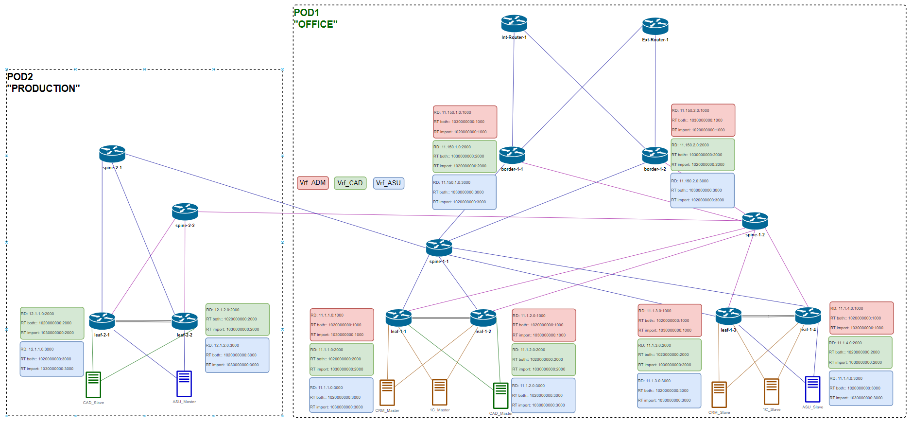
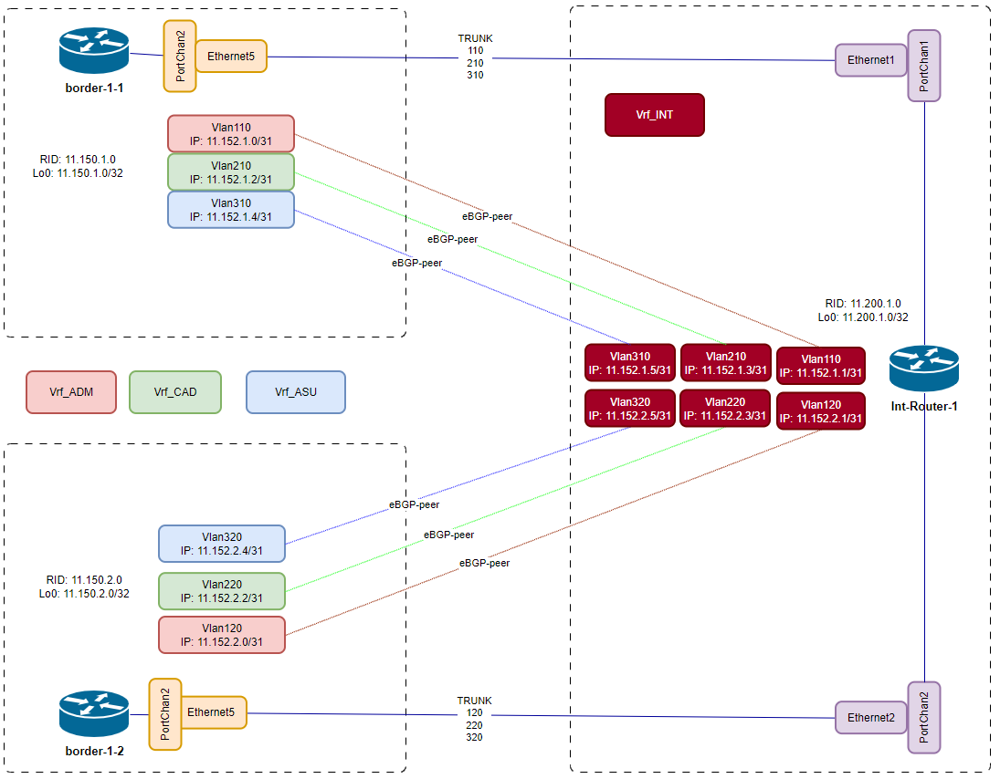
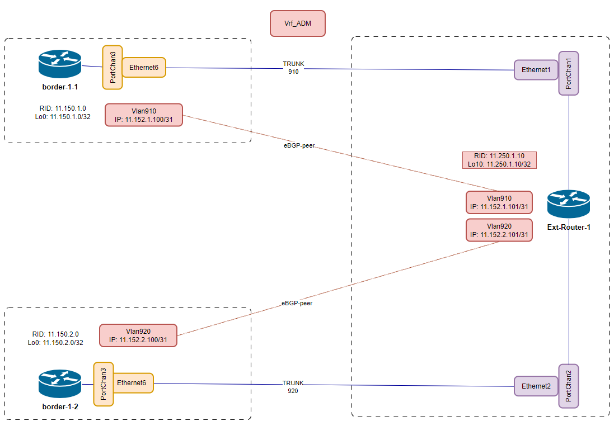

# Этап 1-3. Настройка BGP

## Подготовка

Идентификаторы [маршрутизаторов](../Common/ids.md)

Сводная таблица настроек [BGP процессов](bgp-rtr-conf.md) маршрутизаторов POD-1

Сводная таблица настроек [BGP-соседств](bgp-peers-cfg.md) маршрутизаторов POD-1

### BGP Underlay

[Оригинал схемы](../../schemes/BGP_underlay.drawio)

### Распределение VRF RD, RT

[Оригинал схемы](../../schemes/VRF_RD-RT.drawio)

### Схемы пиринга с выделенными маршрутизаторами
#### Стык border leafs - int-router

[Оригинал схемы](../../schemes/Borders--Int-router.drawio)

#### Стык border leafs - ext-router

[Оригинал схемы](../../schemes/Borders--Ext-router.drawio)

## Конфигурирование
Конфигурация маршрутизаторов приведена [здесь](../../configs/stage03_BGP/POD-01/).

## Контроль применения конфигурации
### Соседства spine
    spine-1-1# show bgp ipv4 unicast summary
        BGP router identifier 11.0.1.0, local AS number 1110000000
        Neighbor       V   AS      MsgRcvd   MsgSent   InQ     OutQ    Up/Down         State/PfxRcd
        11.2.1.1       4   1120000001 26812     27809     0       0       18:27:57        5
        11.2.1.11      4   1130000002 27826     27809     0       0       18:27:57        5
        11.2.1.3       4   1120000001 26784     27809     0       0       18:27:57        5
        11.2.1.5       4   1120000002 26751     27809     0       0       18:27:57        5
        11.2.1.7       4   1120000002 26775     27809     0       0       18:27:57        5
        11.2.1.9       4   1130000001 27823     27809     0       0       18:27:57        5

    spine-1-2# show bgp ipv4 unicast summary
        BGP router identifier 11.0.2.0, local AS number 1110000000
        Neighbor       V   AS      MsgRcvd   MsgSent   InQ     OutQ    Up/Down         State/PfxRcd
        11.2.2.1       4   1120000001 26892     27922     0       0       18:31:27        5
        11.2.2.11      4   1130000002 27916     27922     0       0       18:31:27        5
        11.2.2.3       4   1120000001 26872     27922     0       0       18:31:27        5
        11.2.2.5       4   1120000002 26841     27922     0       0       18:31:27        5
        11.2.2.7       4   1120000002 26865     27922     0       0       18:31:27        5
        11.2.2.9       4   1130000001 27913     27922     0       0       18:31:27        5

### Соседства c выделенными маршрутизаторами
#### border-1-1
    border-1-1# show bgp ipv4 unicast vrf Vrf_ADM summary
        BGP router identifier 11.150.1.0, local AS number 1130000001
        Neighbor         V   AS      MsgRcvd   MsgSent   InQ     OutQ    Up/Down         State/PfxRcd
        11.152.1.1       4   65000   19915     19919     0       0       16:35:36        1
        11.152.1.101     4   64555   19901     19902     0       0       16:34:59        0

    border-1-1# show bgp ipv4 unicast vrf Vrf_CAD summary
        BGP router identifier 11.150.1.0, local AS number 1130000001
        Neighbor       V   AS      MsgRcvd   MsgSent   InQ     OutQ    Up/Down         State/PfxRcd
        11.152.1.3     4   65000   19931     19934     0       0       16:36:24        3

    border-1-1# show bgp ipv4 unicast vrf Vrf_ASU summary
        BGP router identifier 11.150.1.0, local AS number 1130000001
        Neighbor       V   AS      MsgRcvd   MsgSent   InQ     OutQ    Up/Down         State/PfxRcd
        11.152.1.5     4   65000   19953     19956     0       0       16:37:32        1

#### border-1-2
    border-1-2# show bgp ipv4 unicast vrf Vrf_ADM summary
        BGP router identifier 11.150.2.0, local AS number 1130000002
        Neighbor         V   AS      MsgRcvd   MsgSent   InQ     OutQ    Up/Down         State/PfxRcd
        11.152.2.1       4   65000   19980     19984     0       0       16:38:46        1
        11.152.2.101     4   64555   19965     19966     0       0       16:38:09        0

    border-1-2# show bgp ipv4 unicast vrf Vrf_CAD summary
        BGP router identifier 11.150.2.0, local AS number 1130000002
        Neighbor       V   AS      MsgRcvd   MsgSent   InQ     OutQ    Up/Down         State/PfxRcd
        11.152.2.3     4   65000   20007     20011     0       0       16:40:09        3

    border-1-2# show bgp ipv4 unicast vrf Vrf_ASU summary
        BGP router identifier 11.150.2.0, local AS number 1130000002
        Neighbor       V   AS      MsgRcvd   MsgSent   InQ     OutQ    Up/Down         State/PfxRcd
        11.152.2.5     4   65000   20018     20021     0       0       16:40:40        1

