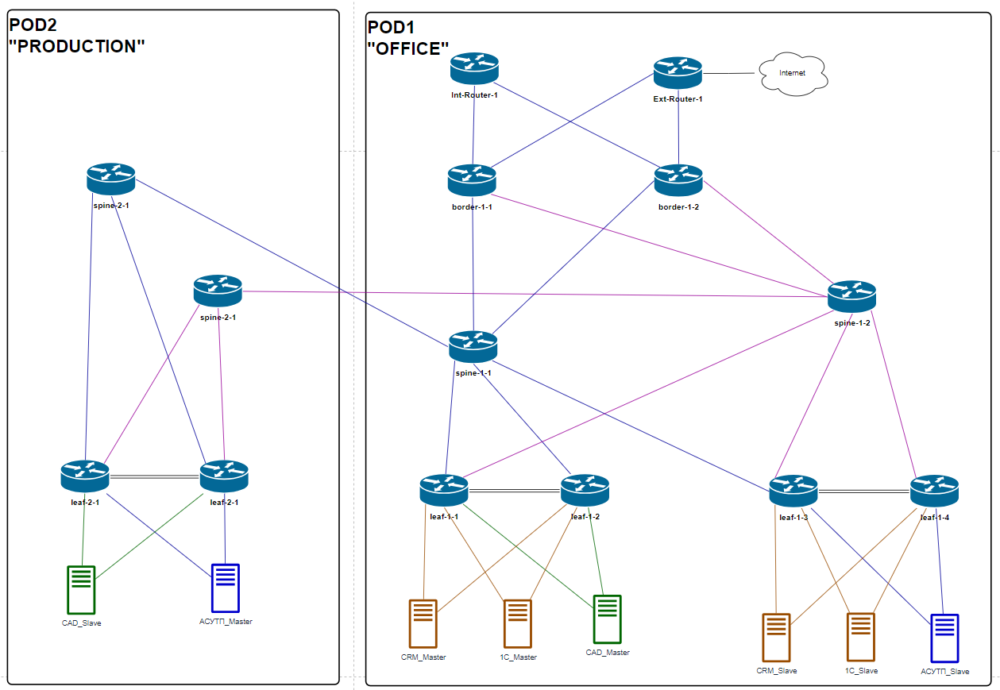

# Этап-1-4. Настройка резервируемых клиентских подключений (MCLAG)
## Подготовка
Подключение клиентов отображено общей схеме топологии ЦОД, интерфейсы стыковых линков приведены [здесь](../Common/links.md).

[Оригинал схемы](../../schemes/DC_topology.drawio)

Идентификаторы [MCLAG](../Common/mclag_ids.md)

## Конфигурирование
Конфигурация маршрутизаторов leaf-1-1,2,3,4 приведена [здесь](../../configs/stage04_MCLAG/POD-01/).

## Контроль применения конфигурации
### leaf-1-1 -- leaf-1-2
    leaf-1-1# show mclag brief

        Domain ID            : 1
        Role                 : active
        Session Status       : up
        Peer Link Status     : up
        Source Address       : 11.1.1.0
        Peer Address         : 11.1.2.0
        Peer Link            : PortChannel1
        Keepalive Interval   : 1 secs
        Session Timeout      : 30 secs
        Delay Restore        : 90 secs
        System Mac           : 50:0a:00:02:00:00
        Mclag System Mac     : 00:00:a1:a1:a1:a1
        Gateway Mac          : 00:11:00:11:00:11

        Number of MLAG Interfaces:3
        -----------------------------------------------------------
        MLAG Interface       Local/Remote Status
        -----------------------------------------------------------
        PortChannel4             up/up
        PortChannel2             up/up
        PortChannel3             up/up

    leaf-1-2# show mclag brief

        Domain ID            : 1
        Role                 : standby
        Session Status       : up
        Peer Link Status     : up
        Source Address       : 11.1.2.0
        Peer Address         : 11.1.1.0
        Peer Link            : PortChannel1
        Keepalive Interval   : 1 secs
        Session Timeout      : 30 secs
        Delay Restore        : 90 secs
        System Mac           : 50:0a:00:02:00:00
        Mclag System Mac     : 00:00:a1:a1:a1:a1
        Gateway Mac          : 00:11:00:11:00:11

        Number of MLAG Interfaces:3
        -----------------------------------------------------------
        MLAG Interface       Local/Remote Status
        -----------------------------------------------------------
        PortChannel4             up/up
        PortChannel2             up/up
        PortChannel3             up/up

### leaf-1-3 -- leaf-1-4

    leaf-1-3# show mclag brief

        Domain ID            : 1
        Role                 : active
        Session Status       : up
        Peer Link Status     : up
        Source Address       : 11.1.3.0
        Peer Address         : 11.1.4.0
        Peer Link            : PortChannel1
        Keepalive Interval   : 1 secs
        Session Timeout      : 30 secs
        Delay Restore        : 90 secs
        System Mac           : 50:0a:00:05:00:00
        Mclag System Mac     : 00:00:a2:a2:a2:a2
        Gateway Mac          : 00:12:00:12:00:12

        Number of MLAG Interfaces:3
        -----------------------------------------------------------
        MLAG Interface       Local/Remote Status
        -----------------------------------------------------------
        PortChannel4             up/up
        PortChannel2             up/up
        PortChannel3             up/up

    leaf-1-4# show mclag brief

        Domain ID            : 1
        Role                 : standby
        Session Status       : up
        Peer Link Status     : up
        Source Address       : 11.1.4.0
        Peer Address         : 11.1.3.0
        Peer Link            : PortChannel1
        Keepalive Interval   : 1 secs
        Session Timeout      : 30 secs
        Delay Restore        : 90 secs
        System Mac           : 50:0a:00:05:00:00
        Mclag System Mac     : 00:00:a2:a2:a2:a2
        Gateway Mac          : 00:12:00:12:00:12

        Number of MLAG Interfaces:3
        -----------------------------------------------------------
        MLAG Interface       Local/Remote Status
        -----------------------------------------------------------
        PortChannel4             up/up
        PortChannel2             up/up
        PortChannel3             up/up

