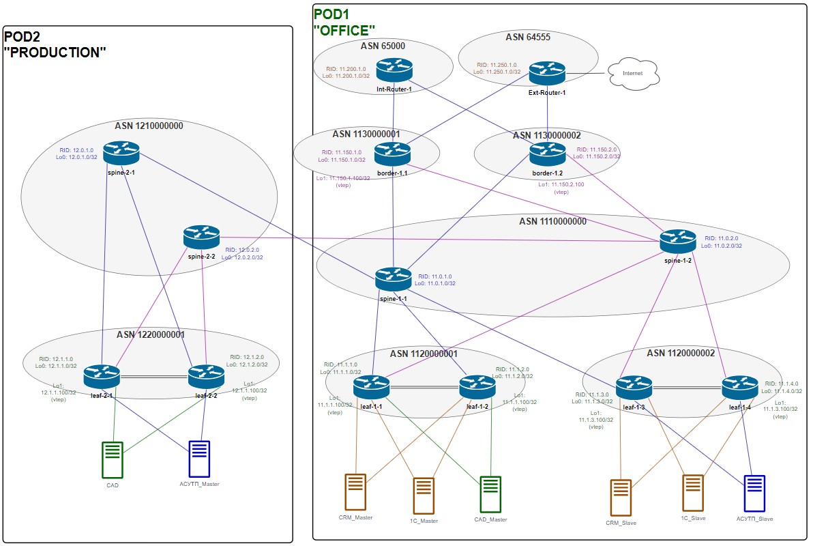
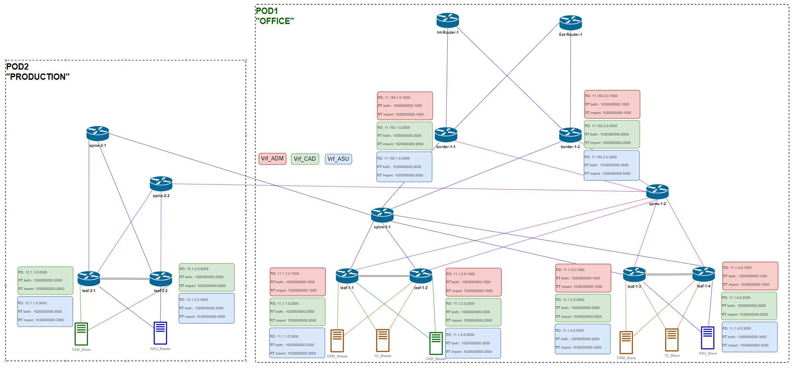

# Этап 2-3. Настройка BGP

## Подготовка

Идентификаторы [маршрутизаторов](../Common/ids.md)

Сводная таблица настроек [BGP процессов](bgp-rtr-conf.md) маршрутизаторов POD-1

Сводная таблица настроек [BGP-соседств](bgp-peers-cfg.md) маршрутизаторов POD-1

### BGP Underlay

[Оригинал схемы](../../schemes/BGP_underlay.drawio)

### Распределение VRF RD, RT

[Оригинал схемы](../../schemes/VRF_RD-RT.drawio)

## Конфигурирование
Конфигурация маршрутизаторов приведена [здесь](../../configs/stage03_BGP/POD-02/).

## Контроль применения конфигурации
### Соседства spine
    spine-2-1# show bgp ipv4 unicast summary
        BGP router identifier 12.0.1.0, local AS number 1210000000
        Neighbor       V   AS      MsgRcvd   MsgSent   InQ     OutQ    Up/Down         State/PfxRcd
        11.102.1.0     4   1110000000 39398     39398     0       0       1d01h59m        25
        12.2.1.1       4   1220000001 38421     39409     0       0       1d02h00m        5
        12.2.1.3       4   1220000001 38458     39409     0       0       1d02h00m        5

    spine-2-2# show bgp ipv4 unicast summary
        BGP router identifier 12.0.2.0, local AS number 1210000000
        Neighbor       V   AS      MsgRcvd   MsgSent   InQ     OutQ    Up/Down         State/PfxRcd
        11.102.2.0     4   1110000000 39481     39481     0       0       19:07:20        25
        12.2.2.1       4   1220000001 38441     39479     0       0       1d02h01m        5
        12.2.2.3       4   1220000001 38528     39495     0       0       19:07:20        5

