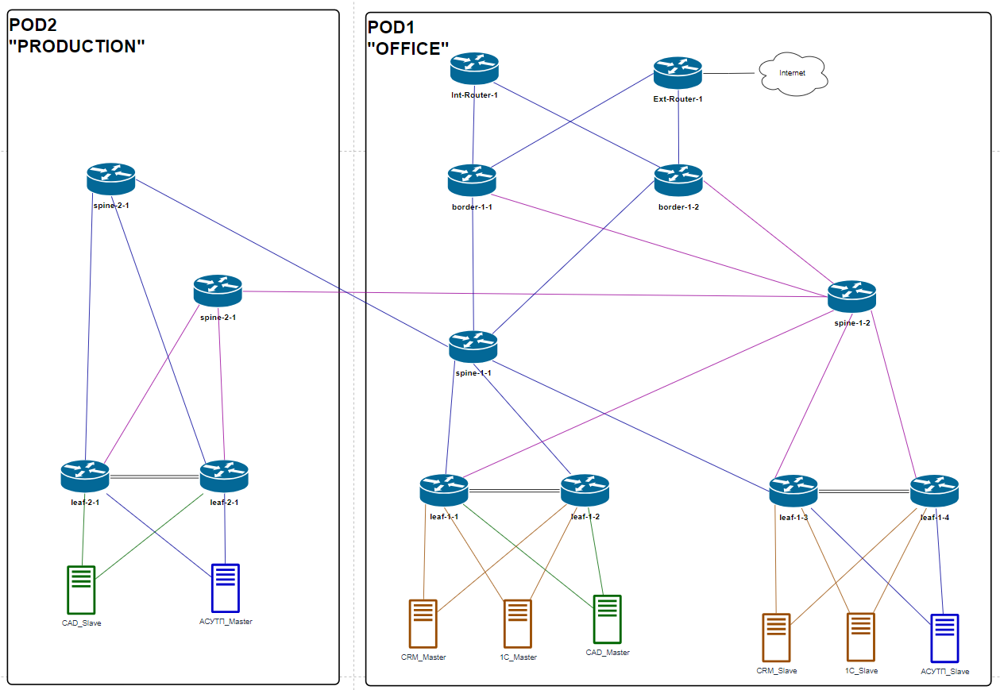

# Этап 2-5. Конфигурация клиентов

## Подготовка
Подключение клиентов отображено общей схеме топологии ЦОД, интерфейсы стыковых линков приведены [здесь](../Common/links.md).

[Оригинал схемы](../../schemes/DC_topology.drawio)

Идентификаторы [клиентов](../Common/clients.md)

## Конфигурирование
Конфигурация оборудования клиентов приведена [здесь](../../configs/stage05_Clients/).

## Контроль применения конфигурации
Пинг Anycast Gateway адресов со стороны клиентов POD-02

### CAD_Slave
    CAD-Slave# ping 10.4.27.254
        PING 10.4.27.254 (10.4.27.254) 56(84) bytes of data.
        64 bytes from 10.4.27.254: icmp_seq=1 ttl=64 time=2.77 ms
        64 bytes from 10.4.27.254: icmp_seq=2 ttl=64 time=1.36 ms
        64 bytes from 10.4.27.254: icmp_seq=3 ttl=64 time=2.72 ms
        64 bytes from 10.4.27.254: icmp_seq=4 ttl=64 time=1.59 ms

### ASU_Master
    ASU-Master# ping 10.8.255.254
        PING 10.8.255.254 (10.8.255.254) 56(84) bytes of data.
        64 bytes from 10.8.255.254: icmp_seq=1 ttl=64 time=2.93 ms
        64 bytes from 10.8.255.254: icmp_seq=2 ttl=64 time=1.10 ms
        64 bytes from 10.8.255.254: icmp_seq=3 ttl=64 time=1.63 ms
        64 bytes from 10.8.255.254: icmp_seq=4 ttl=64 time=1.00 ms
