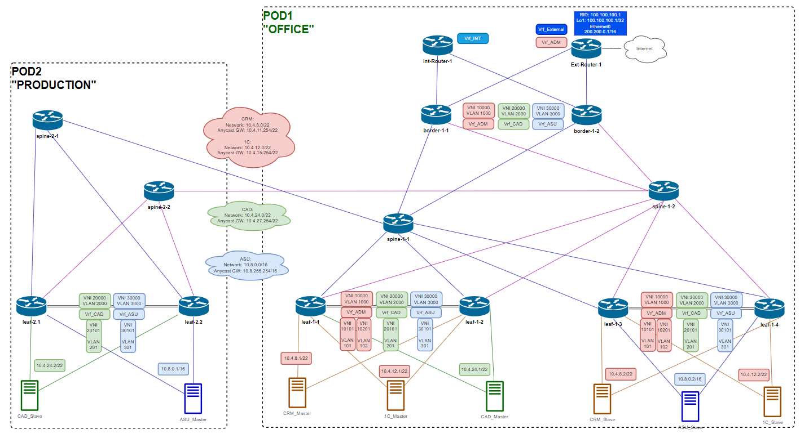

# Этап 2-6. Настройка VXLAN

## Подготовка
### Схема Overlay

[Оригинал схемы](../../schemes/DC_Overlay.drawio)

Параметры [vtep интерфейсов](../Common/vxlan_addr.md)

## Конфигурирование
Конфигурация маршрутизаторов приведена [здесь](../../configs/stage06_VTEP/POD-02/).

## Контроль применения конфигурации
### VTEP интерфейсы и состояние VXLAN-туннелей
#### leaf-2-1
    leaf-2-1# show vxlan interface
        VTEP Name        :  vtep1
        VTEP Source IP   :  12.1.1.100
        EVPN NVO Name    :  nvo1
        EVPN VTEP        :  vtep1
        Source Interface :  Loopback1

    leaf-2-1# show vxlan vlanvnimap
        VLAN      VNI
        ======    =====
        Vlan2000  20000
        Vlan201   20101
        Vlan3000  30000
        Vlan301   30101

    leaf-2-1# show vxlan vrfvnimap
        VRF       VNI
        ======    =====
        Vrf_ASU   30000
        Vrf_CAD   20000

    leaf-2-1# show vxlan tunnel
        Name                SIP               DIP                 source      operstatus
        =======             ======            ======              ======      ========
        EVPN_11.1.1.100     12.1.1.100        11.1.1.100          EVPN        oper_up
        EVPN_11.1.3.100     12.1.1.100        11.1.3.100          EVPN        oper_up
        EVPN_11.150.1.100   12.1.1.100        11.150.1.100        EVPN        oper_up
        EVPN_11.150.2.101   12.1.1.100        11.150.2.101        EVPN        oper_up

#### leaf-2-2
    leaf-2-2# show vxlan interface
        VTEP Name        :  vtep1
        VTEP Source IP   :  12.1.1.100
        EVPN NVO Name    :  nvo1
        EVPN VTEP        :  vtep1
        Source Interface :  Loopback1

    leaf-2-2# show vxlan tunnel
        Name                SIP               DIP                 source      operstatus
        =======             ======            ======              ======      ========
        EVPN_11.1.1.100     12.1.1.100        11.1.1.100          EVPN        oper_up
        EVPN_11.1.3.100     12.1.1.100        11.1.3.100          EVPN        oper_up
        EVPN_11.150.1.100   12.1.1.100        11.150.1.100        EVPN        oper_up
        EVPN_11.150.2.101   12.1.1.100        11.150.2.101        EVPN        oper_up

    leaf-2-2# show vxlan vlanvnimap
        VLAN      VNI
        ======    =====
        Vlan2000  20000
        Vlan201   20101
        Vlan3000  30000
        Vlan301   30101

    leaf-2-2# show vxlan vrfvnimap
        VRF       VNI
        ======    =====
        Vrf_ASU   30000
        Vrf_CAD   20000

### Статус L2VNI
#### VNI 20101. CAD. MAC table

    leaf-2-1# show evpn mac vni 20101
        Number of MACs (local and remote) known for this VNI: 3
        MAC               Type   Intf/Remote VTEP      VLAN  Seq #'s
        50:00:00:31:31:31 remote 11.1.1.100                  0/0
        50:00:00:32:32:32 local  PortChannel2          201   0/0
        00:00:00:01:02:03 local  Vlan201               201   0/0

    leaf-2-2# show evpn mac vni 20101
        Number of MACs (local and remote) known for this VNI: 3
        MAC               Type   Intf/Remote VTEP      VLAN  Seq #'s
        50:00:00:31:31:31 remote 11.1.1.100                  0/0
        50:00:00:32:32:32 local  PortChannel2          201   0/0
        00:00:00:01:02:03 local  Vlan201               201   0/0

#### VNI 30101. ASU. MAC table

    leaf-2-1# show evpn mac vni 30101
        Number of MACs (local and remote) known for this VNI: 3
        MAC               Type   Intf/Remote VTEP      VLAN  Seq #'s
        50:00:00:41:41:41 local  PortChannel3          301   0/0
        50:00:00:42:42:42 remote 11.1.3.100                  0/0
        00:00:00:01:02:03 local  Vlan301               301   0/0

    leaf-2-2# show evpn mac vni 30101
        Number of MACs (local and remote) known for this VNI: 3
        MAC               Type   Intf/Remote VTEP      VLAN  Seq #'s
        50:00:00:41:41:41 local  PortChannel3          301   0/0
        50:00:00:42:42:42 remote 11.1.3.100                  0/0
        00:00:00:01:02:03 local  Vlan301               301   0/0

#### VNI 20101. CAD. Связность клиентов
##### CAD_Slave -- CAD_Master
    CAD-Slave# ping 10.4.24.1
        PING 10.4.24.1 (10.4.24.1) 56(84) bytes of data.
        64 bytes from 10.4.24.1: icmp_seq=1 ttl=64 time=20.6 ms
        64 bytes from 10.4.24.1: icmp_seq=2 ttl=64 time=4.49 ms
        64 bytes from 10.4.24.1: icmp_seq=3 ttl=64 time=4.38 ms

#### VNI 30101. ASU. Связность клиентов
#####  ASU_Master -- ASU_Slave
    ASU-Master# ping 10.8.0.2
        PING 10.8.0.2 (10.8.0.2) 56(84) bytes of data.
        64 bytes from 10.8.0.2: icmp_seq=1 ttl=64 time=15.3 ms
        64 bytes from 10.8.0.2: icmp_seq=2 ttl=64 time=5.60 ms
        64 bytes from 10.8.0.2: icmp_seq=3 ttl=64 time=5.22 ms
        64 bytes from 10.8.0.2: icmp_seq=4 ttl=64 time=5.34 ms

