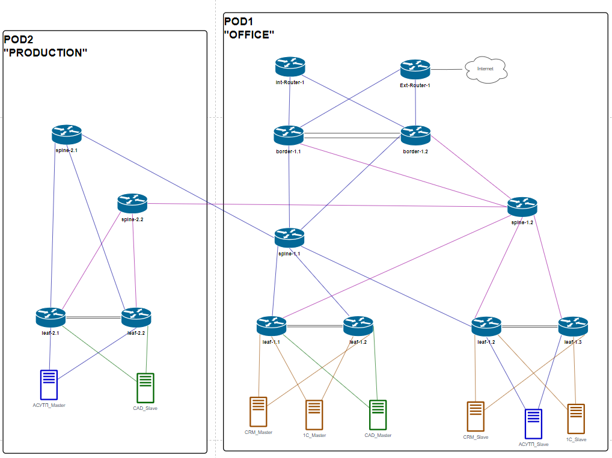

# Проектная работа
## Тема: Разработка корпоративной сети ЦОД предприятия через внедрение архитектуры EVPN/VXLAN
### Размещение объектов Заказчика:
Предприятие располагается на двух площадках:
- Площадка "Офис"
  - На площадке размещается ЦОД, в котором хостятся:
    - основные и резервные сервера системы CRM
    - резервные сервера системы АСУТП
    - основные сервера системы CAD
    - основные и резевные сервера бухгалтерии
    - стык с интернет-провайдерами
- Площадка "Производство"
  - На площадке размещается ЦОД, в котором хостятся:
    - резервные сервера системы CAD
    - основные сервера системы АСУТП

Связность разнесённых площадок выполнена на двух арендованных каналах 1Гб, от двух разных провайдеров

### Цели:
- Разработка территориально распределенной сетевой инфраструктуры с поддержкой возможностей использования VxLAN/EVPN
- Обеспечение географического резервирования производственных приложений Заказчика: CAD, АСУТП
- Обеспечение отказоустойчивых подключений серверов критической инфраструктуры (АСУТП, CRM, CAD) к сети ЦОД
- Изоляция производственной сети от административных и внешних сетей

### План:
- Разработка отказоустойчивой и масштабируемой топологии CLOS для существующего ЦОД
- Проектирование DCI по технологии “multi-pod”
- Проектирование адресного пространства
- Проектирование Underlay и Overlay сетей
- Проектирование маршрутизации между производственным, административным, и интернет сегментами

### Схема сети:

#### Роли узлов
- spine-N.M - спайны CLOS топологии
- leaf-N.M - лифы CLOS-топологии. Подключение клиентов
- border-N.M - пограничные лифы. Межсегментная маршрутизация внутри предприятия
- Int-Router - маршрутизатор. Межсегментная маршрутизация внутри предприятия. Управление обменом маршрутами между сегментами предприятия
- Ext-Router - маршрутизатор доступа к внешним сетям (Интернет)

