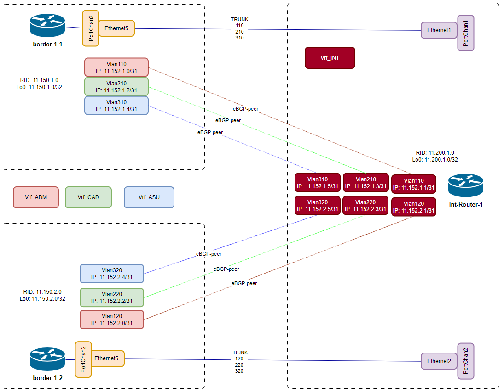
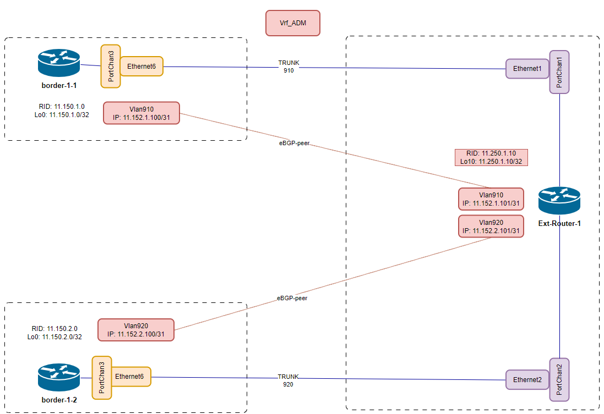

# Проектная работа
## Тема: Разработка корпоративной сети ЦОД предприятия через внедрение архитектуры EVPN/VXLAN
### Размещение объектов Заказчика:
Предприятие располагается на двух площадках:
- Площадка "Офис"
  - На площадке размещается ЦОД, в котором хостятся:
    - основные и резервные сервера системы CRM
    - резервные сервера системы АСУТП
    - основные сервера системы CAD
    - основные и резервные сервера бухгалтерии
    - стык с интернет-провайдерами
- Площадка "Производство"
  - На площадке размещается мини-ЦОД, в котором хостятся:
    - резервные сервера системы CAD
    - основные сервера системы АСУТП

Связность разнесённых площадок выполнена на двух арендованных каналах 1Гб, от двух разных провайдеров

### Цели:
- Обеспечение территориально распределенной сетевой инфраструктуры 
- Обеспечение географического резервирования производственных приложений Заказчика: CAD, АСУТП
- Обеспечение возможности миграции серверов Заказчика как внутри, так и между локациями, без необходимости переконфигурирования сетевого стека со стороны клиента
- Обеспечение горизонтального масштабирования сетевой инфраструктуры для подключения нового оборудования Заказчика, без влияния на уже работающие сервисы
- Построение сетевой инфраструктуры без применения дорогостоящего IP/MPLS стека
- Обеспечение отказоустойчивых подключений серверов критической инфраструктуры (АСУТП, CRM, CAD) к оборудованию сетевой инфраструктуры
- Взаимная изоляция производственной сети от административных, и внешних сетей

### План:
-  [Разработка решения для построения отказоустойчивой и масштабируемой сетевой инфраструктуры](Implementation/Common/solution.md)
-  [Распределение адресного пространства и идентификаторов объектов конфигурации](Implementation/Common/address_space.md)
- Главный POD (Офис)
  - [Построение топологии](Implementation/POD-01/topology.md)
  - [Настройка L3 p2p адресации и адресации loopback интерфейсов](Implementation/POD-01/topology.md)
  - [Настройка L2 интерфейсов и LAG интерфейсов](Implementation/POD-01/topology.md)
  - [Настройка VRF, их L2 / L3 интерфейсов, включая адресацию последних](Implementation/POD-01/vrfs.md)
  - [Настройка BGP](Implementation/POD-01/bgp.md)
  - [Настройка резервируемых клиентских подключений (MCLAG)](Implementation/POD-01/mclag.md)
  - [Настройка сетевого стека на клиентском оборудовании, подключение к сетевой инфпаструктуре](Implementation/POD-01/clients.md)
  - [Настройка VXLAN](Implementation/POD-01/vxlan.md)
  - [Настройка маршрутизации между клиентскими сервисами. Настройка выхода во внешние сети для сегментов CRM, 1C](Implementation/POD-01/route_exchange.md)
- Производственный POD
  - [Построение топологии](Implementation/POD-02/topology.md)
  - [Настройка L3 p2p адресации и адресации loopback интерфейсов](Implementation/POD-02/topology.md)
  - [Настройка L2 интерфейсов и LAG интерфейсов](Implementation/POD-02/topology.md)
  - [Настройка VRF, их L2 / L3 интерфейсов, включая адресацию последних](Implementation/POD-02/vrfs.md)
  - [Настройка BGP](Implementation/POD-02/bgp.md)
  - [Настройка резервируемых клиентских подключений (MCLAG)](Implementation/POD-02/mclag.md)
  - [Настройка сетевого стека на клиентском оборудовании, подключение к сетевой инфпаструктуре](Implementation/POD-02/clients.md)
  - [Настройка VXLAN](Implementation/POD-02/vxlan.md)
  - [Проверка маршрутизации между клиентскими сервисами](Implementation/POD-02/route_exchange.md)

#### Роли узлов
- spine-N.M - спайны CLOS топологии
- leaf-N.M - лифы CLOS-топологии. Подключение клиентов
- border-N.M - пограничные лифы. Межсегментная маршрутизация внутри предприятия
- Int-Router - маршрутизатор. Межсегментная маршрутизация внутри предприятия. Управление обменом маршрутами между подсетями предприятия
- Ext-Router - маршрутизатор доступа к внешним сетям (Интернет)
- CRM_Master/Slave - сервера системы CRM
- 1C_Master/Slave - сервера приложения 1С
- CAD_Master/Slave - сервера системы проектирования
- АСУТП(ASU)_Master/Slave - сервера АСУТП 

### Схемы:
#### Общая топология

[Оригинал схемы](schemes/DC_topology.drawio)

#### BGP Underlay

[Оригинал схемы](schemes/BGP_underlay.drawio)

#### Распределение VRF RD, RT

[Оригинал схемы](schemes/VRF_RD-RT.drawio)

#### Overlay

[Оригинал схемы](schemes/DC_Overlay.drawio)

#### Стык border leafs - int-router

[Оригинал схемы](schemes/Borders--Int-router.drawio)

#### Стык border leafs - ext-router

[Оригинал схемы](schemes/Borders--Ext-router.drawio)

#### Тестовый стенд на базе симулятора EVE-NG

